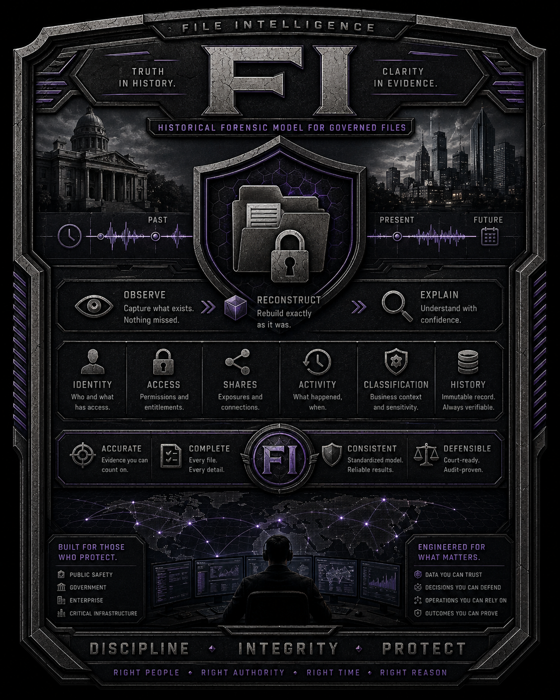

# File Intelligence (FI)

<p align="center">
  
</p>

**File Intelligence (FI)** is a read-only system for building a historical
understanding of explicitly governed files.

FI is designed around a simple question:

> **What do we know about this file?**

Over time that includes its identity, locations, metadata, storage, security,
access, activity, relationships, history, and later classification.

The file remains the center of that history.

FI does not modify customer files, permissions, identities, shares, systems, or
infrastructure.

---

## Why FI exists

Understanding a file in a real environment often requires information from many
different sources.

A question such as:

> Why can this user access this file?

may require correlating:

- the file's identity;
- current and historical paths;
- NTFS permissions;
- SMB share permissions;
- local identities;
- Active Directory identities and direct membership facts;
- inheritance;
- effective-access inputs;
- permission changes;
- governed-file activity; and
- the state of those facts at the time being investigated.

A different question may start with an identity:

> If this account is compromised, what governed files could it affect?

Or with a file:

> Where has this file been, who could access it, what happened to it, and what
> changed?

FI preserves the source facts needed to answer those questions without changing
the systems being examined.

---

## File-centered intelligence

FI treats a governed file as more than a pathname.

A pathname can change. A file can be renamed, moved, exposed through different
shares, have its permissions changed, or have relationships to different
identities over time.

For a governed file, FI is intended to answer questions such as:

- What file is this?
- Where is it now?
- Where has it been?
- Has it been renamed or moved?
- What metadata has been observed?
- What NTFS security applied to it?
- What SMB shares exposed it?
- Who could access it?
- Why could that identity access it?
- Was access direct, inherited, or obtained through group membership?
- When did access change?
- Who changed permissions when the available source information can establish
  that?
- What access, attempted access, modification, creation, deletion, rename/move,
  or security activity involving the file has been observed?
- What was known about the file at a particular point in time?
- Where are there gaps that prevent FI from making a definitive conclusion?
- What classification was later associated with a particular observation?

FI distinguishes between what was directly observed, what can be
deterministically derived, what was classified, and what remains unknown or
incomplete.

A gap in available information must never be presented as proof that an event
did not occur.

---

## Governed-file activity

FI is not intended to become a general Windows event collector or SIEM.

Activity collection is file-centered.

FI preserves Windows activity when it concerns a governed file or directory,
including where observable:

- access and attempted access;
- successful and denied access;
- creation;
- modification;
- deletion;
- rename and move activity;
- ownership, ACL, and other security changes;
- hard-link activity; and
- SMB/share activity associated with the governed object.

Where Windows provides the information, FI preserves source facts such as:

- account/SID;
- process;
- object identity and path;
- access requested or used;
- success/failure;
- timestamp and source record identity;
- share used;
- remote workstation or IP; and
- session/logon identifiers needed to explain the governed-object activity.

Supporting SMB, logon, or session records are collected only when needed to
explain activity associated with governed objects. FI does not collect broad
server activity merely because Windows exposes it.

Windows auditing is not perfect. FI reports coverage and limitations explicitly
and never interprets the absence of an event as proof that no activity occurred.

---

## Useful across IT

FI records one underlying history. Different parts of an IT organization can use
views over that same recorded and correlated information for different purposes.

### Service Desk

Examples include:

- Why did a user lose access to a file or directory?
- What access should the user currently have?
- Through which group or ACL is access granted?
- Did something recently change?

### Developers and DevOps

Examples include:

- What application files changed?
- Which identities can modify application-controlled locations?
- Did filesystem security or ownership change around a deployment?
- What related file state changed during an incident or application failure?

### System Administration

Examples include:

- Who has effective access to a governed location?
- Which shares expose it?
- Which permissions are direct or inherited?
- What changed in the filesystem or security configuration?
- What objects may require review following compromise of a privileged identity?

### Security

Examples include:

- What governed files could a compromised identity reach?
- What did that identity actually interact with where source information supports
  that conclusion?
- What permissions changed?
- What is the difference between observed activity and potential reach?
- What is the possible blast radius?
- Where are there gaps or incomplete coverage?

### Management and Reporting

Examples include:

- Which organizational areas may be affected?
- What is confirmed versus potentially affected?
- What information is currently known?
- What remains unknown?
- Which teams or reporting chains need to become involved?

These are different views of the same underlying recorded history, not
independent copies of the data.

---

## Read-only by design

FI is intentionally read-only with respect to the customer environment.

FI may observe files, filesystem metadata, security information, identities,
shares, activity sources, and other configured sources necessary to build its
historical model.

FI does not:

- modify files;
- change ACLs;
- grant or revoke access;
- modify users or groups;
- change SMB shares;
- quarantine systems;
- alter network configuration; or
- automatically remediate the environment.

The ability to observe and explain a problem remains separate from the authority
to change the systems involved.

Administrator-run deployment examples may configure Windows audit policy, SACLs,
service identities, or related prerequisites. Those are deliberate customer
administrative actions and are not FI runtime behavior.

---

## Customer-controlled deployment

FI is designed to operate entirely within infrastructure controlled by the
customer.

Windows collectors, FI records, historical information, identity and security
metadata, classification results, PostgreSQL data, and other FI backend
information remain on customer-controlled systems unless the customer explicitly
chooses otherwise.

The FI backend may be deployed on a customer-provided server or virtual machine,
or on a dedicated FI appliance located within the customer environment.

Iron Signal Systems does not require persistent administrative or remote access
for FI to operate.

Customers may optionally grant Iron Signal Systems controlled access for
maintenance, upgrades, troubleshooting, or other support services. Any such
access is customer-authorized and is not required for normal FI operation.

FI is intended to remain fully operational in environments where no vendor remote
access is permitted.

---

## Initial platform scope

Initial development targets **Windows Server and NTFS file services**.

Monitoring is explicitly scope-driven. FI operates only against configured
**governed roots**. Installing FI on a server does not mean the entire server,
volume, or share is governed.

The initial Windows collector preserves or is being built to preserve:

- NTFS object and volume identity;
- exact path representation;
- file and directory metadata;
- content hashes;
- alternate data streams;
- reparse information;
- Windows security descriptors, ACLs, SACLs, and ACEs;
- SMB share exposure and share security;
- local Windows identities;
- Active Directory identities and direct membership facts;
- effective-access source inputs;
- USN journal change signals;
- governed-file Windows activity;
- source checkpoints and continuity;
- explicit gap/reconciliation history;
- durable local spool batches; and
- major collector operation history.

Other filesystems and operating systems are outside the initial scope.

---

## Current Windows Security activity validation

FI reads the local Windows Security log as an independent activity source. FI does
not automatically enable Windows audit policy or add SACLs to governed roots.
Those are administrator-controlled deployment settings.

Current live validation has been performed on:

```text
Windows Server 2016
Version 10.0.14393
```

Later Windows Server versions must be characterized independently before FI
assumes identical event-generation behavior.

The current FI coverage model requires effective:

- **Audit File System**: Success and Failure;
- **Audit Handle Manipulation**: Failure;
- **Audit Detailed File Share**: Success and Failure;
- **Audit Policy Change**: Success;
- a sufficient change-capable Success/Failure audit ACE on every governed root;
- a sufficient descendant-file read Success/Failure audit ACE on every governed
  root; and
- readable local Security log access.

For production, FI recommends Advanced Audit Policy through a dedicated scoped
GPO or equivalent configuration-management mechanism. The Windows setting
**Audit: Force audit policy subcategory settings (Windows Vista or later) to
override audit policy category settings** should be enabled so legacy category
policy does not override the intended advanced subcategories.

On the validated Windows Server 2016 system:

- successful governed-file activity produced Event ID `4663`;
- denied file-handle requests produced Event ID `4656` only after Handle
  Manipulation Failure auditing was enabled;
- a descendant-file read under the FI read-audit rule produced Event ID `4663`;
- Detailed File Share auditing produced Event ID `5145`;
- local UNC access preserved `::1` as the source address;
- true remote SMB access preserved the remote client IP; and
- a denied remote NTFS access could produce a successful `5145` share-level
  access-check record followed independently by a failed `4656` NTFS
  handle-request record.

A successful `5145` means the SMB/share-level access check represented by that
event succeeded. It does **not** by itself prove the final NTFS operation
succeeded.

FI currently selects the following Security event IDs:

- `4656` — handle/access requested;
- `4663` — an access right was used;
- `4660` — object deleted;
- `4664` — hard link created;
- `4670` — permissions changed;
- `4907` — auditing settings/SACL changed;
- `5145` — detailed SMB share access check;
- `1102` — Security audit log cleared; and
- `4719` — system audit policy changed.

FI preserves Security records independently from NTFS/USN observations. It does
not collapse a share-level event, a denied handle request, and a filesystem
change into one inferred event.

A root SACL does not prove every descendant is covered. Descendants can protect
their SACL from inheritance, and FI preserves the actual SACL observed on each
object.

See the [Windows file-auditing example](examples/windows/file-auditing/README.md)
for the current PowerShell examples and deployment notes.

---

## Historical model

FI is not intended to keep only the latest state of a file.

An initial governed-root baseline establishes what FI knows at the beginning of
observation. Subsequent observations add history.

Material changes create new records rather than silently rewriting prior history.

Historical records are authoritative. Current-state, operational, reporting, and
role-oriented backend views are rebuildable representations of that history.

---

## Collection and continuity

The Windows source-side model is:

1. establish an initial governed-root baseline;
2. use the NTFS USN journal and relevant Windows activity as independent source
   signals;
3. freshly observe affected governed objects;
4. preserve applicable identity, security, share, and governed-file activity
   source facts;
5. write and verify durable local FI spool batches;
6. advance source checkpoints only after the applicable local durable boundary is
   satisfied;
7. explicitly record continuity gaps and degraded coverage;
8. reconcile current governed-source state after a known continuity gap without
   pretending the missing history was reconstructed; and
9. preserve major collector operation lifecycle history.

USN and Windows Security normal checkpoint continuation have been live validated.
USN and Windows Security continuity-gap detection, durable gap records,
reconciliation, and re-established forward boundaries have also been live
validated.

The configured collector uses append-only operation lifecycle journals for major
boundaries. A durably started operation that has no terminal record after a
process restart is closed as `Interrupted` with reason `ProcessRestart` before new
configured work begins.

Phase 1 owns local source collection and local durable queueing.

Phase 2 owns authenticated transport, retries, downstream acknowledgement, and
removal of acknowledged batches from the source spool.

FI must not silently convert missing coverage into certainty.

---

## Supporting source freshness

The initial baseline also captures supporting source facts such as:

- local SMB share state and share security;
- local users, groups, and direct memberships; and
- relevant current-domain principals and direct membership facts.

Those sources change more slowly than the filesystem but still change over time.

A bounded continuous refresh mechanism for SMB, local identity, and relevant
Active Directory identity is remaining Phase 1 work. Backend correlation will
use the resulting versioned source facts; the Windows collector will not compute
transitive membership or final effective access conclusions.

---

## Local durable spool

Phase 1 writes finalized JSONL batches and manifests locally.

The spool verifies record count, data byte count, and SHA-256 before a batch is
accepted as the local durable boundary.

Finalized batches remain on the source until Phase 2 transport exists.

FI does not use:

```text
send succeeded -> delete
```

as a custody rule.

Phase 2 must establish durable downstream custody and acknowledgement before an
acknowledged local batch may be retired.

---

## Current Phase 1 focus

The core collector architecture is largely established. Remaining Gate 1 work is
primarily integration and validation:

- bounded refresh of SMB/local/AD supporting source facts;
- a documented governed-file activity behavior matrix covering create, modify,
  read, deny, rename/move, delete, security changes, hard-link activity, and SMB
  paths;
- Windows service runtime;
- gMSA deployment and least-privilege validation;
- restart/failure/resource-exhaustion campaigns;
- representative performance and source-impact measurement; and
- validation on additional supported Windows Server versions.

Gate 1 is not complete until those deployment and validation boundaries are
proved.

---

## Source file content and classification

Normal FI record transport does not carry customer source-file content.

Later classification and enrichment may require bounded access to file or stream
content. That capability belongs to the **Separate Protected Classification
Stream** and its streaming/read-broker service in Phase 4, not to the normal
Phase 1 record collector.

Source content is processed transiently and is not stored as normal FI
source-file content in the backend.

Classification results become additional records associated with the exact file
or stream observation that was classified.

**Classification enriches FI's understanding of a file. It does not define the
file's identity or history.**

---

## High-level architecture

```text
             Windows File & Identity Collection
                         |
                         v
                 Durable Local Spool
                         |
                         v
                  Secure Transport
                         |
                         v
                      Ingest
                         |
                         v
                 PostgreSQL Recorder
                         |
              +----------+----------+
              |                     |
              v                     v
        Historical Records      Correlation
                                    |
                                    v
                             PostgreSQL Views
                                    |
                                    v
                             Query / UI / API
```

The collector observes.

The backend preserves and correlates.

Views present the same underlying information for different operational
questions.

FI remains read-only toward the systems it observes.

---

## Core design principles

- The file is the primary subject of FI.
- File identity must not depend solely on pathname.
- FI operates only on explicitly governed roots.
- FI observes customer systems but does not change them.
- Preserve historical state instead of keeping only current state.
- Preserve native source information needed for later verification or
  reinterpretation.
- Keep observed, derived, classified, unknown, and incomplete information
  distinct.
- Never hide collection gaps or uncertainty.
- Never interpret a missing Windows activity record as proof that no activity
  occurred.
- Maintain relationships between files, storage, paths, shares, permissions,
  identities, governed-file activity, and time.
- Make historical records append-only.
- Keep normal customer source-file content outside the FI record path.
- Add classification only after the underlying file/stream observation exists.
- Prefer simple collectors that report source facts over collectors that make
  organizational decisions.

---

## Development roadmap

FI is being developed in phases:

1. **Windows File & Identity Intelligence**
2. **Secure Record Transport**
3. **Ingest & Recorder**
4. **Classification & Enrichment**
5. **Projection, Query & Protected UX**
6. **Integrated Deployment & Release**

See the [FI Roadmap](fi-roadmap/roadmap.md) for detailed implementation status,
boundaries, and phase gates.

---

## Project status

FI is currently **pre-alpha** and under active development.

Current code, record structures, schemas, command names, interfaces, and internal
package layouts may change as the architecture is implemented and validated.

No production-readiness or compatibility guarantee should be inferred from the
current repository.

---

## Licensing

**FI is proprietary source-available software. It is not open-source software.**

Source review and non-production evaluation are permitted only under the terms of
the repository [LICENSE](LICENSE).

FI is developed by **John J. Wood** under the **Iron Signal Systems** project and
brand name.

**Iron Signal Systems is currently a project/brand name and GitHub/domain
identity used by John Joseph Wood. It is not represented by this repository as a
separate corporation, LLC, or other legal entity.**

Copyright ownership and licensing for FI are held and granted by
**John Joseph Wood** unless a future written agreement expressly states otherwise.

---

## Security

Security issues that could expose an active vulnerability or sensitive
implementation detail should not be reported through public GitHub issues.

See [SECURITY.md](SECURITY.md) for the current security reporting process.
