# FI PostgreSQL Data Dictionary and Database Flows

**Project:** File Intelligence (FI)\
**Database:** `fi`\
**Application schema:** `fi`\
**Snapshot date:** 2026-09-25\
**Authoritative implementation:** `main` @ `618cc5186db4410fd43e7d4783bd95b04165aeb8`\
**Phase status:** Phase 3 / Gate 3 complete\
**Effective migrations:** `0001_relational.sql` → `0002_source_families.sql` → `0003_usn_relational_identity.sql`

> This dictionary describes the **effective PostgreSQL FI System-of-Record schema and relational ingest implementation in current `main`** after all three Phase 3 migrations are applied in order. The schema/projector/ingest implementation was rechecked against `main` on 2026-09-25; no database-schema, `recordingest`, or `fi-ingest-worker` implementation drift exists relative to the code used to build the column mappings.
>
> This is the authoritative relational data dictionary. Phase 5 Published FI Projection schemas are separate rebuildable query representations and will receive their own data dictionary when that schema exists.

## 1. Database model at a glance

FI currently uses one authoritative PostgreSQL database, `fi`, with one restricted application schema, also named `fi`.

| Metric | Current effective value |
|---|---:|
| Tables | 49 |
| Columns | 494 |
| Explicit secondary indexes | 57 |
| Tables with primary keys | 49 |
| Foreign-key relationships | 58 |
| Supported top-level source record kinds | 13 |
| Go ↔ PostgreSQL table mapping coverage | 49 / 49 |
| JSON / JSONB source-payload copies | 0 |

The relational database is **derived from verified immutable recorder custody**. Recorder custody remains the exact accepted source representation and authorization basis; PostgreSQL is the authoritative typed relational FI System of Record used for historical relationships, correlation, and projection. It remains reconstructable from accepted immutable custody, but query convenience does not create a second authoritative database. Exact source JSONL is not copied into JSON/JSONB columns.

### Core invariants

- `fi_owner` owns the schema. `PUBLIC` has all schema rights revoked.
- Runtime role `fi_ingest` receives `CONNECT` on database `fi`, `USAGE` on schema `fi`, `SELECT`/`INSERT` on tables, and `USAGE`/`SELECT` on sequences.
- The runtime role receives **no `UPDATE` or `DELETE` authority** from these migrations.
- Default privileges preserve the same append/read model for future `fi_owner` tables and sequences.
- No foreign key in the current schema declares a cascading delete; normal PostgreSQL `NO ACTION` behavior therefore applies.
- NTFS object identity is **volume + file reference number + sequence number**. Paths are observations/attributes, not object identity.
- Windows strings requiring source fidelity are frequently retained as raw UTF-16LE `bytea` alongside display forms.
- Fixed cryptographic digests are stored as `bytea` with explicit octet-length checks.
- The ingest journal is append-only and doubles as the authoritative retry-state source for source-record rejections.
- A generation is not accepted until every source record has a supported typed relational projection.
- Every effective PostgreSQL table has an explicit Go producer/model mapping; normalized child tables are mapped to the originating Go slice/field even when no dedicated Go struct exists.

## 2. Migration history relevant to the current dictionary

| Migration | Function |
|---|---|
| `0001_relational.sql` | Creates schema `fi`, authoritative generation/batch/record lineage, ingest journal, NTFS identity/governed-root model, and the FileObservation relational subtree. |
| `0002_source_families.sql` | Adds typed projections for every other current source-record family: collector identity, SMB shares, local/directory principals, Windows Security, explicit collection failures, and USN. |
| `0003_usn_relational_identity.sql` | Corrects USN identity to be explicitly volume-scoped. It removes standalone FRN/sequence identity columns from the USN projection and replaces them with foreign keys to `fi.ntfs_object`; it also binds `usn_object_observation` to the preceding `usn_read_boundary`. |

`0003_usn_relational_identity.sql` intentionally refuses to run if `fi.usn_object_observation` or `fi.usn_object_change` already contains rows. The migration is therefore a pre-ingester-enablement correction, not an online data rewrite.

## 3. Record-kind projection contract

`fi.source_record` is the canonical relational lineage row. The ingest implementation requires each supported `record_kind` to have its corresponding typed root projection before the generation may commit.

| `source_record.record_kind` | Required root projection |
|---|---|
| `CollectorIdentity` | `fi.collector_identity` |
| `DirectoryPrincipalSnapshot` | `fi.directory_principal_snapshot` |
| `FileObservation` | `fi.file_observation` |
| `LocalPrincipalSnapshot` | `fi.local_principal_snapshot` |
| `NTFSCollectionError` | `fi.ntfs_collection_error` |
| `SMBShareSnapshot` | `fi.smb_share_snapshot` |
| `SupportingSourceCollectionError` | `fi.supporting_source_collection_error` |
| `USNContinuityGap` | `fi.usn_continuity_gap` |
| `USNObjectObservation` | `fi.usn_object_observation` |
| `USNReadBoundary` | `fi.usn_read_boundary` |
| `WindowsSecurityContinuityGap` | `fi.windows_security_continuity_gap` |
| `WindowsSecurityCoverage` | `fi.windows_security_coverage` |
| `WindowsSecurityEvent` | `fi.windows_security_event` |

The commit-time projection-coverage check treats any source record without its required typed root as a rejection condition. This makes the relational database complete by construction for accepted generations.

## 4. Structural flow charts

### 4.1 Recorder authority → relational PostgreSQL

```mermaid
flowchart LR
    C[FI collector output] --> T[Secure transport]
    T --> R[Recorder validation]
    R --> RC[Immutable recorder custody<br/>receipt + canonical artifacts]
    RC --> RM[READY marker]
    RM --> W[fi-ingest-worker]
    W --> P[Receipt / DB plan]
    P -->|Accepted| RET[Retire READY marker]
    P -->|Pending| L[Load and revalidate recorded generation]
    P -->|Conflict| HALT[Stop / surface conflict]
    L --> TX[PostgreSQL transaction]
    TX --> RG[fi.recorded_generation]
    RG --> SB[fi.source_batch]
    SB --> SR[fi.source_record]
    SR --> TP[Typed projection tables]
    TP --> CV[Projection coverage verification]
    CV -->|Complete| AJ[Accepted journal event]
    AJ --> COMMIT[(COMMIT)]
    CV -->|Missing / invalid| RB[(ROLLBACK)]
    RB --> RJ[Rejected / Failed journal event]
```

**Authority boundary:** PostgreSQL does not become the source-copy authority. Immutable recorder custody remains the exact source representation used for rebuild and reconciliation.

### 4.2 Core relational lineage

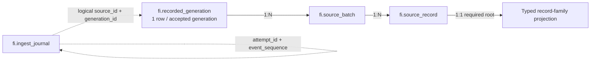

`fi.ingest_journal` intentionally has no foreign key to `fi.recorded_generation`; attempt state must be recordable even when validation or insertion fails before an authoritative generation row exists.

### 4.3 NTFS identity and FileObservation projection

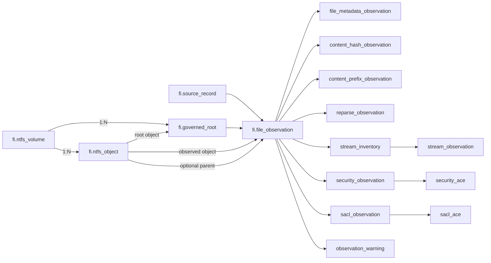

### 4.4 Identity, principal, and SMB source families

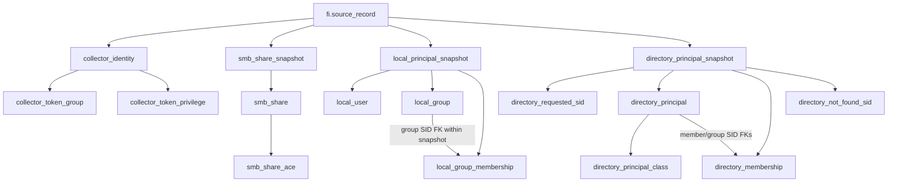

### 4.5 Windows Security and USN

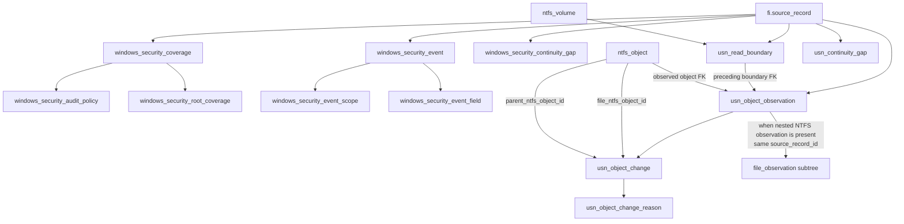

## 5. Decision flows

### 5.1 Operational receipt/database reconciliation

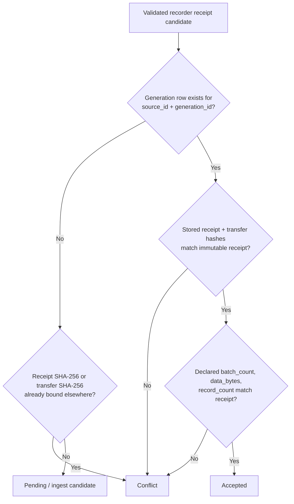

The steady-state path is deliberately cheap: it compares a bounded candidate set against generation identity/hashes/totals. It does **not** recount every child row and projection on every poll.

### 5.2 Deep reconciliation

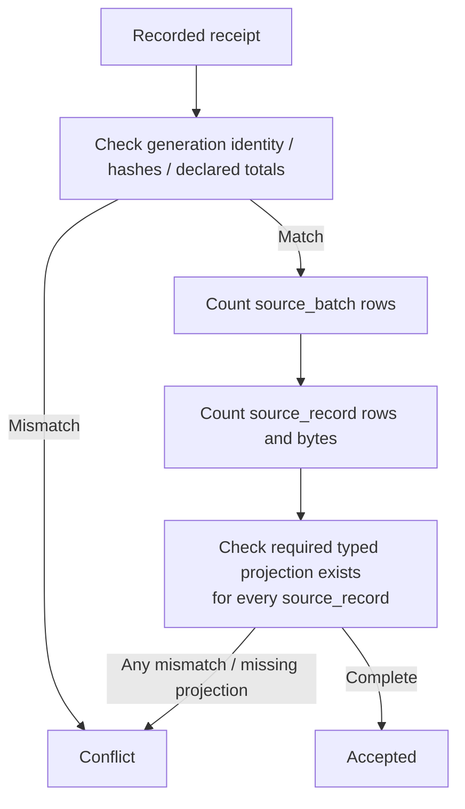

Deep reconciliation is the **separate explicit audit path** implemented by `PlanRecordedGenerations()`. It recounts authoritative child rows and typed-projection coverage. The permanent worker does **not** run this deep path on its adaptive cadence. Worker startup and adaptive repair instead enumerate the authoritative receipt set and call `PlanRecordedGenerationsForIngest()`, which performs the cheaper generation identity/hash/declared-total comparison before ingesting or classifying pending work.

### 5.3 Ingest transaction and journal semantics

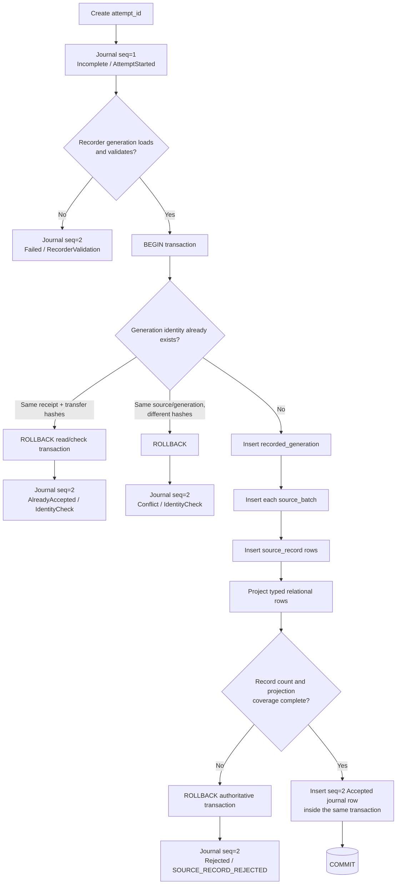

**Important transactional distinction:** the terminal `Accepted` journal event is inserted **inside the same transaction** as the accepted relational generation and projections. A rejection or failure first rolls back the authoritative transaction and then writes its terminal journal event through the connection.

### 5.4 Rejection and deferred retry

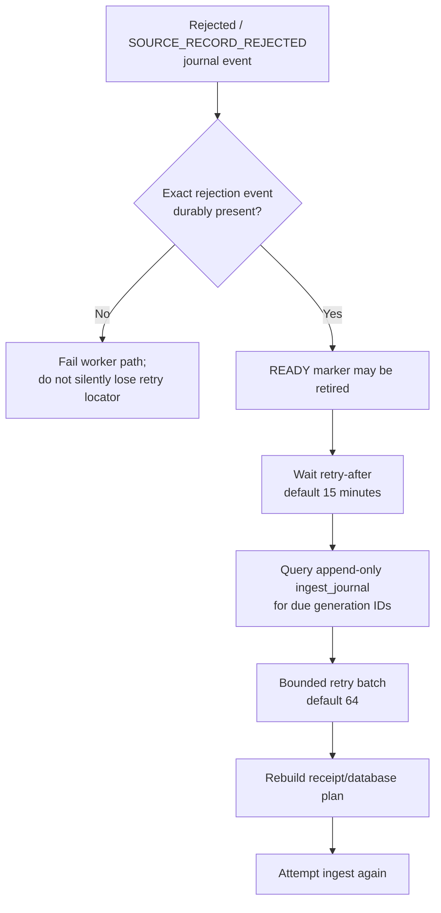

The journal—not READY—is the deferred retry scheduler/authority after a source-record rejection.

### 5.5 Adaptive authoritative receipt-set repair cadence

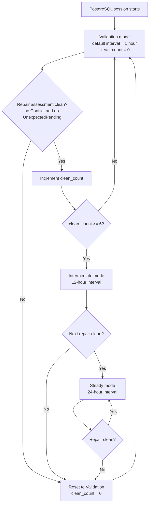

With current defaults, this implements the accepted **1-hour validation → six clean receipt-set sweeps → 12-hour intermediate → 24-hour steady** progression. Each scheduled sweep uses `PlanRecordedGenerationsForIngest()` over the authoritative recorder receipt set; it is intentionally distinct from the deeper child-row/projection audit described above. Any conflict or unexpected pending authority resets the cadence to 1-hour validation.

### 5.6 Source-record projector dispatch

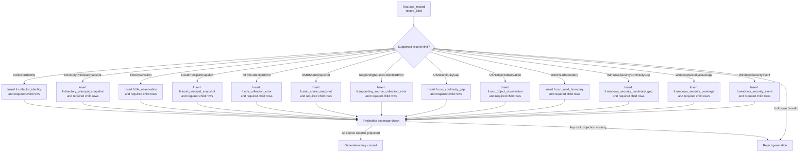

## 6. Table inventory by domain

### Authoritative ingest lineage

| Table | Purpose |
|---|---|
| `fi.recorded_generation` | One authoritative relational row per immutable recorder generation receipt; binds source/generation identity, declared totals, hashes, sizes, and ingest version. |
| `fi.source_batch` | Batch-level lineage and manifest/data artifact facts belonging to a recorded generation. |
| `fi.source_record` | Canonical lineage row for each source record in a batch; every supported record kind must have its typed relational projection. |
| `fi.ingest_journal` | Append-only attempt journal. Records attempt start and terminal outcome without mutating prior history; also serves as deferred rejection retry-state authority. |

### NTFS identity and governed scope

| Table | Purpose |
|---|---|
| `fi.ntfs_volume` | Volume-scoped NTFS identity for a source, keyed by volume GUID and serial number. |
| `fi.ntfs_object` | Stable NTFS object identity within a volume using file reference number plus sequence number; path is deliberately excluded from identity. |
| `fi.governed_root` | Resolved governed collection root binding source/scope to a volume and NTFS object, preserving requested and resolved UTF-16LE paths. |

### File observation projection

| Table | Purpose |
|---|---|
| `fi.file_observation` | Typed FileObservation root. Binds a source record to governed scope, NTFS object identity, parent state, path bytes, collection methods, and observation status. |
| `fi.file_metadata_observation` | NTFS file size, timestamp, attribute, and link-count facts for a file observation. |
| `fi.content_hash_observation` | Hash observation state and MD5/SHA-1/SHA-256 values or an explicit error/not-applicable state. |
| `fi.content_prefix_observation` | Up-to-16-byte content-prefix observation with explicit present/error/not-applicable shape. |
| `fi.reparse_observation` | Reparse-point state and raw/decoded reparse metadata associated with a file observation. |
| `fi.stream_inventory` | Alternate-data-stream inventory state for a file observation. |
| `fi.stream_observation` | Per-stream typed entry under a stream inventory, including raw name bytes and logical/allocated sizes. |
| `fi.security_observation` | File security descriptor/DACL projection with raw descriptor and decoded ownership/ACL metadata. |
| `fi.security_ace` | Ordered DACL ACE rows for a file security observation. |
| `fi.sacl_observation` | File SACL projection with raw descriptor and decoded ACL metadata. |
| `fi.sacl_ace` | Ordered SACL ACE rows for a file SACL observation. |
| `fi.observation_warning` | Ordered non-fatal warning records emitted with a file observation. |

### Collector runtime identity

| Table | Purpose |
|---|---|
| `fi.collector_identity` | Collector host/token identity snapshot: computer names, token user, token type, elevation type, and elevated state. |
| `fi.collector_token_group` | Ordered token group membership/attribute rows for a collector identity snapshot. |
| `fi.collector_token_privilege` | Ordered token privilege/LUID/attribute rows for a collector identity snapshot. |

### SMB share state

| Table | Purpose |
|---|---|
| `fi.smb_share_snapshot` | Root projection for one SMB share snapshot source record. |
| `fi.smb_share` | Per-share state including raw/display names, share type/use values, local path, and share security descriptor/DACL metadata. |
| `fi.smb_share_ace` | Ordered DACL ACE rows attached to an SMB share. |

### Local principal state

| Table | Purpose |
|---|---|
| `fi.local_principal_snapshot` | Root projection for one local user/group snapshot on a computer. |
| `fi.local_user` | Per-user local account facts with SID/raw SID, display/raw name fields, account flags, disabled and locked states. |
| `fi.local_group` | Per-group local account facts plus explicit membership completeness/error state. |
| `fi.local_group_membership` | Ordered local group membership edges, preserving member SID identity and SID-name-use information. |

### Directory principal state

| Table | Purpose |
|---|---|
| `fi.directory_principal_snapshot` | Root projection for directory-principal lookup state, including domain/server/naming-context authority. |
| `fi.directory_requested_sid` | Ordered set of SIDs requested for resolution in a directory snapshot. |
| `fi.directory_principal` | Resolved directory principal facts including SID, GUID, DN, SAM/UPN, UAC and primary-group information. |
| `fi.directory_principal_class` | Ordered objectClass values associated with a resolved directory principal. |
| `fi.directory_membership` | Directory member-to-group SID edges for principals present in the same snapshot. |
| `fi.directory_not_found_sid` | Requested directory SIDs that were not resolved. |

### Windows Security state and events

| Table | Purpose |
|---|---|
| `fi.windows_security_coverage` | Host Security-log/audit coverage snapshot and overall Ready/Partial state. |
| `fi.windows_security_audit_policy` | Per-policy-kind Windows audit subcategory state for the coverage snapshot. |
| `fi.windows_security_root_coverage` | Per-governed-root SACL/audit coverage state and recommended audit presence flags. |
| `fi.windows_security_event` | Typed Windows Security event projection with core event identity, subject/object/process/share/network fields and raw XML integrity metadata. |
| `fi.windows_security_event_scope` | One-to-many governed scopes matched to a Windows Security event. |
| `fi.windows_security_event_field` | Ordered source event name/value fields retained with a Windows Security event. |
| `fi.windows_security_continuity_gap` | Explicit Security-log continuity-loss record with checkpoint/current record bounds and required baseline action. |

### Explicit collection failures

| Table | Purpose |
|---|---|
| `fi.ntfs_collection_error` | Typed source-record projection for an NTFS collection failure at a path. |
| `fi.supporting_source_collection_error` | Typed source-record projection for a supporting-source collection failure. |

### USN journal state and changes

| Table | Purpose |
|---|---|
| `fi.usn_read_boundary` | USN journal read boundary and selection accounting for a volume, including operation IDs and start/next USN. |
| `fi.usn_object_observation` | USN object re-observation root bound to the preceding USNReadBoundary and a volume-qualified ntfs_object; may also project a fresh NTFS file-observation subtree using the same source_record_id. |
| `fi.usn_object_change` | Ordered USN change rows for an object observation; both file and parent identities reference volume-qualified ntfs_object rows after migration 0003. |
| `fi.usn_object_change_reason` | Ordered decoded reason names for one USN object change. |
| `fi.usn_continuity_gap` | Explicit USN journal continuity-loss state with checkpoint/current journal bounds and required current-state baseline plus catch-up action. |

## 7. Complete column dictionary

The SQL definition shown for each column is taken from the effective Phase 3 DDL. For the two USN tables changed by migration `0003`, the dictionary shows the **post-0003 effective columns**, not the superseded pre-migration FRN/sequence columns.

### 7.1 Authoritative ingest lineage

<details>
<summary><code>fi.recorded_generation</code> — One authoritative relational row per immutable recorder generation receipt; binds source/generation identity, declared totals, hashes, sizes, and ingest version.</summary>

**DDL source:** `0001_relational.sql`\

**Columns:** 24\

**Secondary indexes:** 0

| Column | Type | Null? | Key / reference | Rules / default |
|---|---|---:|---|---|
| `recorded_generation_id` | `bigint` | No | PK | `GENERATED ALWAYS AS IDENTITY` |
| `receipt_version` | `text` | No | — | `NOT NULL` |
| `descriptor_version` | `text` | No | — | `NOT NULL` |
| `source_id` | `text` | No | UQ(source_id, generation_id) | `NOT NULL` |
| `generation_id` | `text` | No | UQ(source_id, generation_id) | `NOT NULL` |
| `canonical_version` | `text` | No | — | `NOT NULL` |
| `data_encoding` | `text` | No | — | `NOT NULL` |
| `artifact_count` | `bigint` | No | — | `NOT NULL CHECK (artifact_count > 0)` |
| `source_bytes` | `bigint` | No | — | `NOT NULL CHECK (source_bytes >= 0)` |
| `canonical_bytes` | `bigint` | No | — | `NOT NULL CHECK (canonical_bytes > 0)` |
| `canonical_sha256` | `bytea` | No | — | `NOT NULL CHECK (octet_length(canonical_sha256) = 32)` |
| `encoded_data_bytes` | `bigint` | No | — | `NOT NULL CHECK (encoded_data_bytes > 0)` |
| `encoded_data_sha256` | `bytea` | No | — | `NOT NULL CHECK (octet_length(encoded_data_sha256) = 32)` |
| `metadata_bytes` | `bigint` | No | — | `NOT NULL CHECK (metadata_bytes > 0)` |
| `metadata_sha256` | `bytea` | No | — | `NOT NULL CHECK (octet_length(metadata_sha256) = 32)` |
| `transfer_bytes` | `bigint` | No | — | `NOT NULL CHECK (transfer_bytes > 0)` |
| `transfer_sha256` | `bytea` | No | UQ(transfer_sha256) | `NOT NULL CHECK (octet_length(transfer_sha256) = 32)` |
| `batch_count` | `bigint` | No | — | `NOT NULL CHECK (batch_count > 0)` |
| `data_bytes` | `bigint` | No | — | `NOT NULL CHECK (data_bytes > 0)` |
| `record_count` | `bigint` | No | — | `NOT NULL CHECK (record_count > 0)` |
| `receipt_bytes` | `bigint` | No | — | `NOT NULL CHECK (receipt_bytes > 0)` |
| `receipt_sha256` | `bytea` | No | UQ(receipt_sha256) | `NOT NULL CHECK (octet_length(receipt_sha256) = 32)` |
| `ingested_at` | `timestamptz` | No | — | `NOT NULL DEFAULT clock_timestamp()` |
| `ingest_version` | `text` | No | — | `NOT NULL` |

**Table constraints**
- `CONSTRAINT recorded_generation_source_generation_uq UNIQUE (source_id, generation_id)`
- `CONSTRAINT recorded_generation_transfer_sha256_uq UNIQUE (transfer_sha256)`
- `CONSTRAINT recorded_generation_receipt_sha256_uq UNIQUE (receipt_sha256)`

</details>

<details>
<summary><code>fi.source_batch</code> — Batch-level lineage and manifest/data artifact facts belonging to a recorded generation.</summary>

**DDL source:** `0001_relational.sql`\

**Columns:** 18\

**Secondary indexes:** 0

| Column | Type | Null? | Key / reference | Rules / default |
|---|---|---:|---|---|
| `source_batch_id` | `bigint` | No | PK | `GENERATED ALWAYS AS IDENTITY` |
| `recorded_generation_id` | `bigint` | No | UQ(recorded_generation_id, batch_id), UQ(recorded_generation_id, manifest_artifact_name), UQ(recorded_generation_id, data_artifact_name), FK → fi.recorded_generation.recorded_generation_id | `NOT NULL` |
| `manifest_artifact_name` | `text` | No | UQ(recorded_generation_id, manifest_artifact_name) | `NOT NULL` |
| `data_artifact_name` | `text` | No | UQ(recorded_generation_id, data_artifact_name) | `NOT NULL` |
| `manifest_version` | `text` | No | — | `NOT NULL` |
| `batch_id` | `text` | No | UQ(recorded_generation_id, batch_id) | `NOT NULL` |
| `target_batch_size` | `integer` | No | — | `NOT NULL CHECK (target_batch_size > 0)` |
| `record_count` | `bigint` | No | — | `NOT NULL CHECK (record_count > 0)` |
| `data_bytes` | `bigint` | No | — | `NOT NULL CHECK (data_bytes > 0)` |
| `data_sha256` | `bytea` | No | — | `NOT NULL CHECK (octet_length(data_sha256) = 32)` |
| `data_file` | `text` | No | — | `NOT NULL` |
| `collector_executable_path` | `text` | No | — | `NOT NULL` |
| `collector_executable_sha256` | `bytea` | No | — | `NOT NULL CHECK (octet_length(collector_executable_sha256) = 32)` |
| `created_at` | `timestamptz` | No | — | `NOT NULL` |
| `completed_at` | `timestamptz` | No | — | `NOT NULL` |
| `manifest_bytes` | `bigint` | No | — | `NOT NULL CHECK (manifest_bytes > 0)` |
| `manifest_sha256` | `bytea` | No | — | `NOT NULL CHECK (octet_length(manifest_sha256) = 32)` |
| `ingested_at` | `timestamptz` | No | — | `NOT NULL DEFAULT clock_timestamp()` |

**Table constraints**
- `CONSTRAINT source_batch_generation_batch_uq UNIQUE (recorded_generation_id, batch_id)`
- `CONSTRAINT source_batch_generation_manifest_artifact_uq UNIQUE (recorded_generation_id, manifest_artifact_name)`
- `CONSTRAINT source_batch_generation_data_artifact_uq UNIQUE (recorded_generation_id, data_artifact_name)`

</details>

<details>
<summary><code>fi.source_record</code> — Canonical lineage row for each source record in a batch; every supported record kind must have its typed relational projection.</summary>

**DDL source:** `0001_relational.sql`\

**Columns:** 11\

**Secondary indexes:** 2

| Column | Type | Null? | Key / reference | Rules / default |
|---|---|---:|---|---|
| `source_record_id` | `bigint` | No | PK | `GENERATED ALWAYS AS IDENTITY` |
| `source_batch_id` | `bigint` | No | UQ(source_batch_id, record_ordinal), FK → fi.source_batch.source_batch_id | `NOT NULL` |
| `record_ordinal` | `bigint` | No | UQ(source_batch_id, record_ordinal) | `NOT NULL CHECK (record_ordinal > 0)` |
| `version` | `text` | No | — | `NOT NULL` |
| `record_kind` | `text` | No | — | `NOT NULL` |
| `scope_id` | `text` | No | — | `NOT NULL` |
| `written_at` | `timestamptz` | No | — | `NOT NULL` |
| `record_bytes` | `integer` | No | — | `NOT NULL CHECK (record_bytes > 0)` |
| `record_sha256` | `bytea` | No | — | `NOT NULL CHECK (octet_length(record_sha256) = 32)` |
| `ingested_at` | `timestamptz` | No | — | `NOT NULL DEFAULT clock_timestamp()` |
| `ingest_version` | `text` | No | — | `NOT NULL` |

**Table constraints**
- `CONSTRAINT source_record_batch_ordinal_uq UNIQUE (source_batch_id, record_ordinal)`

**Secondary indexes**
- `source_record_kind_time_idx` on `(record_kind, written_at)`
- `source_record_scope_time_idx` on `(scope_id, written_at)`

</details>

<details>
<summary><code>fi.ingest_journal</code> — Append-only attempt journal. Records attempt start and terminal outcome without mutating prior history; also serves as deferred rejection retry-state authority.</summary>

**DDL source:** `0001_relational.sql`\

**Columns:** 14\

**Secondary indexes:** 3

| Column | Type | Null? | Key / reference | Rules / default |
|---|---|---:|---|---|
| `ingest_journal_id` | `bigint` | No | PK | `GENERATED ALWAYS AS IDENTITY` |
| `attempt_id` | `text` | No | UQ(attempt_id, event_sequence) | `NOT NULL` |
| `event_sequence` | `integer` | No | UQ(attempt_id, event_sequence) | `NOT NULL CHECK (event_sequence > 0)` |
| `occurred_at` | `timestamptz` | No | — | `NOT NULL DEFAULT clock_timestamp()` |
| `source_id` | `text` | Yes | — | `—` |
| `generation_id` | `text` | Yes | — | `—` |
| `transfer_sha256` | `bytea` | Yes | — | `CHECK (transfer_sha256 IS NULL OR octet_length(transfer_sha256) = 32)` |
| `outcome` | `text` | No | — | `NOT NULL CHECK (outcome IN ('Accepted','AlreadyAccepted','Rejected','Failed','Incomplete','Conflict'))` |
| `stage` | `text` | No | — | `NOT NULL` |
| `reason_code` | `text` | Yes | — | `—` |
| `detail` | `text` | Yes | — | `—` |
| `records_seen` | `bigint` | Yes | — | `CHECK (records_seen IS NULL OR records_seen >= 0)` |
| `records_committed` | `bigint` | Yes | — | `CHECK (records_committed IS NULL OR records_committed >= 0)` |
| `ingest_version` | `text` | No | — | `NOT NULL` |

**Table constraints**
- `CONSTRAINT ingest_journal_attempt_event_uq UNIQUE (attempt_id, event_sequence)`

**Secondary indexes**
- `ingest_journal_attempt_idx` on `(attempt_id, event_sequence)`
- `ingest_journal_source_generation_idx` on `(source_id, generation_id)`
- `ingest_journal_occurred_at_idx` on `(occurred_at)`

</details>


### 7.2 NTFS identity and governed scope

<details>
<summary><code>fi.ntfs_volume</code> — Volume-scoped NTFS identity for a source, keyed by volume GUID and serial number.</summary>

**DDL source:** `0001_relational.sql`\

**Columns:** 5\

**Secondary indexes:** 0

| Column | Type | Null? | Key / reference | Rules / default |
|---|---|---:|---|---|
| `ntfs_volume_id` | `bigint` | No | PK | `GENERATED ALWAYS AS IDENTITY` |
| `source_id` | `text` | No | UQ(source_id, volume_guid, volume_serial) | `NOT NULL` |
| `identity_method_version` | `text` | No | — | `NOT NULL` |
| `volume_guid` | `text` | No | UQ(source_id, volume_guid, volume_serial) | `NOT NULL` |
| `volume_serial` | `numeric` | No | UQ(source_id, volume_guid, volume_serial) | `(20,0) NOT NULL CHECK (volume_serial >= 0)` |

**Table constraints**
- `CONSTRAINT ntfs_volume_identity_uq UNIQUE (source_id, volume_guid, volume_serial)`

</details>

<details>
<summary><code>fi.ntfs_object</code> — Stable NTFS object identity within a volume using file reference number plus sequence number; path is deliberately excluded from identity.</summary>

**DDL source:** `0001_relational.sql`\

**Columns:** 5\

**Secondary indexes:** 1

| Column | Type | Null? | Key / reference | Rules / default |
|---|---|---:|---|---|
| `ntfs_object_id` | `bigint` | No | PK | `GENERATED ALWAYS AS IDENTITY` |
| `ntfs_volume_id` | `bigint` | No | UQ(ntfs_volume_id, file_reference_number, sequence_number), FK → fi.ntfs_volume.ntfs_volume_id | `NOT NULL` |
| `identity_method_version` | `text` | No | — | `NOT NULL` |
| `file_reference_number` | `numeric` | No | UQ(ntfs_volume_id, file_reference_number, sequence_number) | `(20,0) NOT NULL CHECK (file_reference_number >= 0)` |
| `sequence_number` | `numeric` | No | UQ(ntfs_volume_id, file_reference_number, sequence_number) | `(20,0) NOT NULL CHECK (sequence_number >= 0)` |

**Table constraints**
- `CONSTRAINT ntfs_object_identity_uq UNIQUE (ntfs_volume_id, file_reference_number, sequence_number)`

**Secondary indexes**
- `ntfs_object_frn_idx` on `(ntfs_volume_id, file_reference_number)`

</details>

<details>
<summary><code>fi.governed_root</code> — Resolved governed collection root binding source/scope to a volume and NTFS object, preserving requested and resolved UTF-16LE paths.</summary>

**DDL source:** `0001_relational.sql`\

**Columns:** 8\

**Secondary indexes:** 1

| Column | Type | Null? | Key / reference | Rules / default |
|---|---|---:|---|---|
| `governed_root_id` | `bigint` | No | PK | `GENERATED ALWAYS AS IDENTITY` |
| `source_id` | `text` | No | UQ(source_id, scope_id, ntfs_volume_id, ntfs_object_id, requested_path_utf16le, resolved_path_utf16le) | `NOT NULL` |
| `scope_id` | `text` | No | UQ(source_id, scope_id, ntfs_volume_id, ntfs_object_id, requested_path_utf16le, resolved_path_utf16le) | `NOT NULL` |
| `containment_method_version` | `text` | No | — | `NOT NULL` |
| `ntfs_volume_id` | `bigint` | No | UQ(source_id, scope_id, ntfs_volume_id, ntfs_object_id, requested_path_utf16le, resolved_path_utf16le), FK → fi.ntfs_volume.ntfs_volume_id | `NOT NULL` |
| `ntfs_object_id` | `bigint` | No | UQ(source_id, scope_id, ntfs_volume_id, ntfs_object_id, requested_path_utf16le, resolved_path_utf16le), FK → fi.ntfs_object.ntfs_object_id | `NOT NULL` |
| `requested_path_utf16le` | `bytea` | No | UQ(source_id, scope_id, ntfs_volume_id, ntfs_object_id, requested_path_utf16le, resolved_path_utf16le) | `NOT NULL` |
| `resolved_path_utf16le` | `bytea` | No | UQ(source_id, scope_id, ntfs_volume_id, ntfs_object_id, requested_path_utf16le, resolved_path_utf16le) | `NOT NULL` |

**Table constraints**
- `CONSTRAINT governed_root_identity_uq UNIQUE ( source_id, scope_id, ntfs_volume_id, ntfs_object_id, requested_path_utf16le, resolved_path_utf16le )`

**Secondary indexes**
- `governed_root_scope_idx` on `(source_id, scope_id)`

</details>


### 7.3 File observation projection

<details>
<summary><code>fi.file_observation</code> — Typed FileObservation root. Binds a source record to governed scope, NTFS object identity, parent state, path bytes, collection methods, and observation status.</summary>

**DDL source:** `0001_relational.sql`\

**Columns:** 14\

**Secondary indexes:** 2

| Column | Type | Null? | Key / reference | Rules / default |
|---|---|---:|---|---|
| `source_record_id` | `bigint` | No | PK, FK → fi.source_record.source_record_id | `—` |
| `governed_root_id` | `bigint` | No | FK → fi.governed_root.governed_root_id | `NOT NULL` |
| `ntfs_object_id` | `bigint` | No | FK → fi.ntfs_object.ntfs_object_id | `NOT NULL` |
| `parent_state` | `text` | No | — | `NOT NULL CHECK (parent_state IN ('Error','GovernedRoot','Present'))` |
| `parent_ntfs_object_id` | `bigint` | Yes | FK → fi.ntfs_object.ntfs_object_id | `REFERENCES fi.ntfs_object(ntfs_object_id)` |
| `parent_reason_code` | `text` | Yes | — | `—` |
| `subject_kind` | `text` | No | — | `NOT NULL` |
| `requested_path_utf16le` | `bytea` | No | — | `NOT NULL` |
| `resolved_path_utf16le` | `bytea` | No | — | `NOT NULL` |
| `observed_at` | `timestamptz` | No | — | `NOT NULL` |
| `containment_method_version` | `text` | No | — | `NOT NULL` |
| `collection_entry_method` | `text` | No | — | `NOT NULL` |
| `collection_method` | `text` | No | — | `NOT NULL` |
| `observation_status` | `text` | No | — | `NOT NULL` |

**`collection_method` semantic contract**
- PostgreSQL stores `fi.file_observation.collection_method` as `text NOT NULL`; the SQL schema intentionally does not duplicate the Go semantic enum with a database `CHECK`.
- Current NTFS source values accepted by `ntfs.ValidateObservation()` are `DirectWindowsNTFS` and `BackupAuthorityWindowsNTFS`.
- `BackupAuthorityWindowsNTFS` means that specific observation was obtained through the bounded `FIObjReader` backup-authority path after the normal collector's initial exact `OpenFileById` returned Access Denied. It is observation provenance, not permanent NTFS-object state.
- Unknown collection-method values fail closed in the strict receiver validator before the source generation is transactionally accepted. During the 2026-09-25 version-skew characterization, the older worker rejected `BackupAuthorityWindowsNTFS` with `SOURCE_RECORD_REJECTED` and committed 0 records; durable generation/retry state retained the generation, and the compatible worker later accepted the same generation with 20 records seen and 20 committed.
- A producer change that adds an enum-like semantic value must add downstream validator/regression coverage and use rollout ordering that preserves receiver compatibility.

**Table constraints**
- `CONSTRAINT file_observation_parent_shape_ck CHECK ( (parent_state = 'Present' AND parent_ntfs_object_id IS NOT NULL AND parent_reason_code IS NULL) OR (parent_state = 'GovernedRoot' AND parent_ntfs_object_id IS NULL AND parent_reason_code IS NULL) OR (parent_state = 'Error' AND parent_ntfs_object_id IS NULL AND parent_reason_code IS NOT NULL) )`

**Secondary indexes**
- `file_observation_object_time_idx` on `(ntfs_object_id, observed_at)`
- `file_observation_root_time_idx` on `(governed_root_id, observed_at)`

</details>

<details>
<summary><code>fi.file_metadata_observation</code> — NTFS file size, timestamp, attribute, and link-count facts for a file observation.</summary>

**DDL source:** `0001_relational.sql`\

**Columns:** 9\

**Secondary indexes:** 1

| Column | Type | Null? | Key / reference | Rules / default |
|---|---|---:|---|---|
| `source_record_id` | `bigint` | No | PK, FK → fi.file_observation.source_record_id | `—` |
| `logical_size` | `numeric` | No | — | `(20,0) NOT NULL CHECK (logical_size >= 0)` |
| `allocated_size` | `numeric` | No | — | `(20,0) NOT NULL CHECK (allocated_size >= 0)` |
| `creation_time` | `timestamptz` | No | — | `NOT NULL` |
| `last_write_time` | `timestamptz` | No | — | `NOT NULL` |
| `change_time` | `timestamptz` | No | — | `NOT NULL` |
| `last_access_time` | `timestamptz` | No | — | `NOT NULL` |
| `raw_attributes` | `bigint` | No | — | `NOT NULL CHECK (raw_attributes >= 0)` |
| `link_count` | `bigint` | No | — | `NOT NULL CHECK (link_count >= 0)` |

**Secondary indexes**
- `file_metadata_last_write_idx` on `(last_write_time)`

</details>

<details>
<summary><code>fi.content_hash_observation</code> — Hash observation state and MD5/SHA-1/SHA-256 values or an explicit error/not-applicable state.</summary>

**DDL source:** `0001_relational.sql`\

**Columns:** 8\

**Secondary indexes:** 2

| Column | Type | Null? | Key / reference | Rules / default |
|---|---|---:|---|---|
| `source_record_id` | `bigint` | No | PK, FK → fi.file_observation.source_record_id | `—` |
| `state` | `text` | No | — | `NOT NULL CHECK (state IN ('Error','NotApplicable','Present'))` |
| `bytes_hashed` | `numeric` | Yes | — | `(20,0) CHECK (bytes_hashed IS NULL OR bytes_hashed >= 0)` |
| `md5` | `bytea` | Yes | — | `CHECK (md5 IS NULL OR octet_length(md5) = 16)` |
| `sha1` | `bytea` | Yes | — | `CHECK (sha1 IS NULL OR octet_length(sha1) = 20)` |
| `sha256` | `bytea` | Yes | — | `CHECK (sha256 IS NULL OR octet_length(sha256) = 32)` |
| `reason_code` | `text` | Yes | — | `—` |
| `detail` | `text` | Yes | — | `—` |

**Table constraints**
- `CONSTRAINT content_hash_shape_ck CHECK ( (state = 'Present' AND bytes_hashed IS NOT NULL AND md5 IS NOT NULL AND sha1 IS NOT NULL AND sha256 IS NOT NULL AND reason_code IS NULL AND detail IS NULL) OR (state = 'Error' AND bytes_hashed IS NULL AND md5 IS NULL AND sha1 IS NULL AND sha256 IS NULL AND reason_code IS NOT NULL) OR (state = 'NotApplicable' AND bytes_hashed IS NULL AND md5 IS NULL AND sha1 IS NULL AND sha256 IS NULL AND reason_code IS NULL AND detail IS NULL) )`

**Secondary indexes**
- `content_hash_sha256_idx` on `(sha256) WHERE sha256 IS NOT NULL`
- `content_hash_md5_idx` on `(md5) WHERE md5 IS NOT NULL`

</details>

<details>
<summary><code>fi.content_prefix_observation</code> — Up-to-16-byte content-prefix observation with explicit present/error/not-applicable shape.</summary>

**DDL source:** `0001_relational.sql`\

**Columns:** 6\

**Secondary indexes:** 0

| Column | Type | Null? | Key / reference | Rules / default |
|---|---|---:|---|---|
| `source_record_id` | `bigint` | No | PK, FK → fi.file_observation.source_record_id | `—` |
| `state` | `text` | No | — | `NOT NULL CHECK (state IN ('Error','NotApplicable','Present'))` |
| `bytes_observed` | `smallint` | Yes | — | `CHECK (bytes_observed IS NULL OR (bytes_observed >= 0 AND bytes_observed <= 16))` |
| `prefix_bytes` | `bytea` | Yes | — | `CHECK (prefix_bytes IS NULL OR octet_length(prefix_bytes) <= 16)` |
| `reason_code` | `text` | Yes | — | `—` |
| `detail` | `text` | Yes | — | `—` |

**Table constraints**
- `CONSTRAINT content_prefix_shape_ck CHECK ( (state = 'Present' AND bytes_observed IS NOT NULL AND prefix_bytes IS NOT NULL AND octet_length(prefix_bytes) = bytes_observed AND reason_code IS NULL AND detail IS NULL) OR (state = 'Error' AND bytes_observed IS NULL AND prefix_bytes IS NULL AND reason_code IS NOT NULL) OR (state = 'NotApplicable' AND bytes_observed IS NULL AND prefix_bytes IS NULL AND reason_code IS NULL AND detail IS NULL) )`

</details>

<details>
<summary><code>fi.reparse_observation</code> — Reparse-point state and raw/decoded reparse metadata associated with a file observation.</summary>

**DDL source:** `0001_relational.sql`\

**Columns:** 11\

**Secondary indexes:** 0

| Column | Type | Null? | Key / reference | Rules / default |
|---|---|---:|---|---|
| `source_record_id` | `bigint` | No | PK, FK → fi.file_observation.source_record_id | `—` |
| `state` | `text` | No | — | `NOT NULL` |
| `data_state` | `text` | No | — | `NOT NULL` |
| `data_format` | `text` | No | — | `NOT NULL` |
| `tag` | `bigint` | Yes | — | `—` |
| `tag_name` | `text` | Yes | — | `—` |
| `raw_buffer` | `bytea` | Yes | — | `—` |
| `substitute_name_utf16le` | `bytea` | Yes | — | `—` |
| `print_name_utf16le` | `bytea` | Yes | — | `—` |
| `symbolic_link_flags` | `bigint` | Yes | — | `—` |
| `reason_code` | `text` | Yes | — | `—` |

</details>

<details>
<summary><code>fi.stream_inventory</code> — Alternate-data-stream inventory state for a file observation.</summary>

**DDL source:** `0001_relational.sql`\

**Columns:** 3\

**Secondary indexes:** 0

| Column | Type | Null? | Key / reference | Rules / default |
|---|---|---:|---|---|
| `source_record_id` | `bigint` | No | PK, FK → fi.file_observation.source_record_id | `—` |
| `state` | `text` | No | — | `NOT NULL` |
| `reason_code` | `text` | Yes | — | `—` |

</details>

<details>
<summary><code>fi.stream_observation</code> — Per-stream typed entry under a stream inventory, including raw name bytes and logical/allocated sizes.</summary>

**DDL source:** `0001_relational.sql`\

**Columns:** 8\

**Secondary indexes:** 0

| Column | Type | Null? | Key / reference | Rules / default |
|---|---|---:|---|---|
| `source_record_id` | `bigint` | No | PK, FK → fi.stream_inventory.source_record_id | `NOT NULL` |
| `stream_ordinal` | `integer` | No | PK | `NOT NULL CHECK (stream_ordinal > 0)` |
| `kind` | `text` | No | — | `NOT NULL` |
| `name_utf16le` | `bytea` | Yes | — | `—` |
| `stream_type` | `text` | Yes | — | `—` |
| `raw_name_utf16le` | `bytea` | No | — | `NOT NULL` |
| `logical_size` | `numeric` | No | — | `(20,0) NOT NULL CHECK (logical_size >= 0)` |
| `allocated_size` | `numeric` | No | — | `(20,0) NOT NULL CHECK (allocated_size >= 0)` |

**Table constraints**
- `PRIMARY KEY (source_record_id, stream_ordinal)`

</details>

<details>
<summary><code>fi.security_observation</code> — File security descriptor/DACL projection with raw descriptor and decoded ownership/ACL metadata.</summary>

**DDL source:** `0001_relational.sql`\

**Columns:** 12\

**Secondary indexes:** 2

| Column | Type | Null? | Key / reference | Rules / default |
|---|---|---:|---|---|
| `source_record_id` | `bigint` | No | PK, FK → fi.file_observation.source_record_id | `—` |
| `state` | `text` | No | — | `NOT NULL` |
| `data_format` | `text` | No | — | `NOT NULL` |
| `raw_descriptor` | `bytea` | Yes | — | `—` |
| `revision` | `smallint` | Yes | — | `—` |
| `control` | `integer` | Yes | — | `—` |
| `owner_sid` | `text` | Yes | — | `—` |
| `primary_group_sid` | `text` | Yes | — | `—` |
| `acl_state` | `text` | Yes | — | `—` |
| `acl_revision` | `smallint` | Yes | — | `—` |
| `acl_size` | `integer` | Yes | — | `—` |
| `reason_code` | `text` | Yes | — | `—` |

**Secondary indexes**
- `security_owner_sid_idx` on `(owner_sid) WHERE owner_sid IS NOT NULL`
- `security_group_sid_idx` on `(primary_group_sid) WHERE primary_group_sid IS NOT NULL`

</details>

<details>
<summary><code>fi.security_ace</code> — Ordered DACL ACE rows for a file security observation.</summary>

**DDL source:** `0001_relational.sql`\

**Columns:** 12\

**Secondary indexes:** 1

| Column | Type | Null? | Key / reference | Rules / default |
|---|---|---:|---|---|
| `source_record_id` | `bigint` | No | PK, FK → fi.security_observation.source_record_id | `NOT NULL` |
| `ace_ordinal` | `integer` | No | PK | `NOT NULL CHECK (ace_ordinal >= 0)` |
| `ace_type` | `integer` | No | — | `NOT NULL` |
| `type_name` | `text` | No | — | `NOT NULL` |
| `flags` | `integer` | No | — | `NOT NULL` |
| `ace_size` | `integer` | No | — | `NOT NULL CHECK (ace_size > 0)` |
| `raw_ace` | `bytea` | No | — | `NOT NULL` |
| `access_mask` | `bigint` | Yes | — | `—` |
| `object_flags` | `bigint` | Yes | — | `—` |
| `object_type_guid` | `uuid` | Yes | — | `—` |
| `inherited_object_type_guid` | `uuid` | Yes | — | `—` |
| `sid` | `text` | Yes | — | `—` |

**Table constraints**
- `PRIMARY KEY (source_record_id, ace_ordinal)`

**Secondary indexes**
- `security_ace_sid_idx` on `(sid) WHERE sid IS NOT NULL`

</details>

<details>
<summary><code>fi.sacl_observation</code> — File SACL projection with raw descriptor and decoded ACL metadata.</summary>

**DDL source:** `0001_relational.sql`\

**Columns:** 10\

**Secondary indexes:** 0

| Column | Type | Null? | Key / reference | Rules / default |
|---|---|---:|---|---|
| `source_record_id` | `bigint` | No | PK, FK → fi.file_observation.source_record_id | `—` |
| `state` | `text` | No | — | `NOT NULL` |
| `data_format` | `text` | No | — | `NOT NULL` |
| `raw_descriptor` | `bytea` | Yes | — | `—` |
| `revision` | `smallint` | Yes | — | `—` |
| `control` | `integer` | Yes | — | `—` |
| `acl_state` | `text` | Yes | — | `—` |
| `acl_revision` | `smallint` | Yes | — | `—` |
| `acl_size` | `integer` | Yes | — | `—` |
| `reason_code` | `text` | Yes | — | `—` |

</details>

<details>
<summary><code>fi.sacl_ace</code> — Ordered SACL ACE rows for a file SACL observation.</summary>

**DDL source:** `0001_relational.sql`\

**Columns:** 12\

**Secondary indexes:** 1

| Column | Type | Null? | Key / reference | Rules / default |
|---|---|---:|---|---|
| `source_record_id` | `bigint` | No | PK, FK → fi.sacl_observation.source_record_id | `NOT NULL` |
| `ace_ordinal` | `integer` | No | PK | `NOT NULL CHECK (ace_ordinal >= 0)` |
| `ace_type` | `integer` | No | — | `NOT NULL` |
| `type_name` | `text` | No | — | `NOT NULL` |
| `flags` | `integer` | No | — | `NOT NULL` |
| `ace_size` | `integer` | No | — | `NOT NULL CHECK (ace_size > 0)` |
| `raw_ace` | `bytea` | No | — | `NOT NULL` |
| `access_mask` | `bigint` | Yes | — | `—` |
| `object_flags` | `bigint` | Yes | — | `—` |
| `object_type_guid` | `uuid` | Yes | — | `—` |
| `inherited_object_type_guid` | `uuid` | Yes | — | `—` |
| `sid` | `text` | Yes | — | `—` |

**Table constraints**
- `PRIMARY KEY (source_record_id, ace_ordinal)`

**Secondary indexes**
- `sacl_ace_sid_idx` on `(sid) WHERE sid IS NOT NULL`

</details>

<details>
<summary><code>fi.observation_warning</code> — Ordered non-fatal warning records emitted with a file observation.</summary>

**DDL source:** `0001_relational.sql`\

**Columns:** 4\

**Secondary indexes:** 0

| Column | Type | Null? | Key / reference | Rules / default |
|---|---|---:|---|---|
| `source_record_id` | `bigint` | No | PK, FK → fi.file_observation.source_record_id | `NOT NULL` |
| `warning_ordinal` | `integer` | No | PK | `NOT NULL CHECK (warning_ordinal > 0)` |
| `code` | `text` | No | — | `NOT NULL` |
| `detail` | `text` | Yes | — | `—` |

**Table constraints**
- `PRIMARY KEY (source_record_id, warning_ordinal)`

</details>


### 7.4 Collector runtime identity

<details>
<summary><code>fi.collector_identity</code> — Collector host/token identity snapshot: computer names, token user, token type, elevation type, and elevated state.</summary>

**DDL source:** `0002_source_families.sql`\

**Columns:** 17\

**Secondary indexes:** 2

| Column | Type | Null? | Key / reference | Rules / default |
|---|---|---:|---|---|
| `source_record_id` | `bigint` | No | PK, FK → fi.source_record.source_record_id | `—` |
| `observed_at` | `timestamptz` | No | — | `NOT NULL` |
| `collection_method` | `text` | No | — | `NOT NULL` |
| `computer_netbios_name` | `text` | No | — | `NOT NULL` |
| `computer_dns_host_name` | `text` | Yes | — | `—` |
| `computer_dns_domain` | `text` | Yes | — | `—` |
| `computer_dns_fqdn` | `text` | Yes | — | `—` |
| `token_user_sid` | `text` | No | — | `NOT NULL` |
| `token_user_account_name` | `text` | Yes | — | `—` |
| `token_user_domain_name` | `text` | Yes | — | `—` |
| `token_user_name_use_raw` | `bigint` | Yes | — | `CHECK (token_user_name_use_raw IS NULL OR token_user_name_use_raw >= 0)` |
| `token_user_name_use_name` | `text` | Yes | — | `—` |
| `token_type_raw` | `smallint` | No | — | `NOT NULL CHECK (token_type_raw IN (1,2))` |
| `token_type_name` | `text` | No | — | `NOT NULL CHECK (token_type_name IN ('Primary','Impersonation'))` |
| `elevation_type_raw` | `smallint` | No | — | `NOT NULL CHECK (elevation_type_raw IN (1,2,3))` |
| `elevation_type_name` | `text` | No | — | `NOT NULL CHECK (elevation_type_name IN ('Default','Full','Limited'))` |
| `elevated` | `boolean` | No | — | `NOT NULL` |

**Secondary indexes**
- `collector_identity_computer_idx` on `(computer_netbios_name, observed_at)`
- `collector_identity_user_sid_idx` on `(token_user_sid, observed_at)`

</details>

<details>
<summary><code>fi.collector_token_group</code> — Ordered token group membership/attribute rows for a collector identity snapshot.</summary>

**DDL source:** `0002_source_families.sql`\

**Columns:** 17\

**Secondary indexes:** 1

| Column | Type | Null? | Key / reference | Rules / default |
|---|---|---:|---|---|
| `source_record_id` | `bigint` | No | PK, FK → fi.collector_identity.source_record_id | `NOT NULL` |
| `group_ordinal` | `integer` | No | PK | `NOT NULL CHECK (group_ordinal >= 0)` |
| `principal_sid` | `text` | No | — | `NOT NULL` |
| `account_name` | `text` | Yes | — | `—` |
| `domain_name` | `text` | Yes | — | `—` |
| `name_use_raw` | `bigint` | Yes | — | `CHECK (name_use_raw IS NULL OR name_use_raw >= 0)` |
| `name_use_name` | `text` | Yes | — | `—` |
| `attributes_raw` | `bigint` | No | — | `NOT NULL CHECK (attributes_raw >= 0)` |
| `mandatory` | `boolean` | No | — | `NOT NULL` |
| `enabled_by_default` | `boolean` | No | — | `NOT NULL` |
| `enabled` | `boolean` | No | — | `NOT NULL` |
| `owner` | `boolean` | No | — | `NOT NULL` |
| `deny_only` | `boolean` | No | — | `NOT NULL` |
| `integrity` | `boolean` | No | — | `NOT NULL` |
| `integrity_enabled` | `boolean` | No | — | `NOT NULL` |
| `logon_id` | `boolean` | No | — | `NOT NULL` |
| `resource` | `boolean` | No | — | `NOT NULL` |

**Table constraints**
- `PRIMARY KEY (source_record_id, group_ordinal)`

**Secondary indexes**
- `collector_token_group_sid_idx` on `(principal_sid)`

</details>

<details>
<summary><code>fi.collector_token_privilege</code> — Ordered token privilege/LUID/attribute rows for a collector identity snapshot.</summary>

**DDL source:** `0002_source_families.sql`\

**Columns:** 10\

**Secondary indexes:** 1

| Column | Type | Null? | Key / reference | Rules / default |
|---|---|---:|---|---|
| `source_record_id` | `bigint` | No | PK, FK → fi.collector_identity.source_record_id | `NOT NULL` |
| `privilege_ordinal` | `integer` | No | PK | `NOT NULL CHECK (privilege_ordinal >= 0)` |
| `luid_low` | `bigint` | No | — | `NOT NULL CHECK (luid_low BETWEEN 0 AND 4294967295)` |
| `luid_high` | `integer` | No | — | `NOT NULL` |
| `name` | `text` | Yes | — | `—` |
| `attributes_raw` | `bigint` | No | — | `NOT NULL CHECK (attributes_raw BETWEEN 0 AND 4294967295)` |
| `enabled_by_default` | `boolean` | No | — | `NOT NULL` |
| `enabled` | `boolean` | No | — | `NOT NULL` |
| `removed` | `boolean` | No | — | `NOT NULL` |
| `used_for_access` | `boolean` | No | — | `NOT NULL` |

**Table constraints**
- `PRIMARY KEY (source_record_id, privilege_ordinal)`

**Secondary indexes**
- `collector_token_privilege_name_idx` on `(name) WHERE name IS NOT NULL`

</details>


### 7.5 SMB share state

<details>
<summary><code>fi.smb_share_snapshot</code> — Root projection for one SMB share snapshot source record.</summary>

**DDL source:** `0002_source_families.sql`\

**Columns:** 3\

**Secondary indexes:** 0

| Column | Type | Null? | Key / reference | Rules / default |
|---|---|---:|---|---|
| `source_record_id` | `bigint` | No | PK, FK → fi.source_record.source_record_id | `—` |
| `observed_at` | `timestamptz` | No | — | `NOT NULL` |
| `collection_method` | `text` | No | — | `NOT NULL` |

</details>

<details>
<summary><code>fi.smb_share</code> — Per-share state including raw/display names, share type/use values, local path, and share security descriptor/DACL metadata.</summary>

**DDL source:** `0002_source_families.sql`\

**Columns:** 26\

**Secondary indexes:** 3

| Column | Type | Null? | Key / reference | Rules / default |
|---|---|---:|---|---|
| `source_record_id` | `bigint` | No | PK, UQ(source_record_id, name_utf16le), FK → fi.smb_share_snapshot.source_record_id | `NOT NULL` |
| `share_ordinal` | `integer` | No | PK | `NOT NULL CHECK (share_ordinal > 0)` |
| `name_display` | `text` | No | — | `NOT NULL` |
| `name_utf16le` | `bytea` | No | UQ(source_record_id, name_utf16le) | `NOT NULL` |
| `type_raw` | `bigint` | No | — | `NOT NULL CHECK (type_raw BETWEEN 0 AND 4294967295)` |
| `type_name` | `text` | No | — | `NOT NULL` |
| `special` | `boolean` | No | — | `NOT NULL` |
| `temporary` | `boolean` | No | — | `NOT NULL` |
| `remark_display` | `text` | Yes | — | `—` |
| `remark_utf16le` | `bytea` | Yes | — | `—` |
| `local_path_display` | `text` | Yes | — | `—` |
| `local_path_utf16le` | `bytea` | Yes | — | `—` |
| `permissions_raw` | `bigint` | No | — | `NOT NULL CHECK (permissions_raw BETWEEN 0 AND 4294967295)` |
| `max_uses_raw` | `bigint` | No | — | `NOT NULL CHECK (max_uses_raw BETWEEN 0 AND 4294967295)` |
| `current_uses` | `bigint` | No | — | `NOT NULL CHECK (current_uses BETWEEN 0 AND 4294967295)` |
| `security_state` | `text` | No | — | `NOT NULL` |
| `security_data_format` | `text` | No | — | `NOT NULL` |
| `security_raw_descriptor` | `bytea` | Yes | — | `—` |
| `security_revision` | `smallint` | Yes | — | `—` |
| `security_control` | `integer` | Yes | — | `—` |
| `security_owner_sid` | `text` | Yes | — | `—` |
| `security_primary_group_sid` | `text` | Yes | — | `—` |
| `dacl_state` | `text` | Yes | — | `—` |
| `dacl_revision` | `smallint` | Yes | — | `—` |
| `dacl_size` | `integer` | Yes | — | `—` |
| `security_reason_code` | `text` | Yes | — | `—` |

**Table constraints**
- `PRIMARY KEY (source_record_id, share_ordinal)`
- `CONSTRAINT smb_share_name_uq UNIQUE (source_record_id, name_utf16le)`

**Secondary indexes**
- `smb_share_name_display_idx` on `(name_display)`
- `smb_share_local_path_idx` on `(local_path_display) WHERE local_path_display IS NOT NULL`
- `smb_share_owner_sid_idx` on `(security_owner_sid) WHERE security_owner_sid IS NOT NULL`

</details>

<details>
<summary><code>fi.smb_share_ace</code> — Ordered DACL ACE rows attached to an SMB share.</summary>

**DDL source:** `0002_source_families.sql`\

**Columns:** 13\

**Secondary indexes:** 1

| Column | Type | Null? | Key / reference | Rules / default |
|---|---|---:|---|---|
| `source_record_id` | `bigint` | No | PK, FK → fi.smb_share.source_record_id | `NOT NULL` |
| `share_ordinal` | `integer` | No | PK, FK → fi.smb_share.share_ordinal | `NOT NULL` |
| `ace_ordinal` | `integer` | No | PK | `NOT NULL CHECK (ace_ordinal >= 0)` |
| `ace_type` | `integer` | No | — | `NOT NULL` |
| `type_name` | `text` | No | — | `NOT NULL` |
| `flags` | `integer` | No | — | `NOT NULL` |
| `ace_size` | `integer` | No | — | `NOT NULL CHECK (ace_size > 0)` |
| `raw_ace` | `bytea` | No | — | `NOT NULL` |
| `access_mask` | `bigint` | Yes | — | `—` |
| `object_flags` | `bigint` | Yes | — | `—` |
| `object_type_guid` | `uuid` | Yes | — | `—` |
| `inherited_object_type_guid` | `uuid` | Yes | — | `—` |
| `sid` | `text` | Yes | — | `—` |

**Table constraints**
- `PRIMARY KEY (source_record_id, share_ordinal, ace_ordinal)`
- `FOREIGN KEY (source_record_id, share_ordinal) REFERENCES fi.smb_share(source_record_id, share_ordinal)`

**Secondary indexes**
- `smb_share_ace_sid_idx` on `(sid) WHERE sid IS NOT NULL`

</details>


### 7.6 Local principal state

<details>
<summary><code>fi.local_principal_snapshot</code> — Root projection for one local user/group snapshot on a computer.</summary>

**DDL source:** `0002_source_families.sql`\

**Columns:** 4\

**Secondary indexes:** 0

| Column | Type | Null? | Key / reference | Rules / default |
|---|---|---:|---|---|
| `source_record_id` | `bigint` | No | PK, FK → fi.source_record.source_record_id | `—` |
| `observed_at` | `timestamptz` | No | — | `NOT NULL` |
| `collection_method` | `text` | No | — | `NOT NULL` |
| `computer_name` | `text` | No | — | `NOT NULL` |

</details>

<details>
<summary><code>fi.local_user</code> — Per-user local account facts with SID/raw SID, display/raw name fields, account flags, disabled and locked states.</summary>

**DDL source:** `0002_source_families.sql`\

**Columns:** 13\

**Secondary indexes:** 2

| Column | Type | Null? | Key / reference | Rules / default |
|---|---|---:|---|---|
| `source_record_id` | `bigint` | No | PK, UQ(source_record_id, sid), FK → fi.local_principal_snapshot.source_record_id | `NOT NULL` |
| `user_ordinal` | `integer` | No | PK | `NOT NULL CHECK (user_ordinal > 0)` |
| `sid` | `text` | No | UQ(source_record_id, sid) | `NOT NULL` |
| `sid_raw` | `bytea` | No | — | `NOT NULL` |
| `name_display` | `text` | No | — | `NOT NULL` |
| `name_utf16le` | `bytea` | No | — | `NOT NULL` |
| `full_name_display` | `text` | Yes | — | `—` |
| `full_name_utf16le` | `bytea` | Yes | — | `—` |
| `comment_display` | `text` | Yes | — | `—` |
| `comment_utf16le` | `bytea` | Yes | — | `—` |
| `flags_raw` | `bigint` | No | — | `NOT NULL CHECK (flags_raw BETWEEN 0 AND 4294967295)` |
| `account_disabled` | `boolean` | No | — | `NOT NULL` |
| `account_locked` | `boolean` | No | — | `NOT NULL` |

**Table constraints**
- `PRIMARY KEY (source_record_id, user_ordinal)`
- `CONSTRAINT local_user_sid_uq UNIQUE (source_record_id, sid)`

**Secondary indexes**
- `local_user_sid_idx` on `(sid)`
- `local_user_name_idx` on `(name_display)`

</details>

<details>
<summary><code>fi.local_group</code> — Per-group local account facts plus explicit membership completeness/error state.</summary>

**DDL source:** `0002_source_families.sql`\

**Columns:** 12\

**Secondary indexes:** 2

| Column | Type | Null? | Key / reference | Rules / default |
|---|---|---:|---|---|
| `source_record_id` | `bigint` | No | PK, UQ(source_record_id, sid), FK → fi.local_principal_snapshot.source_record_id | `NOT NULL` |
| `group_ordinal` | `integer` | No | PK | `NOT NULL CHECK (group_ordinal > 0)` |
| `sid` | `text` | No | UQ(source_record_id, sid) | `NOT NULL` |
| `sid_raw` | `bytea` | No | — | `NOT NULL` |
| `account_domain` | `text` | Yes | — | `—` |
| `name_display` | `text` | No | — | `NOT NULL` |
| `name_utf16le` | `bytea` | No | — | `NOT NULL` |
| `comment_display` | `text` | Yes | — | `—` |
| `comment_utf16le` | `bytea` | Yes | — | `—` |
| `membership_state` | `text` | No | — | `NOT NULL CHECK (membership_state IN ('Complete','Partial','Error'))` |
| `membership_reason_code` | `text` | Yes | — | `—` |
| `membership_detail` | `text` | Yes | — | `—` |

**Table constraints**
- `PRIMARY KEY (source_record_id, group_ordinal)`
- `CONSTRAINT local_group_sid_uq UNIQUE (source_record_id, sid)`
- `CONSTRAINT local_group_membership_shape_ck CHECK ( (membership_state = 'Complete' AND membership_reason_code IS NULL AND membership_detail IS NULL) OR (membership_state IN ('Partial','Error') AND membership_reason_code IS NOT NULL) )`

**Secondary indexes**
- `local_group_sid_idx` on `(sid)`
- `local_group_name_idx` on `(name_display)`

</details>

<details>
<summary><code>fi.local_group_membership</code> — Ordered local group membership edges, preserving member SID identity and SID-name-use information.</summary>

**DDL source:** `0002_source_families.sql`\

**Columns:** 9\

**Secondary indexes:** 2

| Column | Type | Null? | Key / reference | Rules / default |
|---|---|---:|---|---|
| `source_record_id` | `bigint` | No | PK, FK → fi.local_principal_snapshot.source_record_id, FK → fi.local_group.source_record_id | `NOT NULL` |
| `membership_ordinal` | `integer` | No | PK | `NOT NULL CHECK (membership_ordinal > 0)` |
| `group_sid` | `text` | No | FK → fi.local_group.sid | `NOT NULL` |
| `member_sid` | `text` | No | — | `NOT NULL` |
| `member_sid_raw` | `bytea` | No | — | `NOT NULL` |
| `member_domain_name_display` | `text` | Yes | — | `—` |
| `member_domain_name_utf16le` | `bytea` | Yes | — | `—` |
| `sid_name_use_raw` | `bigint` | No | — | `NOT NULL CHECK (sid_name_use_raw BETWEEN 0 AND 4294967295)` |
| `sid_name_use_name` | `text` | No | — | `NOT NULL` |

**Table constraints**
- `PRIMARY KEY (source_record_id, membership_ordinal)`
- `FOREIGN KEY (source_record_id, group_sid) REFERENCES fi.local_group(source_record_id, sid)`

**Secondary indexes**
- `local_group_membership_group_idx` on `(group_sid)`
- `local_group_membership_member_idx` on `(member_sid)`

</details>


### 7.7 Directory principal state

<details>
<summary><code>fi.directory_principal_snapshot</code> — Root projection for directory-principal lookup state, including domain/server/naming-context authority.</summary>

**DDL source:** `0002_source_families.sql`\

**Columns:** 6\

**Secondary indexes:** 0

| Column | Type | Null? | Key / reference | Rules / default |
|---|---|---:|---|---|
| `source_record_id` | `bigint` | No | PK, FK → fi.source_record.source_record_id | `—` |
| `observed_at` | `timestamptz` | No | — | `NOT NULL` |
| `collection_method` | `text` | No | — | `NOT NULL` |
| `domain_dns_name` | `text` | No | — | `NOT NULL` |
| `server_dns_name` | `text` | No | — | `NOT NULL` |
| `naming_context` | `text` | No | — | `NOT NULL` |

</details>

<details>
<summary><code>fi.directory_requested_sid</code> — Ordered set of SIDs requested for resolution in a directory snapshot.</summary>

**DDL source:** `0002_source_families.sql`\

**Columns:** 3\

**Secondary indexes:** 1

| Column | Type | Null? | Key / reference | Rules / default |
|---|---|---:|---|---|
| `source_record_id` | `bigint` | No | PK, UQ(source_record_id, sid), FK → fi.directory_principal_snapshot.source_record_id | `NOT NULL` |
| `sid_ordinal` | `integer` | No | PK | `NOT NULL CHECK (sid_ordinal > 0)` |
| `sid` | `text` | No | UQ(source_record_id, sid) | `NOT NULL` |

**Table constraints**
- `PRIMARY KEY (source_record_id, sid_ordinal)`
- `CONSTRAINT directory_requested_sid_uq UNIQUE (source_record_id, sid)`

**Secondary indexes**
- `directory_requested_sid_idx` on `(sid)`

</details>

<details>
<summary><code>fi.directory_principal</code> — Resolved directory principal facts including SID, GUID, DN, SAM/UPN, UAC and primary-group information.</summary>

**DDL source:** `0002_source_families.sql`\

**Columns:** 12\

**Secondary indexes:** 3

| Column | Type | Null? | Key / reference | Rules / default |
|---|---|---:|---|---|
| `source_record_id` | `bigint` | No | PK, UQ(source_record_id, sid), UQ(source_record_id, object_guid), FK → fi.directory_principal_snapshot.source_record_id | `NOT NULL` |
| `principal_ordinal` | `integer` | No | PK | `NOT NULL CHECK (principal_ordinal > 0)` |
| `sid` | `text` | No | UQ(source_record_id, sid) | `NOT NULL` |
| `sid_raw` | `bytea` | No | — | `NOT NULL` |
| `object_guid` | `uuid` | No | UQ(source_record_id, object_guid) | `NOT NULL` |
| `object_guid_raw` | `bytea` | No | — | `NOT NULL CHECK (octet_length(object_guid_raw) = 16)` |
| `distinguished_name` | `text` | No | — | `NOT NULL` |
| `sam_account_name` | `text` | Yes | — | `—` |
| `user_principal_name` | `text` | Yes | — | `—` |
| `user_account_control_raw` | `bigint` | Yes | — | `CHECK (user_account_control_raw IS NULL OR user_account_control_raw BETWEEN 0 AND 4294967295)` |
| `account_disabled` | `boolean` | Yes | — | `—` |
| `primary_group_id_raw` | `bigint` | Yes | — | `CHECK (primary_group_id_raw IS NULL OR primary_group_id_raw BETWEEN 0 AND 4294967295)` |

**Table constraints**
- `PRIMARY KEY (source_record_id, principal_ordinal)`
- `CONSTRAINT directory_principal_sid_uq UNIQUE (source_record_id, sid)`
- `CONSTRAINT directory_principal_guid_uq UNIQUE (source_record_id, object_guid)`
- `CONSTRAINT directory_uac_shape_ck CHECK ( (user_account_control_raw IS NULL AND account_disabled IS NULL) OR (user_account_control_raw IS NOT NULL AND account_disabled IS NOT NULL) )`

**Secondary indexes**
- `directory_principal_sid_idx` on `(sid)`
- `directory_principal_guid_idx` on `(object_guid)`
- `directory_principal_sam_idx` on `(sam_account_name) WHERE sam_account_name IS NOT NULL`

</details>

<details>
<summary><code>fi.directory_principal_class</code> — Ordered objectClass values associated with a resolved directory principal.</summary>

**DDL source:** `0002_source_families.sql`\

**Columns:** 4\

**Secondary indexes:** 1

| Column | Type | Null? | Key / reference | Rules / default |
|---|---|---:|---|---|
| `source_record_id` | `bigint` | No | PK, FK → fi.directory_principal.source_record_id | `NOT NULL` |
| `principal_ordinal` | `integer` | No | PK, FK → fi.directory_principal.principal_ordinal | `NOT NULL` |
| `class_ordinal` | `integer` | No | PK | `NOT NULL CHECK (class_ordinal > 0)` |
| `object_class` | `text` | No | — | `NOT NULL` |

**Table constraints**
- `PRIMARY KEY (source_record_id, principal_ordinal, class_ordinal)`
- `FOREIGN KEY (source_record_id, principal_ordinal) REFERENCES fi.directory_principal(source_record_id, principal_ordinal)`

**Secondary indexes**
- `directory_principal_class_idx` on `(object_class)`

</details>

<details>
<summary><code>fi.directory_membership</code> — Directory member-to-group SID edges for principals present in the same snapshot.</summary>

**DDL source:** `0002_source_families.sql`\

**Columns:** 5\

**Secondary indexes:** 2

| Column | Type | Null? | Key / reference | Rules / default |
|---|---|---:|---|---|
| `source_record_id` | `bigint` | No | PK, FK → fi.directory_principal_snapshot.source_record_id, FK → fi.directory_principal.source_record_id, FK → fi.directory_principal.source_record_id | `NOT NULL` |
| `membership_ordinal` | `integer` | No | PK | `NOT NULL CHECK (membership_ordinal > 0)` |
| `member_sid` | `text` | No | FK → fi.directory_principal.sid | `NOT NULL` |
| `group_sid` | `text` | No | FK → fi.directory_principal.sid | `NOT NULL` |
| `source` | `text` | No | — | `NOT NULL` |

**Table constraints**
- `PRIMARY KEY (source_record_id, membership_ordinal)`
- `FOREIGN KEY (source_record_id, member_sid) REFERENCES fi.directory_principal(source_record_id, sid)`
- `FOREIGN KEY (source_record_id, group_sid) REFERENCES fi.directory_principal(source_record_id, sid)`

**Secondary indexes**
- `directory_membership_member_idx` on `(member_sid)`
- `directory_membership_group_idx` on `(group_sid)`

</details>

<details>
<summary><code>fi.directory_not_found_sid</code> — Requested directory SIDs that were not resolved.</summary>

**DDL source:** `0002_source_families.sql`\

**Columns:** 3\

**Secondary indexes:** 1

| Column | Type | Null? | Key / reference | Rules / default |
|---|---|---:|---|---|
| `source_record_id` | `bigint` | No | PK, UQ(source_record_id, sid), FK → fi.directory_principal_snapshot.source_record_id | `NOT NULL` |
| `sid_ordinal` | `integer` | No | PK | `NOT NULL CHECK (sid_ordinal > 0)` |
| `sid` | `text` | No | UQ(source_record_id, sid) | `NOT NULL` |

**Table constraints**
- `PRIMARY KEY (source_record_id, sid_ordinal)`
- `CONSTRAINT directory_not_found_sid_uq UNIQUE (source_record_id, sid)`

**Secondary indexes**
- `directory_not_found_sid_idx` on `(sid)`

</details>


### 7.8 Windows Security state and events

<details>
<summary><code>fi.windows_security_coverage</code> — Host Security-log/audit coverage snapshot and overall Ready/Partial state.</summary>

**DDL source:** `0002_source_families.sql`\

**Columns:** 5\

**Secondary indexes:** 0

| Column | Type | Null? | Key / reference | Rules / default |
|---|---|---:|---|---|
| `source_record_id` | `bigint` | No | PK, FK → fi.source_record.source_record_id | `—` |
| `observed_at` | `timestamptz` | No | — | `NOT NULL` |
| `collection_method` | `text` | No | — | `NOT NULL` |
| `security_log_readable` | `boolean` | No | — | `NOT NULL` |
| `status` | `text` | No | — | `NOT NULL CHECK (status IN ('Ready','Partial'))` |

</details>

<details>
<summary><code>fi.windows_security_audit_policy</code> — Per-policy-kind Windows audit subcategory state for the coverage snapshot.</summary>

**DDL source:** `0002_source_families.sql`\

**Columns:** 7\

**Secondary indexes:** 1

| Column | Type | Null? | Key / reference | Rules / default |
|---|---|---:|---|---|
| `source_record_id` | `bigint` | No | PK, FK → fi.windows_security_coverage.source_record_id | `NOT NULL` |
| `policy_kind` | `text` | No | PK | `NOT NULL CHECK (policy_kind IN ('FileSystem','HandleManipulation','DetailedFileShare','AuditPolicyChange'))` |
| `subcategory_guid` | `text` | No | — | `NOT NULL` |
| `auditing_information` | `text` | No | — | `NOT NULL` |
| `success_enabled` | `boolean` | No | — | `NOT NULL` |
| `failure_enabled` | `boolean` | No | — | `NOT NULL` |
| `reason_code` | `text` | Yes | — | `—` |

**Table constraints**
- `PRIMARY KEY (source_record_id, policy_kind)`

**Secondary indexes**
- `windows_security_policy_guid_idx` on `(subcategory_guid)`

</details>

<details>
<summary><code>fi.windows_security_root_coverage</code> — Per-governed-root SACL/audit coverage state and recommended audit presence flags.</summary>

**DDL source:** `0002_source_families.sql`\

**Columns:** 8\

**Secondary indexes:** 1

| Column | Type | Null? | Key / reference | Rules / default |
|---|---|---:|---|---|
| `source_record_id` | `bigint` | No | PK, UQ(source_record_id, scope_id), FK → fi.windows_security_coverage.source_record_id | `NOT NULL` |
| `root_ordinal` | `integer` | No | PK | `NOT NULL CHECK (root_ordinal > 0)` |
| `scope_id` | `text` | No | UQ(source_record_id, scope_id) | `NOT NULL` |
| `governed_root` | `text` | No | — | `NOT NULL` |
| `sacl_state` | `text` | No | — | `NOT NULL` |
| `recommended_change_audit_present` | `boolean` | No | — | `NOT NULL` |
| `recommended_read_audit_present` | `boolean` | No | — | `NOT NULL` |
| `reason_code` | `text` | Yes | — | `—` |

**Table constraints**
- `PRIMARY KEY (source_record_id, root_ordinal)`
- `CONSTRAINT windows_security_root_scope_uq UNIQUE (source_record_id, scope_id)`

**Secondary indexes**
- `windows_security_root_scope_idx` on `(scope_id)`

</details>

<details>
<summary><code>fi.windows_security_event</code> — Typed Windows Security event projection with core event identity, subject/object/process/share/network fields and raw XML integrity metadata.</summary>

**DDL source:** `0002_source_families.sql`\

**Columns:** 40\

**Secondary indexes:** 6

| Column | Type | Null? | Key / reference | Rules / default |
|---|---|---:|---|---|
| `source_record_id` | `bigint` | No | PK, FK → fi.source_record.source_record_id | `—` |
| `observed_at` | `timestamptz` | No | — | `NOT NULL` |
| `collection_method` | `text` | No | — | `NOT NULL` |
| `channel` | `text` | No | — | `NOT NULL` |
| `provider` | `text` | No | — | `NOT NULL` |
| `event_id` | `bigint` | No | — | `NOT NULL CHECK (event_id >= 0)` |
| `version` | `text` | Yes | — | `—` |
| `event_record_id` | `numeric` | No | — | `(20,0) NOT NULL CHECK (event_record_id >= 0)` |
| `time_created` | `timestamptz` | No | — | `NOT NULL` |
| `computer` | `text` | No | — | `NOT NULL` |
| `keywords` | `text` | Yes | — | `—` |
| `audit_result` | `text` | No | — | `NOT NULL CHECK (audit_result IN ('Success','Failure','NotApplicable','Unknown'))` |
| `scope_basis` | `text` | No | — | `NOT NULL CHECK (scope_basis IN ('PathMatched','HardLinkPathMatched','SharePathMatched','UnresolvedFileDeleteIncluded','HostMonitoringChange'))` |
| `subject_user_sid` | `text` | Yes | — | `—` |
| `subject_user_name` | `text` | Yes | — | `—` |
| `subject_domain_name` | `text` | Yes | — | `—` |
| `subject_logon_id` | `text` | Yes | — | `—` |
| `object_server` | `text` | Yes | — | `—` |
| `object_type` | `text` | Yes | — | `—` |
| `object_name` | `text` | Yes | — | `—` |
| `handle_id` | `text` | Yes | — | `—` |
| `process_id` | `text` | Yes | — | `—` |
| `process_name` | `text` | Yes | — | `—` |
| `access_mask` | `text` | Yes | — | `—` |
| `access_list` | `text` | Yes | — | `—` |
| `access_reason` | `text` | Yes | — | `—` |
| `transaction_id` | `text` | Yes | — | `—` |
| `file_name` | `text` | Yes | — | `—` |
| `link_name` | `text` | Yes | — | `—` |
| `source_ip` | `text` | Yes | — | `—` |
| `source_port` | `text` | Yes | — | `—` |
| `share_name` | `text` | Yes | — | `—` |
| `share_local_path` | `text` | Yes | — | `—` |
| `relative_target_name` | `text` | Yes | — | `—` |
| `old_security_descriptor` | `text` | Yes | — | `—` |
| `new_security_descriptor` | `text` | Yes | — | `—` |
| `subcategory_guid` | `text` | Yes | — | `—` |
| `audit_policy_changes` | `text` | Yes | — | `—` |
| `raw_xml_bytes` | `integer` | No | — | `NOT NULL CHECK (raw_xml_bytes > 0)` |
| `raw_xml_sha256` | `bytea` | No | — | `NOT NULL CHECK (octet_length(raw_xml_sha256) = 32)` |

**Secondary indexes**
- `windows_security_event_record_idx` on `(computer, event_record_id)`
- `windows_security_event_time_idx` on `(time_created)`
- `windows_security_event_id_idx` on `(event_id, time_created)`
- `windows_security_event_subject_sid_idx` on `(subject_user_sid) WHERE subject_user_sid IS NOT NULL`
- `windows_security_event_process_idx` on `(process_name) WHERE process_name IS NOT NULL`
- `windows_security_event_source_ip_idx` on `(source_ip) WHERE source_ip IS NOT NULL`

</details>

<details>
<summary><code>fi.windows_security_event_scope</code> — One-to-many governed scopes matched to a Windows Security event.</summary>

**DDL source:** `0002_source_families.sql`\

**Columns:** 4\

**Secondary indexes:** 1

| Column | Type | Null? | Key / reference | Rules / default |
|---|---|---:|---|---|
| `source_record_id` | `bigint` | No | PK, UQ(source_record_id, scope_id), FK → fi.windows_security_event.source_record_id | `NOT NULL` |
| `scope_ordinal` | `integer` | No | PK | `NOT NULL CHECK (scope_ordinal > 0)` |
| `scope_id` | `text` | No | UQ(source_record_id, scope_id) | `NOT NULL` |
| `governed_root` | `text` | No | — | `NOT NULL` |

**Table constraints**
- `PRIMARY KEY (source_record_id, scope_ordinal)`
- `CONSTRAINT windows_security_event_scope_uq UNIQUE (source_record_id, scope_id)`

**Secondary indexes**
- `windows_security_event_scope_idx` on `(scope_id)`

</details>

<details>
<summary><code>fi.windows_security_event_field</code> — Ordered source event name/value fields retained with a Windows Security event.</summary>

**DDL source:** `0002_source_families.sql`\

**Columns:** 4\

**Secondary indexes:** 1

| Column | Type | Null? | Key / reference | Rules / default |
|---|---|---:|---|---|
| `source_record_id` | `bigint` | No | PK, FK → fi.windows_security_event.source_record_id | `NOT NULL` |
| `field_ordinal` | `integer` | No | PK | `NOT NULL CHECK (field_ordinal > 0)` |
| `name` | `text` | No | — | `NOT NULL` |
| `value` | `text` | No | — | `NOT NULL` |

**Table constraints**
- `PRIMARY KEY (source_record_id, field_ordinal)`

**Secondary indexes**
- `windows_security_event_field_name_idx` on `(name)`

</details>

<details>
<summary><code>fi.windows_security_continuity_gap</code> — Explicit Security-log continuity-loss record with checkpoint/current record bounds and required baseline action.</summary>

**DDL source:** `0002_source_families.sql`\

**Columns:** 11\

**Secondary indexes:** 1

| Column | Type | Null? | Key / reference | Rules / default |
|---|---|---:|---|---|
| `source_record_id` | `bigint` | No | PK, FK → fi.source_record.source_record_id | `—` |
| `observed_at` | `timestamptz` | No | — | `NOT NULL` |
| `collection_method` | `text` | No | — | `NOT NULL` |
| `channel` | `text` | No | — | `NOT NULL CHECK (channel = 'Security')` |
| `scope_id` | `text` | No | — | `NOT NULL` |
| `reason_code` | `text` | No | — | `NOT NULL CHECK (reason_code IN ('SecurityLogResetOrCleared','SecurityLogRecordsOverwritten'))` |
| `checkpoint_event_record_id` | `numeric` | No | — | `(20,0) NOT NULL CHECK (checkpoint_event_record_id >= 0)` |
| `current_oldest_event_record_id` | `numeric` | No | — | `(20,0) NOT NULL CHECK (current_oldest_event_record_id >= 0)` |
| `current_newest_event_record_id` | `numeric` | No | — | `(20,0) NOT NULL CHECK (current_newest_event_record_id >= 0)` |
| `coverage_state` | `text` | No | — | `NOT NULL CHECK (coverage_state = 'Incomplete')` |
| `reconciliation_action` | `text` | No | — | `NOT NULL CHECK (reconciliation_action = 'CurrentStateBaseline')` |

**Secondary indexes**
- `windows_security_gap_time_idx` on `(observed_at)`

</details>


### 7.9 Explicit collection failures

<details>
<summary><code>fi.ntfs_collection_error</code> — Typed source-record projection for an NTFS collection failure at a path.</summary>

**DDL source:** `0002_source_families.sql`\

**Columns:** 4\

**Secondary indexes:** 0

| Column | Type | Null? | Key / reference | Rules / default |
|---|---|---:|---|---|
| `source_record_id` | `bigint` | No | PK, FK → fi.source_record.source_record_id | `—` |
| `path_display` | `text` | No | — | `NOT NULL` |
| `path_utf16le` | `bytea` | No | — | `NOT NULL` |
| `error_text` | `text` | No | — | `NOT NULL` |

</details>

<details>
<summary><code>fi.supporting_source_collection_error</code> — Typed source-record projection for a supporting-source collection failure.</summary>

**DDL source:** `0002_source_families.sql`\

**Columns:** 3\

**Secondary indexes:** 0

| Column | Type | Null? | Key / reference | Rules / default |
|---|---|---:|---|---|
| `source_record_id` | `bigint` | No | PK, FK → fi.source_record.source_record_id | `—` |
| `source` | `text` | No | — | `NOT NULL` |
| `error_text` | `text` | No | — | `NOT NULL` |

</details>


### 7.10 USN journal state and changes

<details>
<summary><code>fi.usn_read_boundary</code> — USN journal read boundary and selection accounting for a volume, including operation IDs and start/next USN.</summary>

**DDL source:** `0002_source_families.sql`\

**Columns:** 16\

**Secondary indexes:** 1

| Column | Type | Null? | Key / reference | Rules / default |
|---|---|---:|---|---|
| `source_record_id` | `bigint` | No | PK, FK → fi.source_record.source_record_id | `—` |
| `observed_at` | `timestamptz` | No | — | `NOT NULL` |
| `collection_method` | `text` | No | — | `NOT NULL` |
| `ntfs_volume_id` | `bigint` | No | FK → fi.ntfs_volume.ntfs_volume_id | `NOT NULL` |
| `journal_id` | `numeric` | No | — | `(20,0) NOT NULL CHECK (journal_id >= 0)` |
| `start_usn` | `numeric` | No | — | `(20,0) NOT NULL CHECK (start_usn >= 0)` |
| `next_usn` | `numeric` | No | — | `(20,0) NOT NULL CHECK (next_usn >= 0)` |
| `source_record_count` | `integer` | No | — | `NOT NULL CHECK (source_record_count >= 0)` |
| `source_distinct_object_count` | `integer` | No | — | `NOT NULL CHECK (source_distinct_object_count >= 0)` |
| `selected_record_count` | `integer` | No | — | `NOT NULL CHECK (selected_record_count >= 0)` |
| `selected_object_count` | `integer` | No | — | `NOT NULL CHECK (selected_object_count >= 0)` |
| `ignored_volume_record_count` | `integer` | No | — | `NOT NULL CHECK (ignored_volume_record_count >= 0)` |
| `ignored_volume_object_count` | `integer` | No | — | `NOT NULL CHECK (ignored_volume_object_count >= 0)` |
| `scope_unresolved_object_count` | `integer` | No | — | `NOT NULL CHECK (scope_unresolved_object_count >= 0)` |
| `usn_read_operation_id` | `text` | No | — | `NOT NULL` |
| `reobservation_operation_id` | `text` | No | — | `NOT NULL` |

**Secondary indexes**
- `usn_read_boundary_journal_idx` on `(ntfs_volume_id, journal_id, start_usn, next_usn)`

</details>

<details>
<summary><code>fi.usn_object_observation</code> — USN object re-observation root bound to the preceding USNReadBoundary and a volume-qualified ntfs_object; may also project a fresh NTFS file-observation subtree using the same source_record_id.</summary>

**DDL source:** `0002 + 0003_usn_relational_identity.sql`\

**Columns:** 10\

**Secondary indexes:** 2

| Column | Type | Null? | Key / reference | Rules / default |
|---|---|---:|---|---|
| `source_record_id` | `bigint` | No | PK, FK → fi.source_record.source_record_id | `—` |
| `scope_basis` | `text` | No | — | `NOT NULL CHECK (scope_basis IN ('CurrentObjectContained','CurrentObjectContainedByHelper','RecordedAncestorContained','RecordedParentContained','ScopeUnresolvedIncluded'))` |
| `scope_detail` | `text` | Yes | — | `—` |
| `status` | `text` | No | — | `NOT NULL CHECK (status IN ('Observed','OutsideGovernedRoot','Unavailable','Error'))` |
| `reason_code` | `text` | Yes | — | `—` |
| `error_text` | `text` | Yes | — | `—` |
| `has_ntfs_observation` | `boolean` | No | — | `NOT NULL` |
| `has_content_hashes` | `boolean` | No | — | `NOT NULL` |
| `usn_read_boundary_source_record_id` | `bigint` | No | FK → fi.usn_read_boundary.source_record_id | `NOT NULL` |
| `ntfs_object_id` | `bigint` | No | FK → fi.ntfs_object.ntfs_object_id | `NOT NULL` |

**Table constraints**
- `CONSTRAINT usn_object_boundary_fk FOREIGN KEY (usn_read_boundary_source_record_id) REFERENCES fi.usn_read_boundary(source_record_id)`
- `CONSTRAINT usn_object_ntfs_object_fk FOREIGN KEY (ntfs_object_id) REFERENCES fi.ntfs_object(ntfs_object_id)`

**Secondary indexes**
- `usn_object_boundary_idx` on `(usn_read_boundary_source_record_id)`
- `usn_object_ntfs_object_idx` on `(ntfs_object_id)`

</details>

<details>
<summary><code>fi.usn_object_change</code> — Ordered USN change rows for an object observation; both file and parent identities reference volume-qualified ntfs_object rows after migration 0003.</summary>

**DDL source:** `0002 + 0003_usn_relational_identity.sql`\

**Columns:** 13\

**Secondary indexes:** 3

| Column | Type | Null? | Key / reference | Rules / default |
|---|---|---:|---|---|
| `source_record_id` | `bigint` | No | PK, FK → fi.usn_object_observation.source_record_id | `NOT NULL` |
| `change_ordinal` | `integer` | No | PK | `NOT NULL CHECK (change_ordinal > 0)` |
| `major_version` | `smallint` | No | — | `NOT NULL` |
| `minor_version` | `smallint` | No | — | `NOT NULL` |
| `usn` | `numeric` | No | — | `(20,0) NOT NULL CHECK (usn >= 0)` |
| `event_timestamp` | `timestamptz` | No | — | `NOT NULL` |
| `reason_raw` | `bigint` | No | — | `NOT NULL CHECK (reason_raw BETWEEN 0 AND 4294967295)` |
| `source_info_raw` | `bigint` | No | — | `NOT NULL CHECK (source_info_raw BETWEEN 0 AND 4294967295)` |
| `security_id` | `bigint` | No | — | `NOT NULL CHECK (security_id BETWEEN 0 AND 4294967295)` |
| `file_attributes_raw` | `bigint` | No | — | `NOT NULL CHECK (file_attributes_raw BETWEEN 0 AND 4294967295)` |
| `file_name_utf16le` | `bytea` | No | — | `NOT NULL` |
| `file_ntfs_object_id` | `bigint` | No | FK → fi.ntfs_object.ntfs_object_id | `NOT NULL` |
| `parent_ntfs_object_id` | `bigint` | No | FK → fi.ntfs_object.ntfs_object_id | `NOT NULL` |

**Table constraints**
- `PRIMARY KEY (source_record_id, change_ordinal)`
- `CONSTRAINT usn_object_change_file_object_fk FOREIGN KEY (file_ntfs_object_id) REFERENCES fi.ntfs_object(ntfs_object_id)`
- `CONSTRAINT usn_object_change_parent_object_fk FOREIGN KEY (parent_ntfs_object_id) REFERENCES fi.ntfs_object(ntfs_object_id)`

**Secondary indexes**
- `usn_object_change_usn_idx` on `(usn)`
- `usn_object_change_file_idx` on `(file_ntfs_object_id, usn)`
- `usn_object_change_parent_idx` on `(parent_ntfs_object_id, usn)`

</details>

<details>
<summary><code>fi.usn_object_change_reason</code> — Ordered decoded reason names for one USN object change.</summary>

**DDL source:** `0002_source_families.sql`\

**Columns:** 4\

**Secondary indexes:** 1

| Column | Type | Null? | Key / reference | Rules / default |
|---|---|---:|---|---|
| `source_record_id` | `bigint` | No | PK, FK → fi.usn_object_change.source_record_id | `NOT NULL` |
| `change_ordinal` | `integer` | No | PK, FK → fi.usn_object_change.change_ordinal | `NOT NULL` |
| `reason_ordinal` | `integer` | No | PK | `NOT NULL CHECK (reason_ordinal > 0)` |
| `reason_name` | `text` | No | — | `NOT NULL` |

**Table constraints**
- `PRIMARY KEY (source_record_id, change_ordinal, reason_ordinal)`
- `FOREIGN KEY (source_record_id, change_ordinal) REFERENCES fi.usn_object_change(source_record_id, change_ordinal)`

**Secondary indexes**
- `usn_object_change_reason_name_idx` on `(reason_name)`

</details>

<details>
<summary><code>fi.usn_continuity_gap</code> — Explicit USN journal continuity-loss state with checkpoint/current journal bounds and required current-state baseline plus catch-up action.</summary>

**DDL source:** `0002_source_families.sql`\

**Columns:** 14\

**Secondary indexes:** 1

| Column | Type | Null? | Key / reference | Rules / default |
|---|---|---:|---|---|
| `source_record_id` | `bigint` | No | PK, FK → fi.source_record.source_record_id | `—` |
| `observed_at` | `timestamptz` | No | — | `NOT NULL` |
| `collection_method` | `text` | No | — | `NOT NULL` |
| `scope_id` | `text` | No | — | `NOT NULL` |
| `governed_root` | `text` | No | — | `NOT NULL` |
| `reason_code` | `text` | No | — | `NOT NULL` |
| `checkpoint_journal_id` | `numeric` | No | — | `(20,0) NOT NULL CHECK (checkpoint_journal_id >= 0)` |
| `checkpoint_next_usn` | `numeric` | No | — | `(20,0) NOT NULL CHECK (checkpoint_next_usn >= 0)` |
| `current_journal_id` | `numeric` | No | — | `(20,0) NOT NULL CHECK (current_journal_id >= 0)` |
| `current_first_usn` | `numeric` | No | — | `(20,0) NOT NULL CHECK (current_first_usn >= 0)` |
| `current_lowest_valid_usn` | `numeric` | No | — | `(20,0) NOT NULL CHECK (current_lowest_valid_usn >= 0)` |
| `current_next_usn` | `numeric` | No | — | `(20,0) NOT NULL CHECK (current_next_usn >= 0)` |
| `coverage_state` | `text` | No | — | `NOT NULL CHECK (coverage_state = 'Incomplete')` |
| `reconciliation_action` | `text` | No | — | `NOT NULL CHECK (reconciliation_action = 'CurrentStateBaselineAndUSNCatchUp')` |

**Secondary indexes**
- `usn_continuity_gap_scope_time_idx` on `(scope_id, observed_at)`

</details>

## 8. Effective secondary-index inventory

This list excludes indexes implicitly created by primary-key and unique constraints.

| Index | Table | Key columns / expression | Predicate | Introduced by |
|---|---|---|---|---|
| `source_record_kind_time_idx` | `fi.source_record` | `record_kind, written_at` | — | `0001_relational.sql` |
| `source_record_scope_time_idx` | `fi.source_record` | `scope_id, written_at` | — | `0001_relational.sql` |
| `ingest_journal_attempt_idx` | `fi.ingest_journal` | `attempt_id, event_sequence` | — | `0001_relational.sql` |
| `ingest_journal_source_generation_idx` | `fi.ingest_journal` | `source_id, generation_id` | — | `0001_relational.sql` |
| `ingest_journal_occurred_at_idx` | `fi.ingest_journal` | `occurred_at` | — | `0001_relational.sql` |
| `ntfs_object_frn_idx` | `fi.ntfs_object` | `ntfs_volume_id, file_reference_number` | — | `0001_relational.sql` |
| `governed_root_scope_idx` | `fi.governed_root` | `source_id, scope_id` | — | `0001_relational.sql` |
| `file_observation_object_time_idx` | `fi.file_observation` | `ntfs_object_id, observed_at` | — | `0001_relational.sql` |
| `file_observation_root_time_idx` | `fi.file_observation` | `governed_root_id, observed_at` | — | `0001_relational.sql` |
| `file_metadata_last_write_idx` | `fi.file_metadata_observation` | `last_write_time` | — | `0001_relational.sql` |
| `content_hash_sha256_idx` | `fi.content_hash_observation` | `sha256` | `sha256 IS NOT NULL` | `0001_relational.sql` |
| `content_hash_md5_idx` | `fi.content_hash_observation` | `md5` | `md5 IS NOT NULL` | `0001_relational.sql` |
| `security_owner_sid_idx` | `fi.security_observation` | `owner_sid` | `owner_sid IS NOT NULL` | `0001_relational.sql` |
| `security_group_sid_idx` | `fi.security_observation` | `primary_group_sid` | `primary_group_sid IS NOT NULL` | `0001_relational.sql` |
| `security_ace_sid_idx` | `fi.security_ace` | `sid` | `sid IS NOT NULL` | `0001_relational.sql` |
| `sacl_ace_sid_idx` | `fi.sacl_ace` | `sid` | `sid IS NOT NULL` | `0001_relational.sql` |
| `collector_identity_computer_idx` | `fi.collector_identity` | `computer_netbios_name, observed_at` | — | `0002_source_families.sql` |
| `collector_identity_user_sid_idx` | `fi.collector_identity` | `token_user_sid, observed_at` | — | `0002_source_families.sql` |
| `collector_token_group_sid_idx` | `fi.collector_token_group` | `principal_sid` | — | `0002_source_families.sql` |
| `collector_token_privilege_name_idx` | `fi.collector_token_privilege` | `name` | `name IS NOT NULL` | `0002_source_families.sql` |
| `smb_share_name_display_idx` | `fi.smb_share` | `name_display` | — | `0002_source_families.sql` |
| `smb_share_local_path_idx` | `fi.smb_share` | `local_path_display` | `local_path_display IS NOT NULL` | `0002_source_families.sql` |
| `smb_share_owner_sid_idx` | `fi.smb_share` | `security_owner_sid` | `security_owner_sid IS NOT NULL` | `0002_source_families.sql` |
| `smb_share_ace_sid_idx` | `fi.smb_share_ace` | `sid` | `sid IS NOT NULL` | `0002_source_families.sql` |
| `local_user_sid_idx` | `fi.local_user` | `sid` | — | `0002_source_families.sql` |
| `local_user_name_idx` | `fi.local_user` | `name_display` | — | `0002_source_families.sql` |
| `local_group_sid_idx` | `fi.local_group` | `sid` | — | `0002_source_families.sql` |
| `local_group_name_idx` | `fi.local_group` | `name_display` | — | `0002_source_families.sql` |
| `local_group_membership_group_idx` | `fi.local_group_membership` | `group_sid` | — | `0002_source_families.sql` |
| `local_group_membership_member_idx` | `fi.local_group_membership` | `member_sid` | — | `0002_source_families.sql` |
| `directory_requested_sid_idx` | `fi.directory_requested_sid` | `sid` | — | `0002_source_families.sql` |
| `directory_principal_sid_idx` | `fi.directory_principal` | `sid` | — | `0002_source_families.sql` |
| `directory_principal_guid_idx` | `fi.directory_principal` | `object_guid` | — | `0002_source_families.sql` |
| `directory_principal_sam_idx` | `fi.directory_principal` | `sam_account_name` | `sam_account_name IS NOT NULL` | `0002_source_families.sql` |
| `directory_principal_class_idx` | `fi.directory_principal_class` | `object_class` | — | `0002_source_families.sql` |
| `directory_membership_member_idx` | `fi.directory_membership` | `member_sid` | — | `0002_source_families.sql` |
| `directory_membership_group_idx` | `fi.directory_membership` | `group_sid` | — | `0002_source_families.sql` |
| `directory_not_found_sid_idx` | `fi.directory_not_found_sid` | `sid` | — | `0002_source_families.sql` |
| `windows_security_policy_guid_idx` | `fi.windows_security_audit_policy` | `subcategory_guid` | — | `0002_source_families.sql` |
| `windows_security_root_scope_idx` | `fi.windows_security_root_coverage` | `scope_id` | — | `0002_source_families.sql` |
| `windows_security_event_record_idx` | `fi.windows_security_event` | `computer, event_record_id` | — | `0002_source_families.sql` |
| `windows_security_event_time_idx` | `fi.windows_security_event` | `time_created` | — | `0002_source_families.sql` |
| `windows_security_event_id_idx` | `fi.windows_security_event` | `event_id, time_created` | — | `0002_source_families.sql` |
| `windows_security_event_subject_sid_idx` | `fi.windows_security_event` | `subject_user_sid` | `subject_user_sid IS NOT NULL` | `0002_source_families.sql` |
| `windows_security_event_process_idx` | `fi.windows_security_event` | `process_name` | `process_name IS NOT NULL` | `0002_source_families.sql` |
| `windows_security_event_source_ip_idx` | `fi.windows_security_event` | `source_ip` | `source_ip IS NOT NULL` | `0002_source_families.sql` |
| `windows_security_event_scope_idx` | `fi.windows_security_event_scope` | `scope_id` | — | `0002_source_families.sql` |
| `windows_security_event_field_name_idx` | `fi.windows_security_event_field` | `name` | — | `0002_source_families.sql` |
| `windows_security_gap_time_idx` | `fi.windows_security_continuity_gap` | `observed_at` | — | `0002_source_families.sql` |
| `usn_read_boundary_journal_idx` | `fi.usn_read_boundary` | `ntfs_volume_id, journal_id, start_usn, next_usn` | — | `0002_source_families.sql` |
| `usn_object_change_usn_idx` | `fi.usn_object_change` | `usn` | — | `0002_source_families.sql` |
| `usn_object_change_reason_name_idx` | `fi.usn_object_change_reason` | `reason_name` | — | `0002_source_families.sql` |
| `usn_continuity_gap_scope_time_idx` | `fi.usn_continuity_gap` | `scope_id, observed_at` | — | `0002_source_families.sql` |
| `usn_object_boundary_idx` | `fi.usn_object_observation` | `usn_read_boundary_source_record_id` | — | `0003_usn_relational_identity.sql` |
| `usn_object_ntfs_object_idx` | `fi.usn_object_observation` | `ntfs_object_id` | — | `0003_usn_relational_identity.sql` |
| `usn_object_change_file_idx` | `fi.usn_object_change` | `file_ntfs_object_id, usn` | — | `0003_usn_relational_identity.sql` |
| `usn_object_change_parent_idx` | `fi.usn_object_change` | `parent_ntfs_object_id, usn` | — | `0003_usn_relational_identity.sql` |

## 9. Runtime privilege model

```text
database fi
└── schema fi (owner: fi_owner)
    ├── PUBLIC: schema rights revoked
    └── fi_ingest:
        ├── CONNECT on database fi
        ├── USAGE on schema fi
        ├── SELECT, INSERT on all fi tables
        ├── USAGE, SELECT on all fi sequences
        └── no UPDATE / DELETE grants in the Phase 3 migrations
```

This matches the relational-history design: the normal ingest runtime can append authoritative history and read it for reconciliation, but cannot edit or delete previously accepted rows.

## 10. Operational query paths implied by current indexes

The current index set is aligned around these access patterns:

- **Generation/ingest operations:** source/generation identity, attempt sequence, journal chronology.
- **File history:** record kind/time, scope/time, NTFS object/time, governed root/time, last-write time.
- **Content/security pivots:** SHA-256/MD5, owner/group SID, ACE/SACL SID.
- **Collector/principal pivots:** computer, token SID/group/privilege, user/group names and SIDs, directory SID/GUID/SAM/objectClass, membership edges.
- **Windows Security pivots:** event record ID, time, event ID, subject SID, process, source IP, matched scope, arbitrary field name, continuity-gap time.
- **USN pivots:** volume/journal boundary, object boundary, volume-qualified object identity, USN order, file/parent object + USN, decoded reason, continuity-gap scope/time.

## 11. Database decisions worth preserving as explicit contracts

1. **Recorder custody remains authoritative.** PostgreSQL can be rebuilt from verified recorder custody.
2. **No source-payload JSON copy.** The database stores typed relational facts plus lineage rather than duplicating canonical JSONL.
3. **Accepted generation is atomic.** Generation, batches, source records, projections, and the Accepted terminal journal row commit together.
4. **Rejected generation leaves no partial relational generation.** Authoritative inserts roll back; the rejection is recorded separately in the append-only journal.
5. **Every source record requires a projection.** Missing typed roots prevent generation acceptance.
6. **NTFS identity is path-independent and volume-qualified.** The 0003 migration extends that same identity discipline to USN objects and their file/parent references.
7. **Steady-state reconciliation stays bounded.** READY discovery is bounded (default 64), due retries are bounded (default 64), and the cheap path compares generation identity/hashes/totals rather than recounting the full relational subtree every poll.
8. **Authoritative receipt-set repair is adaptive; deep audit remains separate.** The worker uses the operational `PlanRecordedGenerationsForIngest()` path at 1 hour during validation, 12 hours after six clean validation sweeps, then 24 hours steady; any anomaly resets the cadence. `PlanRecordedGenerations()` remains the explicit deeper child/projection audit path.
9. **Journal is retry authority.** A durable `SOURCE_RECORD_REJECTED` terminal event is required before READY may be retired for that rejection path.
10. **Runtime history is append/read, not mutable.** Current grants intentionally omit update/delete authority.

## 12. Keeping this dictionary synchronized

The companion `FI_PostgreSQL_Catalog_Report.sql` file emits the live PostgreSQL catalog for:

- tables and row-estimate metadata;
- every column, data type, nullability, default, and identity property;
- primary/unique/check/foreign-key constraints;
- foreign-key source/target mappings;
- explicit indexes;
- table and sequence privileges granted to `fi_ingest`.

Use it after future migrations to compare the deployed database with this source-derived dictionary.

Suggested repository locations if you decide to commit these files:

```text
docs/database/POSTGRESQL-DATA-DICTIONARY.md
scripts/postgresql_data_dictionary.sql
```

## 13. Go ↔ PostgreSQL implementation mapping
This section is an implementation-coverage contract: **every effective PostgreSQL table must trace to Go code that produces it.** A table does not need a dedicated Go struct when it is a normalized child of a Go aggregate, but the originating Go field/slice and the projector that creates the row must be named. Current coverage is **49/49 tables**.

> **Troubleshooting depth:** the table matrix below is an ownership/index view. For actual value tracing—**PostgreSQL column → source JSON path → Go type/field → conversion/derivation → writer/projector**—use [`POSTGRESQL-JSON-GO-TRACEABILITY.md`](POSTGRESQL-JSON-GO-TRACEABILITY.md). That companion maps all **494/494 effective columns**.

Example: `fi.recorded_generation.record_count` traces to receipt JSON `record_count` → `generationrecorder.RecordedReceipt.RecordCount` → `int64(receipt.RecordCount)` → `insertRecordedGeneration()` → PostgreSQL. Database-generated values such as `recorded_generation_id` and `ingested_at` are explicitly marked as having no source JSON field.
### 13.1 Mapping rules
- **Direct model:** the table corresponds closely to a Go struct, such as `fi.local_user` ↔ `records.LocalUserObservation`.
- **Normalized child:** the table is produced from a nested Go field or slice, such as `fi.directory_principal_class` ↔ `DirectoryPrincipalObservation.ObjectClasses`.
- **Relational identity:** the table is produced by an `ensure*` helper that converts source identity into a PostgreSQL surrogate/FK, such as `records.NTFSObjectIdentity` → `fi.ntfs_object.ntfs_object_id`.
- **Database-generated:** identity PKs and `clock_timestamp()` defaults have no source Go field by design; the Go writer receives/uses the resulting key where required.
- **No hidden ORM:** the current path uses explicit SQL in `go/internal/recordingest`; the function listed below is the code owner for that relational projection.
### 13.2 PostgreSQL → Go coverage matrix
| PostgreSQL table | Go model / source | Go writer | Go file | Record family / role | Mapping note |
|---|---|---|---|---|---|
| `fi.recorded_generation` | `generationrecorder.RecordedReceipt + transportgeneration.Descriptor + recordingest.PreparedGeneration` | `insertRecordedGeneration` | `go/internal/recordingest/postgres_ingest.go` | `Generation ingest` | Receipt/descriptor facts are normalized into the authoritative generation row; recorded_generation_id and ingested_at are PostgreSQL-generated. |
| `fi.source_batch` | `recordingest.PreparedBatch + spool.Manifest` | `insertSourceBatch` | `go/internal/recordingest/postgres_ingest.go` | `Generation ingest` | One row per prepared recorder batch. Manifest digests/bytes and collector identity come from PreparedBatch/Manifest. |
| `fi.source_record` | `recordingest.SourceRecord + spool.Record` | `ingestSourceBatch` | `go/internal/recordingest/postgres_ingest.go` | `Generation ingest` | Lineage row is inserted before ProjectSourceRecord dispatches the typed payload. |
| `fi.ingest_journal` | `recordingest.JournalEvent + recordingest.IngestResult` | `writeJournalEvent / IngestPreparedGeneration` | `go/internal/recordingest/journal.go`; `go/internal/recordingest/postgres_ingest.go` | `Ingest control` | AttemptStarted/Rejected/Failed/etc. use JournalEvent; Accepted is inserted inside the authoritative transaction. ingest_journal_id/occurred_at are PostgreSQL-generated. |
| `fi.ntfs_volume` | `records.VolumeIdentity` | `ensureNTFSVolume` | `go/internal/recordingest/projector_ntfs.go` | `NTFS identity` | Relational identity is ensured/reused from source_id + VolumeIdentity. |
| `fi.ntfs_object` | `records.NTFSObjectIdentity` | `ensureNTFSObject` | `go/internal/recordingest/projector_ntfs.go` | `NTFS identity` | Object identity is volume-qualified; ntfs_object_id is the relational surrogate. |
| `fi.governed_root` | `records.GovernedRootIdentity` | `ensureGovernedRoot` | `go/internal/recordingest/projector_ntfs.go` | `NTFS identity` | Normalized governed-root identity; resolves/ensures ntfs_volume and ntfs_object first. |
| `fi.file_observation` | `ntfs.Observation + records.ParentObjectBinding + records.PathBinding` | `projectNTFSObservation` | `go/internal/recordingest/projector_ntfs.go` | `FileObservation / nested USN NTFS` | Root typed projection for FileObservation. USNObjectObservation can also project a nested NTFS observation using the same source_record_id. |
| `fi.file_metadata_observation` | `records.MetadataObservation` | `projectFileMetadata` | `go/internal/recordingest/projector_ntfs.go` | `FileObservation` | 1:1 child of file_observation. |
| `fi.content_hash_observation` | `records.ContentHashObservation` | `projectContentHashes` | `go/internal/recordingest/projector_ntfs.go` | `FileObservation / nested USN NTFS` | Normalized content-hash state and digests. |
| `fi.content_prefix_observation` | `records.ContentPrefixObservation` | `projectContentPrefix` | `go/internal/recordingest/projector_ntfs.go` | `FileObservation` | Normalized bounded prefix state. |
| `fi.reparse_observation` | `records.ReparseObservation` | `projectReparseObservation` | `go/internal/recordingest/projector_ntfs.go` | `FileObservation` | Normalized reparse metadata and raw buffer. |
| `fi.stream_inventory` | `records.StreamInventory` | `projectStreamInventory` | `go/internal/recordingest/projector_ntfs.go` | `FileObservation` | Inventory state row. |
| `fi.stream_observation` | `records.StreamObservation + records.StreamIdentity` | `projectStreamInventory` | `go/internal/recordingest/projector_ntfs.go` | `FileObservation` | One row per StreamInventory.Streams element; ordinal is derived from slice order. |
| `fi.security_observation` | `records.SecurityObservation` | `projectSecurityObservation` | `go/internal/recordingest/projector_ntfs.go` | `FileObservation` | DACL/security descriptor projection. |
| `fi.security_ace` | `records.ACEObservation via SecurityObservation.DACL.ACEs` | `projectSecurityACE called by projectSecurityObservation` | `go/internal/recordingest/projector_ntfs.go` | `FileObservation` | Normalized ACE child rows; ace_ordinal derives from ACE index/order. |
| `fi.sacl_observation` | `records.SACLObservation` | `projectSACLObservation` | `go/internal/recordingest/projector_ntfs.go` | `FileObservation` | SACL descriptor projection. |
| `fi.sacl_ace` | `records.ACEObservation via SACLObservation.ACL.ACEs` | `projectSecurityACE called by projectSACLObservation` | `go/internal/recordingest/projector_ntfs.go` | `FileObservation` | Normalized SACL ACE child rows. |
| `fi.observation_warning` | `records.ObservationWarning via ntfs.Observation.Warnings` | `projectNTFSObservation` | `go/internal/recordingest/projector_ntfs.go` | `FileObservation` | One row per warning; warning_ordinal is derived from slice order. |
| `fi.collector_identity` | `records.ProcessIdentityObservation + records.ComputerIdentity + records.ProcessTokenObservation` | `projectCollectorIdentity` | `go/internal/recordingest/projector_sources.go` | `CollectorIdentity` | Root projection. |
| `fi.collector_token_group` | `records.TokenGroupObservation via ProcessTokenObservation.Groups` | `projectCollectorIdentity` | `go/internal/recordingest/projector_sources.go` | `CollectorIdentity` | One row per token group. |
| `fi.collector_token_privilege` | `records.TokenPrivilegeObservation via ProcessTokenObservation.Privileges` | `projectCollectorIdentity` | `go/internal/recordingest/projector_sources.go` | `CollectorIdentity` | One row per token privilege. |
| `fi.smb_share_snapshot` | `records.SMBShareSnapshot` | `projectSMBShareSnapshot` | `go/internal/recordingest/projector_sources.go` | `SMBShareSnapshot` | Root projection. |
| `fi.smb_share` | `records.SMBShareObservation via SMBShareSnapshot.Shares` | `projectSMBShareSnapshot` | `go/internal/recordingest/projector_sources.go` | `SMBShareSnapshot` | One row per share. |
| `fi.smb_share_ace` | `records.ACEObservation via SMBShareObservation.Security.DACL.ACEs` | `projectSMBShareACE` | `go/internal/recordingest/projector_sources.go` | `SMBShareSnapshot` | Normalized share DACL ACE rows. |
| `fi.local_principal_snapshot` | `records.LocalPrincipalSnapshot` | `projectLocalPrincipalSnapshot` | `go/internal/recordingest/projector_sources.go` | `LocalPrincipalSnapshot` | Root projection. |
| `fi.local_user` | `records.LocalUserObservation via LocalPrincipalSnapshot.Users` | `projectLocalPrincipalSnapshot` | `go/internal/recordingest/projector_sources.go` | `LocalPrincipalSnapshot` | One row per local user. |
| `fi.local_group` | `records.LocalGroupObservation via LocalPrincipalSnapshot.Groups` | `projectLocalPrincipalSnapshot` | `go/internal/recordingest/projector_sources.go` | `LocalPrincipalSnapshot` | One row per local group. |
| `fi.local_group_membership` | `records.LocalGroupMembershipObservation via LocalPrincipalSnapshot.Memberships` | `projectLocalPrincipalSnapshot` | `go/internal/recordingest/projector_sources.go` | `LocalPrincipalSnapshot` | One row per local membership. |
| `fi.directory_principal_snapshot` | `records.DirectoryPrincipalSnapshot` | `projectDirectoryPrincipalSnapshot` | `go/internal/recordingest/projector_sources.go` | `DirectoryPrincipalSnapshot` | Root projection. |
| `fi.directory_requested_sid` | `DirectoryPrincipalSnapshot.RequestedSIDs []string` | `projectDirectoryPrincipalSnapshot` | `go/internal/recordingest/projector_sources.go` | `DirectoryPrincipalSnapshot` | Normalized scalar-slice projection; no dedicated Go struct. |
| `fi.directory_principal` | `records.DirectoryPrincipalObservation via DirectoryPrincipalSnapshot.Principals` | `projectDirectoryPrincipalSnapshot` | `go/internal/recordingest/projector_sources.go` | `DirectoryPrincipalSnapshot` | One row per resolved directory principal. |
| `fi.directory_principal_class` | `DirectoryPrincipalObservation.ObjectClasses []string` | `projectDirectoryPrincipalSnapshot` | `go/internal/recordingest/projector_sources.go` | `DirectoryPrincipalSnapshot` | Normalized scalar-slice projection; no dedicated Go struct. |
| `fi.directory_membership` | `records.DirectoryMembershipObservation via DirectoryPrincipalSnapshot.Memberships` | `projectDirectoryPrincipalSnapshot` | `go/internal/recordingest/projector_sources.go` | `DirectoryPrincipalSnapshot` | Membership row references member/group principals in same snapshot. |
| `fi.directory_not_found_sid` | `DirectoryPrincipalSnapshot.NotFoundSIDs []string` | `projectDirectoryPrincipalSnapshot` | `go/internal/recordingest/projector_sources.go` | `DirectoryPrincipalSnapshot` | Normalized scalar-slice projection; no dedicated Go struct. |
| `fi.windows_security_coverage` | `records.WindowsSecurityCoverageObservation` | `projectWindowsSecurityCoverage` | `go/internal/recordingest/projector_security.go` | `WindowsSecurityCoverage` | Root projection. |
| `fi.windows_security_audit_policy` | `records.WindowsSecurityAuditPolicyObservation via FileSystemPolicy / HandleManipulationPolicy / DetailedFileSharePolicy / AuditPolicyChangePolicy` | `projectWindowsSecurityCoverage` | `go/internal/recordingest/projector_security.go` | `WindowsSecurityCoverage` | Four named policy observations normalized to rows keyed by policy_kind. |
| `fi.windows_security_root_coverage` | `records.WindowsSecurityRootAuditCoverage via WindowsSecurityCoverageObservation.Roots` | `projectWindowsSecurityCoverage` | `go/internal/recordingest/projector_security.go` | `WindowsSecurityCoverage` | One row per governed root coverage result. |
| `fi.windows_security_event` | `records.WindowsSecurityEventObservation` | `projectWindowsSecurityEvent` | `go/internal/recordingest/projector_security.go` | `WindowsSecurityEvent` | Root event projection; raw XML is represented by bytes/hash rather than copied XML payload. |
| `fi.windows_security_event_scope` | `records.WindowsSecurityMatchedScope via WindowsSecurityEventObservation.MatchedScopes` | `projectWindowsSecurityEvent` | `go/internal/recordingest/projector_security.go` | `WindowsSecurityEvent` | One row per matched scope. |
| `fi.windows_security_event_field` | `records.WindowsSecurityEventField via WindowsSecurityEventObservation.Fields` | `projectWindowsSecurityEvent` | `go/internal/recordingest/projector_security.go` | `WindowsSecurityEvent` | One row per retained event field. |
| `fi.windows_security_continuity_gap` | `records.WindowsSecurityContinuityGapObservation` | `projectWindowsSecurityContinuityGap` | `go/internal/recordingest/projector_security.go` | `WindowsSecurityContinuityGap` | Root projection. |
| `fi.ntfs_collection_error` | `recordingest.ntfsCollectionErrorPayload` | `projectNTFSCollectionError` | `go/internal/recordingest/projector.go`; `go/internal/recordingest/projector_sources.go` | `NTFSCollectionError` | Private ingest payload type defined in projector.go; projected directly to this table. |
| `fi.supporting_source_collection_error` | `recordingest.supportingSourceCollectionErrorPayload` | `projectSupportingSourceCollectionError` | `go/internal/recordingest/projector.go`; `go/internal/recordingest/projector_sources.go` | `SupportingSourceCollectionError` | Private ingest payload type defined in projector.go; projected directly to this table. |
| `fi.usn_read_boundary` | `recordingest.usnReadBoundaryPayload + records.VolumeIdentity` | `projectUSNReadBoundary` | `go/internal/recordingest/projector.go`; `go/internal/recordingest/projector_usn.go` | `USNReadBoundary` | Private ingest payload; ensures volume identity and records read boundary. |
| `fi.usn_object_observation` | `recordingest.usnObjectObservationPayload + records.NTFSObjectIdentity` | `projectUSNObjectObservation` | `go/internal/recordingest/projector.go`; `go/internal/recordingest/projector_usn.go` | `USNObjectObservation` | Private ingest payload; resolves preceding USNReadBoundary and volume-qualified ntfs_object. |
| `fi.usn_object_change` | `records.USNChangeObservation via usnObjectObservationPayload.Changes` | `projectUSNObjectObservation` | `go/internal/recordingest/projector_usn.go` | `USNObjectObservation` | One row per USN change; file and parent identities are resolved to ntfs_object FKs. |
| `fi.usn_object_change_reason` | `USNChangeObservation.ReasonNames []string` | `projectUSNObjectObservation` | `go/internal/recordingest/projector_usn.go` | `USNObjectObservation` | Normalized scalar-slice projection; no dedicated Go struct. |
| `fi.usn_continuity_gap` | `records.USNContinuityGapObservation` | `projectUSNContinuityGap` | `go/internal/recordingest/projector_usn.go` | `USNContinuityGap` | Root projection. |

### 13.3 Source-record dispatch → Go type → PostgreSQL root
| `record_kind` | Decoded Go payload | Projector | Required PostgreSQL root |
|---|---|---|---|
| `CollectorIdentity` | `records.ProcessIdentityObservation` | `projectCollectorIdentity` | `fi.collector_identity` |
| `DirectoryPrincipalSnapshot` | `records.DirectoryPrincipalSnapshot` | `projectDirectoryPrincipalSnapshot` | `fi.directory_principal_snapshot` |
| `FileObservation` | `recordingest.fileObservationPayload → ntfs.Observation + records.ContentHashObservation` | `projectNTFSObservation` | `fi.file_observation` |
| `LocalPrincipalSnapshot` | `records.LocalPrincipalSnapshot` | `projectLocalPrincipalSnapshot` | `fi.local_principal_snapshot` |
| `NTFSCollectionError` | `recordingest.ntfsCollectionErrorPayload` | `projectNTFSCollectionError` | `fi.ntfs_collection_error` |
| `SMBShareSnapshot` | `records.SMBShareSnapshot` | `projectSMBShareSnapshot` | `fi.smb_share_snapshot` |
| `SupportingSourceCollectionError` | `recordingest.supportingSourceCollectionErrorPayload` | `projectSupportingSourceCollectionError` | `fi.supporting_source_collection_error` |
| `USNContinuityGap` | `records.USNContinuityGapObservation` | `projectUSNContinuityGap` | `fi.usn_continuity_gap` |
| `USNObjectObservation` | `recordingest.usnObjectObservationPayload` | `projectUSNObjectObservation` | `fi.usn_object_observation` |
| `USNReadBoundary` | `recordingest.usnReadBoundaryPayload` | `projectUSNReadBoundary` | `fi.usn_read_boundary` |
| `WindowsSecurityContinuityGap` | `records.WindowsSecurityContinuityGapObservation` | `projectWindowsSecurityContinuityGap` | `fi.windows_security_continuity_gap` |
| `WindowsSecurityCoverage` | `records.WindowsSecurityCoverageObservation` | `projectWindowsSecurityCoverage` | `fi.windows_security_coverage` |
| `WindowsSecurityEvent` | `records.WindowsSecurityEventObservation` | `projectWindowsSecurityEvent` | `fi.windows_security_event` |

### 13.4 Go → database write flow

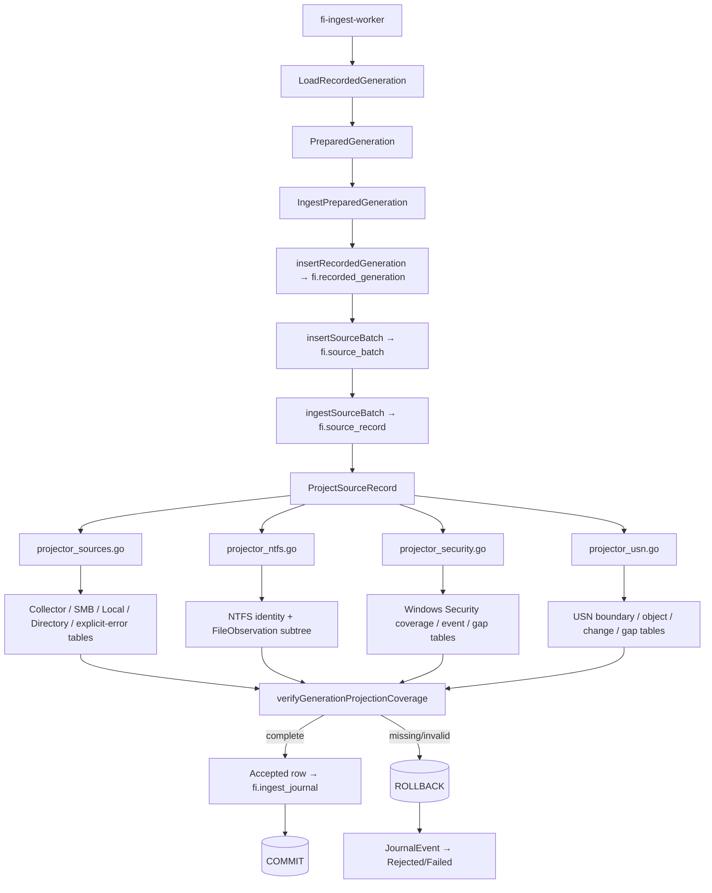

### 13.5 Identity-resolution mappings that are intentionally not 1:1 structs

| Go identity/value | Resolver | PostgreSQL result | Used by |
|---|---|---|---|
| `records.VolumeIdentity` | `ensureNTFSVolume` | `fi.ntfs_volume.ntfs_volume_id` | governed roots, file observations, USN read boundaries |
| `records.NTFSObjectIdentity` | `ensureNTFSObject` | `fi.ntfs_object.ntfs_object_id` | file object, parent object, USN object/change file/change parent |
| `records.GovernedRootIdentity` | `ensureGovernedRoot` | `fi.governed_root.governed_root_id` | `fi.file_observation` |
| preceding `USNReadBoundary` source record | `findPrecedingUSNReadBoundary` | `fi.usn_object_observation.usn_read_boundary_source_record_id` | USN object observation |
| `source_record_id` returned after source lineage insert | `ingestSourceBatch` | root-projection PK/FK | all 13 typed source-record roots |

### 13.6 Database-generated columns versus Go-provided values

A complete mapping does **not** mean every PostgreSQL column must have a serialized Go field. The following are intentionally database-generated or relationally derived:

- `*_id bigint GENERATED ALWAYS AS IDENTITY` surrogate keys (`recorded_generation_id`, `source_batch_id`, `source_record_id`, `ingest_journal_id`, `ntfs_volume_id`, `ntfs_object_id`, `governed_root_id`) are generated by PostgreSQL. Go captures returned IDs where downstream inserts require them.
- `ingested_at DEFAULT clock_timestamp()` and `ingest_journal.occurred_at DEFAULT clock_timestamp()` are PostgreSQL timestamps, not collector timestamps.
- Child ordinals such as `stream_ordinal`, `warning_ordinal`, `scope_ordinal`, `field_ordinal`, and normalized scalar-list ordinals are generated from deterministic Go iteration/order during projection.
- Foreign-key IDs such as `ntfs_object_id`, `parent_ntfs_object_id`, and `usn_read_boundary_source_record_id` are resolved by Go from source identities/ordering rather than copied from collector payloads.
- Digests stored as `bytea` are generally supplied to SQL after Go validates/decodes their canonical hex/base64 representation.

### 13.7 Reverse-map requirement for future schema changes

For Phase 4 and later, a schema change should not be considered complete until all four references exist together:

1. PostgreSQL migration/table/column definition.
2. Go model or explicitly named originating Go field/slice.
3. Go projector/writer and validation path.
4. This dictionary mapping entry, including any database-generated/derived exception.

That rule makes an unmapped new table or projection a documentation/design defect rather than something discovered later during troubleshooting.
