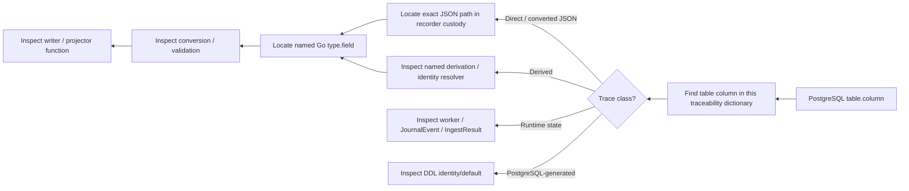
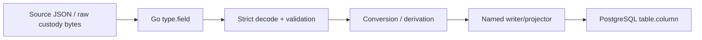
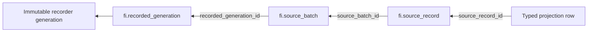

# FI PostgreSQL ↔ JSON ↔ Go Traceability Dictionary

**Project:** File Intelligence (FI)\
**Schema:** `fi`\
**Snapshot:** 2026-09-25\
**Authoritative implementation reviewed:** `main` @ `618cc5186db4410fd43e7d4783bd95b04165aeb8`\
**Phase status:** Phase 3 / Gate 3 complete\
**Coverage:** **49 / 49 tables; 494 / 494 effective PostgreSQL columns classified and mapped**

This document is the engineering traceability companion to `POSTGRESQL-DATA-DICTIONARY.md`.
It is intentionally organized for troubleshooting. Starting from a suspicious PostgreSQL value, an FI engineer should be able to identify the **exact source JSON fact (when one exists), the Go type/field that receives or derives it, the conversion performed, and the function that persists it**.

The current `main` audit confirmed that the Phase 3 schema, `go/internal/recordingest` projector/writer implementation, and `go/cmd/fi-ingest-worker` relational behavior used by these mappings have not changed since the mapping extraction. Dependency/CI remediation after Gate 3 did not alter the DB↔JSON↔Go paths.

## 1. Traceability contract

Every PostgreSQL value must fit one of these classes:

| Class | Columns | Meaning |
|---|---:|---|
| Direct / converted source JSON | 379 | The value is represented in immutable recorder/source JSON and is decoded into a named Go field before projection. |
| Derived | 90 | Go derives the value from source bytes, array order, parent identity, object presence, or a relational identity lookup. |
| Runtime state | 14 | The value describes relational ingest execution rather than collector source facts. |
| PostgreSQL-generated | 11 | PostgreSQL supplies an identity/default value intentionally. |

**No effective database column is intentionally left without a trace classification.** If a future schema change creates a column that cannot be traced to source JSON, a defined derivation/runtime value, or a database-generated value, that should be treated as a schema/documentation review failure.

## 2. How to troubleshoot a value



The forward direction is the inverse:



### Example: `fi.recorded_generation.record_count`

```text
fi.recorded_generation.record_count
    ← insertRecordedGeneration()
    ← generationrecorder.RecordedReceipt.RecordCount
    ← receipt JSON: record_count
```

If PostgreSQL and the receipt agree, the problem is upstream of relational ingest. If recorder JSON and PostgreSQL disagree, inspect `insertRecordedGeneration()` and conversion/transaction behavior.

### Example: `fi.security_ace.sid`

```text
fi.security_ace.sid
    ← projectSecurityACE()
    ← records.ACEObservation.SID
    ← records.SecurityObservation.DACL.ACEs[n]
    ← payload.ntfs_observation.security.dacl.aces[n].sid
```

### Worked object map: `fi.recorded_generation`

```text
recordingest.PreparedGeneration
│
├── Receipt : generationrecorder.RecordedReceipt
│   │
│   ├── Version --------------------------> receipt_version
│   ├── MetadataBytes --------------------> metadata_bytes
│   ├── MetadataSHA256 -------------------> metadata_sha256
│   ├── TransferBytes --------------------> transfer_bytes
│   ├── TransferSHA256 -------------------> transfer_sha256
│   ├── BatchCount -----------------------> batch_count
│   ├── DataBytes ------------------------> data_bytes
│   ├── RecordCount ----------------------> record_count
│   │
│   └── Descriptor : transportgeneration.Descriptor
│       ├── Version -----------------------> descriptor_version
│       ├── SourceID ----------------------> source_id
│       ├── GenerationID ------------------> generation_id
│       ├── CanonicalVersion --------------> canonical_version
│       ├── DataEncoding ------------------> data_encoding
│       ├── ArtifactCount -----------------> artifact_count
│       ├── SourceBytes -------------------> source_bytes
│       ├── CanonicalBytes ----------------> canonical_bytes
│       ├── CanonicalSHA256 ---------------> canonical_sha256
│       ├── EncodedDataBytes --------------> encoded_data_bytes
│       └── EncodedDataSHA256 -------------> encoded_data_sha256
│
├── ReceiptBytes --------------------------> receipt_bytes
└── ReceiptSHA256 -------------------------> receipt_sha256

recordingest.IngestVersion ----------------> ingest_version
PostgreSQL IDENTITY -----------------------> recorded_generation_id
PostgreSQL clock_timestamp() --------------> ingested_at
```

This is deliberately **many Go inputs → one PostgreSQL row**. The column table below then adds the JSON path and conversion for each arrow.

## 3. Go projection dispatch

```mermaid
flowchart TD
    SR[spool.Record / recordingest.SourceRecord] --> PSR[ProjectSourceRecord]
    PSR -->|CollectorIdentity| CI[records.ProcessIdentityObservation]
    PSR -->|DirectoryPrincipalSnapshot| DP[records.DirectoryPrincipalSnapshot]
    PSR -->|FileObservation| FO[fileObservationPayload + ntfs.Observation]
    PSR -->|LocalPrincipalSnapshot| LP[records.LocalPrincipalSnapshot]
    PSR -->|NTFSCollectionError| NE[ntfsCollectionErrorPayload]
    PSR -->|SMBShareSnapshot| SMB[records.SMBShareSnapshot]
    PSR -->|SupportingSourceCollectionError| SE[supportingSourceCollectionErrorPayload]
    PSR -->|USNContinuityGap| UG[records.USNContinuityGapObservation]
    PSR -->|USNObjectObservation| UO[usnObjectObservationPayload]
    PSR -->|USNReadBoundary| UB[usnReadBoundaryPayload]
    PSR -->|WindowsSecurityContinuityGap| WG[records.WindowsSecurityContinuityGapObservation]
    PSR -->|WindowsSecurityCoverage| WC[records.WindowsSecurityCoverageObservation]
    PSR -->|WindowsSecurityEvent| WE[records.WindowsSecurityEventObservation]
```



`ProjectSourceRecord()` uses strict JSON decoding; unknown payload fields fail rather than being silently discarded. The generation then has a projection-coverage check before commit.

## 4. Table-by-table DB → JSON → Go maps
### fi.recorded_generation

**Source:** Immutable recorder receipt JSON + receipt bytes\
**Go model(s):** `generationrecorder.RecordedReceipt`, `transportgeneration.Descriptor`, `recordingest.PreparedGeneration`\
**Writer / projector:** `insertRecordedGeneration()` — `go/internal/recordingest/postgres_ingest.go`\
**Flow:** recorded receipt JSON → `PreparedGeneration` → `insertRecordedGeneration()` → `fi.recorded_generation`

| PostgreSQL column | Type | Source JSON path | Go field / value | Conversion / derivation | Trace class |
|---|---|---|---|---|---|
| `recorded_generation_id` | `bigint` | — | — | `GENERATED ALWAYS AS IDENTITY`; returned into local Go `id int64` | PostgreSQL-generated |
| `receipt_version` | `text` | receipt.version | generationrecorder.RecordedReceipt.Version | Direct | Direct JSON |
| `descriptor_version` | `text` | receipt.descriptor.version | transportgeneration.Descriptor.Version | Direct | Direct JSON |
| `source_id` | `text` | receipt.descriptor.source_id | transportgeneration.Descriptor.SourceID | Direct | Direct JSON |
| `generation_id` | `text` | receipt.descriptor.generation_id | transportgeneration.Descriptor.GenerationID | Direct | Direct JSON |
| `canonical_version` | `text` | receipt.descriptor.canonical_version | transportgeneration.Descriptor.CanonicalVersion | Direct | Direct JSON |
| `data_encoding` | `text` | receipt.descriptor.data_encoding | transportgeneration.Descriptor.DataEncoding | Direct | Direct JSON |
| `artifact_count` | `bigint` | receipt.descriptor.artifact_count | transportgeneration.Descriptor.ArtifactCount | `uint64` → `int64` | Direct JSON |
| `source_bytes` | `bigint` | receipt.descriptor.source_bytes | transportgeneration.Descriptor.SourceBytes | `uint64` → `int64` | Direct JSON |
| `canonical_bytes` | `bigint` | receipt.descriptor.canonical_bytes | transportgeneration.Descriptor.CanonicalBytes | `uint64` → `int64` | Direct JSON |
| `canonical_sha256` | `bytea` | receipt.descriptor.canonical_sha256 | transportgeneration.Descriptor.CanonicalSHA256 | hex text → 32-byte `bytea` via `decodeHex()` | Direct JSON |
| `encoded_data_bytes` | `bigint` | receipt.descriptor.encoded_data_bytes | transportgeneration.Descriptor.EncodedDataBytes | `uint64` → `int64` | Direct JSON |
| `encoded_data_sha256` | `bytea` | receipt.descriptor.encoded_data_sha256 | transportgeneration.Descriptor.EncodedDataSHA256 | hex text → 32-byte `bytea` via `decodeHex()` | Direct JSON |
| `metadata_bytes` | `bigint` | receipt.metadata_bytes | generationrecorder.RecordedReceipt.MetadataBytes | `uint64` → `int64` | Direct JSON |
| `metadata_sha256` | `bytea` | receipt.metadata_sha256 | generationrecorder.RecordedReceipt.MetadataSHA256 | hex text → 32-byte `bytea` via `decodeHex()` | Direct JSON |
| `transfer_bytes` | `bigint` | receipt.transfer_bytes | generationrecorder.RecordedReceipt.TransferBytes | `uint64` → `int64` | Direct JSON |
| `transfer_sha256` | `bytea` | receipt.transfer_sha256 | generationrecorder.RecordedReceipt.TransferSHA256 | hex text → 32-byte `bytea` via `decodeHex()` | Direct JSON |
| `batch_count` | `bigint` | receipt.batch_count | generationrecorder.RecordedReceipt.BatchCount | `uint64` → `int64` | Direct JSON |
| `data_bytes` | `bigint` | receipt.data_bytes | generationrecorder.RecordedReceipt.DataBytes | `uint64` → `int64` | Direct JSON |
| `record_count` | `bigint` | receipt.record_count | generationrecorder.RecordedReceipt.RecordCount | `uint64` → `int64` | Direct JSON |
| `receipt_bytes` | `bigint` | — | recordingest.PreparedGeneration.ReceiptBytes | measured from immutable receipt bytes during load | Derived |
| `receipt_sha256` | `bytea` | — | recordingest.PreparedGeneration.ReceiptSHA256 | SHA-256 of immutable receipt bytes; hex → 32-byte `bytea` | Derived |
| `ingested_at` | `timestamptz` | — | — | `DEFAULT clock_timestamp()` | PostgreSQL-generated |
| `ingest_version` | `text` | — | recordingest.IngestVersion | Runtime ingest state; not source JSON | Runtime state |

### fi.source_batch

**Source:** Validated batch manifest JSON + prepared manifest artifact metadata\
**Go model(s):** `recordingest.PreparedBatch`, `spool.Manifest`, `spool.CollectorIdentity`\
**Writer / projector:** `insertSourceBatch()` — `go/internal/recordingest/postgres_ingest.go`\
**Flow:** manifest JSON → `PreparedBatch.Manifest` → `insertSourceBatch()` → `fi.source_batch`

| PostgreSQL column | Type | Source JSON path | Go field / value | Conversion / derivation | Trace class |
|---|---|---|---|---|---|
| `source_batch_id` | `bigint` | — | — | `GENERATED ALWAYS AS IDENTITY`; returned to Go for child source records | PostgreSQL-generated |
| `recorded_generation_id` | `bigint` | — | recordedGenerationID | returned by `insertRecordedGeneration()` | Derived |
| `manifest_artifact_name` | `text` | — | recordingest.PreparedBatch.ManifestArtifactName | derived from validated recorder artifact inventory; not a manifest JSON field | Derived |
| `data_artifact_name` | `text` | — | recordingest.PreparedBatch.DataArtifactName | derived from validated recorder artifact inventory; not a manifest JSON field | Derived |
| `manifest_version` | `text` | manifest.version | spool.Manifest.Version | Direct | Direct JSON |
| `batch_id` | `text` | manifest.batch_id | spool.Manifest.BatchID | Direct | Direct JSON |
| `target_batch_size` | `integer` | manifest.target_batch_size | spool.Manifest.TargetBatchSize | Direct | Direct JSON |
| `record_count` | `bigint` | manifest.record_count | spool.Manifest.RecordCount | `int` → `int64` | Direct JSON |
| `data_bytes` | `bigint` | manifest.data_bytes | spool.Manifest.DataBytes | Direct | Direct JSON |
| `data_sha256` | `bytea` | manifest.data_sha256 | spool.Manifest.DataSHA256 | hex text → 32-byte `bytea` | Direct JSON |
| `data_file` | `text` | manifest.data_file | spool.Manifest.DataFile | Direct | Direct JSON |
| `collector_executable_path` | `text` | manifest.collector.executable_path | spool.Manifest.Collector.ExecutablePath | Direct | Direct JSON |
| `collector_executable_sha256` | `bytea` | manifest.collector.executable_sha256 | spool.Manifest.Collector.ExecutableSHA256 | hex text → 32-byte `bytea` | Direct JSON |
| `created_at` | `timestamptz` | manifest.created_at | spool.Manifest.CreatedAt | RFC3339 text → `timestamptz` | Direct JSON |
| `completed_at` | `timestamptz` | manifest.completed_at | spool.Manifest.CompletedAt | RFC3339 text → `timestamptz` | Direct JSON |
| `manifest_bytes` | `bigint` | — | recordingest.PreparedBatch.ManifestBytes | measured from immutable manifest bytes | Derived |
| `manifest_sha256` | `bytea` | — | recordingest.PreparedBatch.ManifestSHA256 | SHA-256 of immutable manifest bytes; hex → 32-byte `bytea` | Derived |
| `ingested_at` | `timestamptz` | — | — | `DEFAULT clock_timestamp()` | PostgreSQL-generated |

### fi.source_record

**Source:** Canonical source JSONL record envelope + exact raw record bytes\
**Go model(s):** `spool.Record`, `recordingest.SourceRecord`\
**Writer / projector:** `ingestSourceBatch()` — `go/internal/recordingest/postgres_ingest.go`\
**Flow:** JSONL record → `PrepareSourceRecord()` → `recordingest.SourceRecord` → `fi.source_record`

| PostgreSQL column | Type | Source JSON path | Go field / value | Conversion / derivation | Trace class |
|---|---|---|---|---|---|
| `source_record_id` | `bigint` | — | — | `GENERATED ALWAYS AS IDENTITY`; returned to Go and used as projection PK/FK | PostgreSQL-generated |
| `source_batch_id` | `bigint` | — | sourceBatchID | returned by `insertSourceBatch()` | Derived |
| `record_ordinal` | `bigint` | — | ordinal | incremented while reading canonical batch JSONL | Derived |
| `version` | `text` | record.version | spool.Record.Version | Direct | Direct JSON |
| `record_kind` | `text` | record.record_kind | spool.Record.RecordKind | Direct | Direct JSON |
| `scope_id` | `text` | record.scope_id | spool.Record.ScopeID | Direct | Direct JSON |
| `written_at` | `timestamptz` | record.written_at | recordingest.SourceRecord.WrittenAtUTC | strict parsed timestamp | Direct JSON |
| `record_bytes` | `integer` | — | recordingest.SourceRecord.RecordBytes | measured from exact source record bytes | Derived |
| `record_sha256` | `bytea` | — | recordingest.SourceRecord.RecordSHA256 | SHA-256 over exact raw record bytes; hex → 32-byte `bytea` | Derived |
| `ingested_at` | `timestamptz` | — | — | `DEFAULT clock_timestamp()` | PostgreSQL-generated |
| `ingest_version` | `text` | — | recordingest.IngestVersion | Runtime ingest state; not source JSON | Runtime state |

### fi.ingest_journal

**Source:** Ingest-worker runtime state; not collector/recorder source JSON\
**Go model(s):** `recordingest.JournalEvent`, `recordingest.IngestResult`\
**Writer / projector:** `writeJournalEvent()` / accepted transaction insert — `journal.go` and `postgres_ingest.go`\
**Flow:** worker decision / ingest result → journal event → `fi.ingest_journal`

| PostgreSQL column | Type | Source JSON path | Go field / value | Conversion / derivation | Trace class |
|---|---|---|---|---|---|
| `ingest_journal_id` | `bigint` | — | — | `GENERATED ALWAYS AS IDENTITY` | PostgreSQL-generated |
| `attempt_id` | `text` | — | JournalEvent.AttemptID / IngestResult.AttemptID | Runtime ingest state; not source JSON | Runtime state |
| `event_sequence` | `integer` | — | JournalEvent.EventSequence | sequence 1 = attempt start; terminal normally 2 | Runtime state |
| `occurred_at` | `timestamptz` | — | — | `DEFAULT clock_timestamp()` | PostgreSQL-generated |
| `source_id` | `text` | — | JournalEvent.SourceID / IngestResult.SourceID | Runtime ingest state; not source JSON | Runtime state |
| `generation_id` | `text` | — | JournalEvent.GenerationID / IngestResult.GenerationID | Runtime ingest state; not source JSON | Runtime state |
| `transfer_sha256` | `bytea` | — | JournalEvent.TransferSHA256 / IngestResult.TransferSHA256 | hex text → optional 32-byte `bytea` | Runtime state |
| `outcome` | `text` | — | JournalEvent.Outcome / IngestResult.Outcome | Runtime ingest state; not source JSON | Runtime state |
| `stage` | `text` | — | JournalEvent.Stage / fixed transaction stage | Runtime ingest state; not source JSON | Runtime state |
| `reason_code` | `text` | — | JournalEvent.ReasonCode | Runtime ingest state; not source JSON | Runtime state |
| `detail` | `text` | — | JournalEvent.Detail | Runtime ingest state; not source JSON | Runtime state |
| `records_seen` | `bigint` | — | JournalEvent.RecordsSeen / IngestResult.RecordsSeen | Runtime ingest state; not source JSON | Runtime state |
| `records_committed` | `bigint` | — | JournalEvent.RecordsCommitted / IngestResult.RecordsCommitted | Runtime ingest state; not source JSON | Runtime state |
| `ingest_version` | `text` | — | recordingest.IngestVersion | Runtime ingest state; not source JSON | Runtime state |

### fi.ntfs_volume

**Source:** Volume identity appearing in FileObservation, USNReadBoundary, or nested USN re-observation\
**Go model(s):** `records.VolumeIdentity`\
**Writer / projector:** `ensureNTFSVolume()` — `go/internal/recordingest/projector_ntfs.go`\
**Flow:** `records.VolumeIdentity` → `ensureNTFSVolume()` → `fi.ntfs_volume`

> The JSON prefix varies by producer (`ntfs_observation.volume_identity`, governed-root identity, or USN boundary). The Go value type is the stable trace point.

| PostgreSQL column | Type | Source JSON path | Go field / value | Conversion / derivation | Trace class |
|---|---|---|---|---|---|
| `ntfs_volume_id` | `bigint` | — | — | `GENERATED ALWAYS AS IDENTITY`; helper returns/reuses ID | PostgreSQL-generated |
| `source_id` | `text` | — | sourceID | comes from recorder generation/source context, not payload | Derived |
| `identity_method_version` | `text` | payload.…volume_identity.method_version | records.VolumeIdentity.MethodVersion | Direct | Direct JSON |
| `volume_guid` | `text` | payload.…volume_identity.volume_guid | records.VolumeIdentity.VolumeGUID | Direct | Direct JSON |
| `volume_serial` | `numeric(20,0)` | payload.…volume_identity.volume_serial | records.VolumeIdentity.VolumeSerial | canonical decimal text → PostgreSQL `numeric(20,0)` | Direct JSON |

### fi.ntfs_object

**Source:** NTFS object identity appearing as observed/root/parent/file-change identity\
**Go model(s):** `records.NTFSObjectIdentity`\
**Writer / projector:** `ensureNTFSObject()` — `go/internal/recordingest/projector_ntfs.go`\
**Flow:** `records.NTFSObjectIdentity` + resolved volume → `ensureNTFSObject()` → `fi.ntfs_object`

> The JSON prefix can be observed object, governed-root object, parent object, USN file identity, or USN parent identity. Volume qualification is mandatory.

| PostgreSQL column | Type | Source JSON path | Go field / value | Conversion / derivation | Trace class |
|---|---|---|---|---|---|
| `ntfs_object_id` | `bigint` | — | — | `GENERATED ALWAYS AS IDENTITY`; helper returns/reuses ID | PostgreSQL-generated |
| `ntfs_volume_id` | `bigint` | — | volumeID | resolved by `ensureNTFSVolume()` or preceding USN boundary | Derived |
| `identity_method_version` | `text` | payload.…object_identity.method_version | records.NTFSObjectIdentity.MethodVersion | Direct | Direct JSON |
| `file_reference_number` | `numeric(20,0)` | payload.…object_identity.file_reference_number | records.NTFSObjectIdentity.FileReferenceNumber | canonical decimal text → `numeric(20,0)` | Direct JSON |
| `sequence_number` | `numeric(20,0)` | payload.…object_identity.sequence_number | records.NTFSObjectIdentity.SequenceNumber | canonical decimal text → `numeric(20,0)` | Direct JSON |

### fi.governed_root

**Source:** `FileObservation.payload.ntfs_observation.governed_root` (also nested USN NTFS re-observation)\
**Go model(s):** `records.GovernedRootIdentity`\
**Writer / projector:** `ensureGovernedRoot()` — `go/internal/recordingest/projector_ntfs.go`\
**Flow:** governed-root JSON → `records.GovernedRootIdentity` → ensure volume/object → `fi.governed_root`

| PostgreSQL column | Type | Source JSON path | Go field / value | Conversion / derivation | Trace class |
|---|---|---|---|---|---|
| `governed_root_id` | `bigint` | — | — | `GENERATED ALWAYS AS IDENTITY`; helper returns/reuses ID | PostgreSQL-generated |
| `source_id` | `text` | — | sourceID | Derived by Go / relational lookup | Derived |
| `scope_id` | `text` | payload.ntfs_observation.governed_root.scope_id | records.GovernedRootIdentity.ScopeID | Direct | Direct JSON |
| `containment_method_version` | `text` | payload.ntfs_observation.governed_root.method_version | records.GovernedRootIdentity.MethodVersion | Direct | Direct JSON |
| `ntfs_volume_id` | `bigint` | — | volumeID | resolved from `GovernedRootIdentity.VolumeIdentity` by `ensureNTFSVolume()` | Derived |
| `ntfs_object_id` | `bigint` | — | objectID | resolved from `GovernedRootIdentity.ObjectIdentity` by `ensureNTFSObject()` | Derived |
| `requested_path_utf16le` | `bytea` | payload.ntfs_observation.governed_root.requested_path_utf16le_base64url | records.GovernedRootIdentity.RequestedPathUTF16LEBase64URL | base64url → raw UTF-16LE `bytea` | Direct JSON |
| `resolved_path_utf16le` | `bytea` | payload.ntfs_observation.governed_root.resolved_path_utf16le_base64url | records.GovernedRootIdentity.ResolvedPathUTF16LEBase64URL | base64url → raw UTF-16LE `bytea` | Direct JSON |

### fi.file_observation

**Source:** `FileObservation.payload.ntfs_observation` or nested `USNObjectObservation.payload.ntfs_observation`\
**Go model(s):** `ntfs.Observation`\
**Writer / projector:** `projectNTFSObservation()` — `go/internal/recordingest/projector_ntfs.go`\
**Flow:** NTFS observation JSON → `ntfs.Observation` → identity helpers → `projectNTFSObservation()` → `fi.file_observation`

`collection_method` is strict source semantics, not free-form relational text. Both the direct collector value (`DirectWindowsNTFS`) and the bounded FIObjReader value (`BackupAuthorityWindowsNTFS`) are validated by `ntfs.ValidateObservation()` before `projectNTFSObservation()` runs. This validation is used for both top-level `FileObservation` records and nested `USNObjectObservation.payload.ntfs_observation` records. Unknown values are rejected rather than coerced; PostgreSQL retains the accepted source value verbatim in `fi.file_observation.collection_method`.

| PostgreSQL column | Type | Source JSON path | Go field / value | Conversion / derivation | Trace class |
|---|---|---|---|---|---|
| `source_record_id` | `bigint` | — | sourceRecordID | PK/FK returned from `fi.source_record`; same ID is reused for projection root | Derived |
| `governed_root_id` | `bigint` | payload.ntfs_observation.governed_root | governedRootID | `records.GovernedRootIdentity` resolved by `ensureGovernedRoot()` | Derived |
| `ntfs_object_id` | `bigint` | payload.ntfs_observation.object_identity | objectID | `records.NTFSObjectIdentity` resolved by `ensureNTFSObject()` | Derived |
| `parent_state` | `text` | payload.ntfs_observation.parent_binding.state | ntfs.Observation.ParentBinding.State | enum → text | Direct JSON |
| `parent_ntfs_object_id` | `bigint` | payload.ntfs_observation.parent_binding.object_identity | parentObjectID | optional `records.NTFSObjectIdentity` resolved by `ensureNTFSObject()`; NULL for root/error states | Derived |
| `parent_reason_code` | `text` | payload.ntfs_observation.parent_binding.reason_code | ntfs.Observation.ParentBinding.ReasonCode | empty string → SQL NULL | Direct JSON |
| `subject_kind` | `text` | payload.ntfs_observation.subject_kind | ntfs.Observation.SubjectKind | enum → text | Direct JSON |
| `requested_path_utf16le` | `bytea` | payload.ntfs_observation.path_binding.requested_path_utf16le_base64url | ntfs.Observation.PathBinding.RequestedPathUTF16LEBase64URL | base64url → raw UTF-16LE `bytea` | Direct JSON |
| `resolved_path_utf16le` | `bytea` | payload.ntfs_observation.path_binding.resolved_path_utf16le_base64url | ntfs.Observation.PathBinding.ResolvedPathUTF16LEBase64URL | base64url → raw UTF-16LE `bytea` | Direct JSON |
| `observed_at` | `timestamptz` | payload.ntfs_observation.observed_at | ntfs.Observation.ObservedAt | RFC3339 text → `timestamptz` | Direct JSON |
| `containment_method_version` | `text` | payload.ntfs_observation.containment.method_version | ntfs.Observation.Containment.MethodVersion | Direct | Direct JSON |
| `collection_entry_method` | `text` | payload.ntfs_observation.collection_entry_method | ntfs.Observation.CollectionEntryMethod | enum → text | Direct JSON |
| `collection_method` | `text` | payload.ntfs_observation.collection_method | ntfs.Observation.CollectionMethod | validated enum → text (`DirectWindowsNTFS` or `BackupAuthorityWindowsNTFS`) | Direct JSON |
| `observation_status` | `text` | payload.ntfs_observation.observation_status | ntfs.Observation.ObservationStatus | enum → text | Direct JSON |

### fi.file_metadata_observation

**Source:** `payload.ntfs_observation.metadata`\
**Go model(s):** `records.MetadataObservation`\
**Writer / projector:** `projectFileMetadata()` — `projector_ntfs.go`\
**Flow:** metadata JSON → `records.MetadataObservation` → `projectFileMetadata()` → DB

| PostgreSQL column | Type | Source JSON path | Go field / value | Conversion / derivation | Trace class |
|---|---|---|---|---|---|
| `source_record_id` | `bigint` | — | sourceRecordID | Derived by Go / relational lookup | Derived |
| `logical_size` | `numeric(20,0)` | payload.ntfs_observation.metadata.logical_size | records.MetadataObservation.LogicalSize | Direct | Direct JSON |
| `allocated_size` | `numeric(20,0)` | payload.ntfs_observation.metadata.allocated_size | records.MetadataObservation.AllocatedSize | Direct | Direct JSON |
| `creation_time` | `timestamptz` | payload.ntfs_observation.metadata.creation_time | records.MetadataObservation.CreationTime | RFC3339 → `timestamptz` | Direct JSON |
| `last_write_time` | `timestamptz` | payload.ntfs_observation.metadata.last_write_time | records.MetadataObservation.LastWriteTime | RFC3339 → `timestamptz` | Direct JSON |
| `change_time` | `timestamptz` | payload.ntfs_observation.metadata.change_time | records.MetadataObservation.ChangeTime | RFC3339 → `timestamptz` | Direct JSON |
| `last_access_time` | `timestamptz` | payload.ntfs_observation.metadata.last_access_time | records.MetadataObservation.LastAccessTime | RFC3339 → `timestamptz` | Direct JSON |
| `raw_attributes` | `bigint` | payload.ntfs_observation.metadata.raw_attributes | records.MetadataObservation.RawAttributes | decimal text → uint32 → `bigint` | Direct JSON |
| `link_count` | `bigint` | payload.ntfs_observation.metadata.link_count | records.MetadataObservation.LinkCount | decimal text → uint32 → `bigint` | Direct JSON |

### fi.content_hash_observation

**Source:** `FileObservation.payload.content_hashes` or `USNObjectObservation.payload.content_hashes`\
**Go model(s):** `records.ContentHashObservation`\
**Writer / projector:** `projectContentHashes()` — `projector_ntfs.go`\
**Flow:** content hash JSON → Go state object → decoded digests → DB

| PostgreSQL column | Type | Source JSON path | Go field / value | Conversion / derivation | Trace class |
|---|---|---|---|---|---|
| `source_record_id` | `bigint` | — | sourceRecordID | Derived by Go / relational lookup | Derived |
| `state` | `text` | payload.content_hashes.state | records.ContentHashObservation.State | enum → text | Direct JSON |
| `bytes_hashed` | `numeric(20,0)` | payload.content_hashes.bytes_hashed | records.ContentHashObservation.BytesHashed | canonical decimal text → `numeric(20,0)`; NULL unless Present | Direct JSON |
| `md5` | `bytea` | payload.content_hashes.md5 | records.ContentHashObservation.MD5 | hex → 16-byte `bytea`; NULL unless Present | Direct JSON |
| `sha1` | `bytea` | payload.content_hashes.sha1 | records.ContentHashObservation.SHA1 | hex → 20-byte `bytea`; NULL unless Present | Direct JSON |
| `sha256` | `bytea` | payload.content_hashes.sha256 | records.ContentHashObservation.SHA256 | hex → 32-byte `bytea`; NULL unless Present | Direct JSON |
| `reason_code` | `text` | payload.content_hashes.reason_code | records.ContentHashObservation.ReasonCode | empty → NULL | Direct JSON |
| `detail` | `text` | payload.content_hashes.detail | records.ContentHashObservation.Detail | empty → NULL | Direct JSON |

### fi.content_prefix_observation

**Source:** `payload.ntfs_observation.content_prefix`\
**Go model(s):** `records.ContentPrefixObservation`\
**Writer / projector:** `projectContentPrefix()` — `projector_ntfs.go`\
**Flow:** content prefix JSON → Go → decoded prefix bytes → DB

| PostgreSQL column | Type | Source JSON path | Go field / value | Conversion / derivation | Trace class |
|---|---|---|---|---|---|
| `source_record_id` | `bigint` | — | sourceRecordID | Derived by Go / relational lookup | Derived |
| `state` | `text` | payload.ntfs_observation.content_prefix.state | records.ContentPrefixObservation.State | enum → text | Direct JSON |
| `bytes_observed` | `smallint` | payload.ntfs_observation.content_prefix.bytes_observed | records.ContentPrefixObservation.BytesObserved | decimal text → uint → `smallint`; validated ≤16 | Direct JSON |
| `prefix_bytes` | `bytea` | payload.ntfs_observation.content_prefix.prefix_base64url | records.ContentPrefixObservation.PrefixBase64URL | base64url → `bytea`; length must equal bytes_observed | Direct JSON |
| `reason_code` | `text` | payload.ntfs_observation.content_prefix.reason_code | records.ContentPrefixObservation.ReasonCode | empty → NULL | Direct JSON |
| `detail` | `text` | payload.ntfs_observation.content_prefix.detail | records.ContentPrefixObservation.Detail | empty → NULL | Direct JSON |

### fi.reparse_observation

**Source:** `payload.ntfs_observation.reparse`\
**Go model(s):** `records.ReparseObservation`\
**Writer / projector:** `projectReparseObservation()` — `projector_ntfs.go`\
**Flow:** reparse JSON → decoded raw/path fields → DB

| PostgreSQL column | Type | Source JSON path | Go field / value | Conversion / derivation | Trace class |
|---|---|---|---|---|---|
| `source_record_id` | `bigint` | — | sourceRecordID | Derived by Go / relational lookup | Derived |
| `state` | `text` | payload.ntfs_observation.reparse.state | records.ReparseObservation.State | Direct | Direct JSON |
| `data_state` | `text` | payload.ntfs_observation.reparse.data_state | records.ReparseObservation.DataState | Direct | Direct JSON |
| `data_format` | `text` | payload.ntfs_observation.reparse.data_format | records.ReparseObservation.DataFormat | Direct | Direct JSON |
| `tag` | `bigint` | payload.ntfs_observation.reparse.tag | records.ReparseObservation.Tag | flexible numeric text → uint32 → `bigint` | Direct JSON |
| `tag_name` | `text` | payload.ntfs_observation.reparse.tag_name | records.ReparseObservation.TagName | Direct | Direct JSON |
| `raw_buffer` | `bytea` | payload.ntfs_observation.reparse.raw_buffer_base64url | records.ReparseObservation.RawBufferBase64URL | base64url → `bytea` | Direct JSON |
| `substitute_name_utf16le` | `bytea` | payload.ntfs_observation.reparse.substitute_name_utf16le_base64url | records.ReparseObservation.SubstituteNameUTF16LEBase64URL | base64url → UTF-16LE `bytea` | Direct JSON |
| `print_name_utf16le` | `bytea` | payload.ntfs_observation.reparse.print_name_utf16le_base64url | records.ReparseObservation.PrintNameUTF16LEBase64URL | base64url → UTF-16LE `bytea` | Direct JSON |
| `symbolic_link_flags` | `bigint` | payload.ntfs_observation.reparse.symbolic_link_flags | records.ReparseObservation.SymbolicLinkFlags | numeric text → uint32 → `bigint` | Direct JSON |
| `reason_code` | `text` | payload.ntfs_observation.reparse.reason_code | records.ReparseObservation.ReasonCode | Direct | Direct JSON |

### fi.stream_inventory

**Source:** `payload.ntfs_observation.stream_inventory`\
**Go model(s):** `records.StreamInventory`\
**Writer / projector:** `projectStreamInventory()` — `projector_ntfs.go`\
**Flow:** stream inventory JSON → Go → parent inventory row

| PostgreSQL column | Type | Source JSON path | Go field / value | Conversion / derivation | Trace class |
|---|---|---|---|---|---|
| `source_record_id` | `bigint` | — | sourceRecordID | Derived by Go / relational lookup | Derived |
| `state` | `text` | payload.ntfs_observation.stream_inventory.state | records.StreamInventory.State | Direct | Direct JSON |
| `reason_code` | `text` | payload.ntfs_observation.stream_inventory.reason_code | records.StreamInventory.ReasonCode | Direct | Direct JSON |

### fi.stream_observation

**Source:** `payload.ntfs_observation.stream_inventory.streams[*]`\
**Go model(s):** `records.StreamObservation`, `records.StreamIdentity`\
**Writer / projector:** `projectStreamInventory()` — `projector_ntfs.go`\
**Flow:** streams[] → one relational row per stream

| PostgreSQL column | Type | Source JSON path | Go field / value | Conversion / derivation | Trace class |
|---|---|---|---|---|---|
| `source_record_id` | `bigint` | — | sourceRecordID | Derived by Go / relational lookup | Derived |
| `stream_ordinal` | `integer` | — | i + 1 | Derived by Go / relational lookup | Derived |
| `kind` | `text` | payload.ntfs_observation.stream_inventory.streams[*].identity.kind | records.StreamObservation.Identity.Kind | enum → text | Direct JSON |
| `name_utf16le` | `bytea` | payload.ntfs_observation.stream_inventory.streams[*].identity.name_utf16le_base64url | records.StreamObservation.Identity.NameUTF16LEBase64URL | base64url → optional `bytea` | Direct JSON |
| `stream_type` | `text` | payload.ntfs_observation.stream_inventory.streams[*].identity.stream_type | records.StreamObservation.Identity.StreamType | empty → NULL | Direct JSON |
| `raw_name_utf16le` | `bytea` | payload.ntfs_observation.stream_inventory.streams[*].identity.raw_name_utf16le_base64url | records.StreamObservation.Identity.RawNameUTF16LEBase64URL | base64url → required `bytea` | Direct JSON |
| `logical_size` | `numeric(20,0)` | payload.ntfs_observation.stream_inventory.streams[*].logical_size | records.StreamObservation.LogicalSize | canonical decimal text → `numeric(20,0)` | Direct JSON |
| `allocated_size` | `numeric(20,0)` | payload.ntfs_observation.stream_inventory.streams[*].allocated_size | records.StreamObservation.AllocatedSize | canonical decimal text → `numeric(20,0)` | Direct JSON |

### fi.security_observation

**Source:** `payload.ntfs_observation.security`\
**Go model(s):** `records.SecurityObservation`, `records.ACLObservation`\
**Writer / projector:** `projectSecurityObservation()` — `projector_ntfs.go`\
**Flow:** security descriptor JSON → Go → decoded raw descriptor/ACL metadata → DB

| PostgreSQL column | Type | Source JSON path | Go field / value | Conversion / derivation | Trace class |
|---|---|---|---|---|---|
| `source_record_id` | `bigint` | — | sourceRecordID | Derived by Go / relational lookup | Derived |
| `state` | `text` | payload.ntfs_observation.security.state | records.SecurityObservation.State | enum → text | Direct JSON |
| `data_format` | `text` | payload.ntfs_observation.security.data_format | records.SecurityObservation.DataFormat | enum → text | Direct JSON |
| `raw_descriptor` | `bytea` | payload.ntfs_observation.security.raw_descriptor_base64url | records.SecurityObservation.RawDescriptorBase64URL | base64url → `bytea` | Direct JSON |
| `revision` | `smallint` | payload.ntfs_observation.security.revision | records.SecurityObservation.Revision | optional numeric text → uint8 | Direct JSON |
| `control` | `integer` | payload.ntfs_observation.security.control | records.SecurityObservation.Control | optional numeric text → uint16 | Direct JSON |
| `owner_sid` | `text` | payload.ntfs_observation.security.owner_sid | records.SecurityObservation.OwnerSID | empty → NULL | Direct JSON |
| `primary_group_sid` | `text` | payload.ntfs_observation.security.primary_group_sid | records.SecurityObservation.PrimaryGroupSID | empty → NULL | Direct JSON |
| `acl_state` | `text` | payload.ntfs_observation.security.dacl.state | records.SecurityObservation.DACL.State | enum → text | Direct JSON |
| `acl_revision` | `smallint` | payload.ntfs_observation.security.dacl.revision | records.SecurityObservation.DACL.Revision | optional numeric text → uint8 | Direct JSON |
| `acl_size` | `integer` | payload.ntfs_observation.security.dacl.size | records.SecurityObservation.DACL.Size | optional numeric text → uint32 | Direct JSON |
| `reason_code` | `text` | payload.ntfs_observation.security.reason_code | records.SecurityObservation.ReasonCode | empty → NULL | Direct JSON |

### fi.security_ace

**Source:** `payload.ntfs_observation.security.dacl.aces[*]`\
**Go model(s):** `records.ACEObservation`\
**Writer / projector:** `projectSecurityACE(..., "fi.security_ace", ...)` — `projector_ntfs.go`\
**Flow:** DACL ACE array → `projectSecurityACE()` → one DB row per ACE

| PostgreSQL column | Type | Source JSON path | Go field / value | Conversion / derivation | Trace class |
|---|---|---|---|---|---|
| `source_record_id` | `bigint` | — | sourceRecordID | Derived by Go / relational lookup | Derived |
| `ace_ordinal` | `integer` | payload.ntfs_observation.security.dacl.aces[*].index | records.ACEObservation.Index | numeric text → uint32 → integer | Direct JSON |
| `ace_type` | `integer` | payload.ntfs_observation.security.dacl.aces[*].type | records.ACEObservation.Type | numeric text → uint8 → integer | Direct JSON |
| `type_name` | `text` | payload.ntfs_observation.security.dacl.aces[*].type_name | records.ACEObservation.TypeName | Direct | Direct JSON |
| `flags` | `integer` | payload.ntfs_observation.security.dacl.aces[*].flags | records.ACEObservation.Flags | numeric text → uint8 → integer | Direct JSON |
| `ace_size` | `integer` | payload.ntfs_observation.security.dacl.aces[*].size | records.ACEObservation.Size | numeric text → uint16 → integer | Direct JSON |
| `raw_ace` | `bytea` | payload.ntfs_observation.security.dacl.aces[*].raw_base64url | records.ACEObservation.RawBase64URL | base64url → `bytea` | Direct JSON |
| `access_mask` | `bigint` | payload.ntfs_observation.security.dacl.aces[*].mask | records.ACEObservation.Mask | optional numeric text → uint32 → `bigint` | Direct JSON |
| `object_flags` | `bigint` | payload.ntfs_observation.security.dacl.aces[*].object_flags | records.ACEObservation.ObjectFlags | optional numeric text → uint32 → `bigint` | Direct JSON |
| `object_type_guid` | `uuid` | payload.ntfs_observation.security.dacl.aces[*].object_type_guid | records.ACEObservation.ObjectTypeGUID | empty → NULL; text cast to UUID | Direct JSON |
| `inherited_object_type_guid` | `uuid` | payload.ntfs_observation.security.dacl.aces[*].inherited_object_type_guid | records.ACEObservation.InheritedObjectTypeGUID | empty → NULL; text cast to UUID | Direct JSON |
| `sid` | `text` | payload.ntfs_observation.security.dacl.aces[*].sid | records.ACEObservation.SID | empty → NULL | Direct JSON |

### fi.sacl_observation

**Source:** `payload.ntfs_observation.sacl`\
**Go model(s):** `records.SACLObservation`, `records.ACLObservation`\
**Writer / projector:** `projectSACLObservation()` — `projector_ntfs.go`\
**Flow:** SACL JSON → Go → decoded descriptor/ACL metadata → DB

| PostgreSQL column | Type | Source JSON path | Go field / value | Conversion / derivation | Trace class |
|---|---|---|---|---|---|
| `source_record_id` | `bigint` | — | sourceRecordID | Derived by Go / relational lookup | Derived |
| `state` | `text` | payload.ntfs_observation.sacl.state | records.SACLObservation.State | enum → text | Direct JSON |
| `data_format` | `text` | payload.ntfs_observation.sacl.data_format | records.SACLObservation.DataFormat | enum → text | Direct JSON |
| `raw_descriptor` | `bytea` | payload.ntfs_observation.sacl.raw_descriptor_base64url | records.SACLObservation.RawDescriptorBase64URL | base64url → `bytea` | Direct JSON |
| `revision` | `smallint` | payload.ntfs_observation.sacl.revision | records.SACLObservation.Revision | optional numeric text → uint8 | Direct JSON |
| `control` | `integer` | payload.ntfs_observation.sacl.control | records.SACLObservation.Control | optional numeric text → uint16 | Direct JSON |
| `acl_state` | `text` | payload.ntfs_observation.sacl.acl.state | records.SACLObservation.ACL.State | enum → text | Direct JSON |
| `acl_revision` | `smallint` | payload.ntfs_observation.sacl.acl.revision | records.SACLObservation.ACL.Revision | optional numeric text → uint8 | Direct JSON |
| `acl_size` | `integer` | payload.ntfs_observation.sacl.acl.size | records.SACLObservation.ACL.Size | optional numeric text → uint32 | Direct JSON |
| `reason_code` | `text` | payload.ntfs_observation.sacl.reason_code | records.SACLObservation.ReasonCode | empty → NULL | Direct JSON |

### fi.sacl_ace

**Source:** `payload.ntfs_observation.sacl.acl.aces[*]`\
**Go model(s):** `records.ACEObservation`\
**Writer / projector:** `projectSecurityACE(..., "fi.sacl_ace", ...)` — `projector_ntfs.go`\
**Flow:** SACL ACE array → shared ACE projector → one DB row per ACE

| PostgreSQL column | Type | Source JSON path | Go field / value | Conversion / derivation | Trace class |
|---|---|---|---|---|---|
| `source_record_id` | `bigint` | — | sourceRecordID | Derived by Go / relational lookup | Derived |
| `ace_ordinal` | `integer` | payload.ntfs_observation.sacl.acl.aces[*].index | records.ACEObservation.Index | numeric text → uint32 → integer | Direct JSON |
| `ace_type` | `integer` | payload.ntfs_observation.sacl.acl.aces[*].type | records.ACEObservation.Type | numeric text → uint8 → integer | Direct JSON |
| `type_name` | `text` | payload.ntfs_observation.sacl.acl.aces[*].type_name | records.ACEObservation.TypeName | Direct | Direct JSON |
| `flags` | `integer` | payload.ntfs_observation.sacl.acl.aces[*].flags | records.ACEObservation.Flags | numeric text → uint8 → integer | Direct JSON |
| `ace_size` | `integer` | payload.ntfs_observation.sacl.acl.aces[*].size | records.ACEObservation.Size | numeric text → uint16 → integer | Direct JSON |
| `raw_ace` | `bytea` | payload.ntfs_observation.sacl.acl.aces[*].raw_base64url | records.ACEObservation.RawBase64URL | base64url → `bytea` | Direct JSON |
| `access_mask` | `bigint` | payload.ntfs_observation.sacl.acl.aces[*].mask | records.ACEObservation.Mask | optional numeric text → uint32 → `bigint` | Direct JSON |
| `object_flags` | `bigint` | payload.ntfs_observation.sacl.acl.aces[*].object_flags | records.ACEObservation.ObjectFlags | optional numeric text → uint32 → `bigint` | Direct JSON |
| `object_type_guid` | `uuid` | payload.ntfs_observation.sacl.acl.aces[*].object_type_guid | records.ACEObservation.ObjectTypeGUID | empty → NULL; text cast to UUID | Direct JSON |
| `inherited_object_type_guid` | `uuid` | payload.ntfs_observation.sacl.acl.aces[*].inherited_object_type_guid | records.ACEObservation.InheritedObjectTypeGUID | empty → NULL; text cast to UUID | Direct JSON |
| `sid` | `text` | payload.ntfs_observation.sacl.acl.aces[*].sid | records.ACEObservation.SID | empty → NULL | Direct JSON |

### fi.observation_warning

**Source:** `payload.ntfs_observation.warnings[*]`\
**Go model(s):** `records.ObservationWarning`\
**Writer / projector:** `projectNTFSObservation()` — `projector_ntfs.go`\
**Flow:** warnings[] → one DB row per warning

| PostgreSQL column | Type | Source JSON path | Go field / value | Conversion / derivation | Trace class |
|---|---|---|---|---|---|
| `source_record_id` | `bigint` | — | sourceRecordID | Derived by Go / relational lookup | Derived |
| `warning_ordinal` | `integer` | — | i + 1 | Derived by Go / relational lookup | Derived |
| `code` | `text` | payload.ntfs_observation.warnings[*].code | records.ObservationWarning.Code | Direct | Direct JSON |
| `detail` | `text` | payload.ntfs_observation.warnings[*].detail | records.ObservationWarning.Detail | empty → NULL | Direct JSON |

### fi.collector_identity

**Source:** `CollectorIdentity.payload`\
**Go model(s):** `records.ProcessIdentityObservation`, `ComputerIdentity`, `ProcessTokenObservation`, `TokenPrincipalObservation`\
**Writer / projector:** `projectCollectorIdentity()` — `projector_sources.go`\
**Flow:** CollectorIdentity JSON → strict decode/validate → root identity row

| PostgreSQL column | Type | Source JSON path | Go field / value | Conversion / derivation | Trace class |
|---|---|---|---|---|---|
| `source_record_id` | `bigint` | — | sourceRecordID | Derived by Go / relational lookup | Derived |
| `observed_at` | `timestamptz` | payload.observed_at | records.ProcessIdentityObservation.ObservedAt | RFC3339 → `timestamptz` | Direct JSON |
| `collection_method` | `text` | payload.collection_method | records.ProcessIdentityObservation.CollectionMethod | Direct | Direct JSON |
| `computer_netbios_name` | `text` | payload.computer.netbios_name | records.ProcessIdentityObservation.Computer.NetBIOSName | Direct | Direct JSON |
| `computer_dns_host_name` | `text` | payload.computer.dns_host_name | records.ProcessIdentityObservation.Computer.DNSHostName | empty → NULL | Direct JSON |
| `computer_dns_domain` | `text` | payload.computer.dns_domain | records.ProcessIdentityObservation.Computer.DNSDomain | empty → NULL | Direct JSON |
| `computer_dns_fqdn` | `text` | payload.computer.dns_fqdn | records.ProcessIdentityObservation.Computer.DNSFQDN | empty → NULL | Direct JSON |
| `token_user_sid` | `text` | payload.token.user.sid | records.ProcessIdentityObservation.Token.User.SID | Direct | Direct JSON |
| `token_user_account_name` | `text` | payload.token.user.account_name | records.ProcessIdentityObservation.Token.User.AccountName | empty → NULL | Direct JSON |
| `token_user_domain_name` | `text` | payload.token.user.domain_name | records.ProcessIdentityObservation.Token.User.DomainName | empty → NULL | Direct JSON |
| `token_user_name_use_raw` | `bigint` | payload.token.user.name_use_raw | records.ProcessIdentityObservation.Token.User.NameUseRaw | optional decimal text → uint32 → bigint | Direct JSON |
| `token_user_name_use_name` | `text` | payload.token.user.name_use_name | records.ProcessIdentityObservation.Token.User.NameUseName | empty → NULL | Direct JSON |
| `token_type_raw` | `smallint` | payload.token.token_type_raw | records.ProcessIdentityObservation.Token.TokenTypeRaw | decimal text → uint16 → smallint | Direct JSON |
| `token_type_name` | `text` | payload.token.token_type_name | records.ProcessIdentityObservation.Token.TokenTypeName | Direct | Direct JSON |
| `elevation_type_raw` | `smallint` | payload.token.elevation_type_raw | records.ProcessIdentityObservation.Token.ElevationTypeRaw | decimal text → uint16 → smallint | Direct JSON |
| `elevation_type_name` | `text` | payload.token.elevation_type_name | records.ProcessIdentityObservation.Token.ElevationTypeName | Direct | Direct JSON |
| `elevated` | `boolean` | payload.token.elevated | records.ProcessIdentityObservation.Token.Elevated | Direct | Direct JSON |

### fi.collector_token_group

**Source:** `CollectorIdentity.payload.token.groups[*]`\
**Go model(s):** `records.TokenGroupObservation`, `TokenPrincipalObservation`\
**Writer / projector:** `projectCollectorIdentity()` — `projector_sources.go`\
**Flow:** token.groups[] → parsed group rows

| PostgreSQL column | Type | Source JSON path | Go field / value | Conversion / derivation | Trace class |
|---|---|---|---|---|---|
| `source_record_id` | `bigint` | — | sourceRecordID | Derived by Go / relational lookup | Derived |
| `group_ordinal` | `integer` | payload.token.groups[*].index | records.TokenGroupObservation.Index | decimal text → uint32 → integer | Direct JSON |
| `principal_sid` | `text` | payload.token.groups[*].principal.sid | records.TokenGroupObservation.Principal.SID | Direct | Direct JSON |
| `account_name` | `text` | payload.token.groups[*].principal.account_name | records.TokenGroupObservation.Principal.AccountName | empty → NULL | Direct JSON |
| `domain_name` | `text` | payload.token.groups[*].principal.domain_name | records.TokenGroupObservation.Principal.DomainName | empty → NULL | Direct JSON |
| `name_use_raw` | `bigint` | payload.token.groups[*].principal.name_use_raw | records.TokenGroupObservation.Principal.NameUseRaw | optional decimal text → bigint | Direct JSON |
| `name_use_name` | `text` | payload.token.groups[*].principal.name_use_name | records.TokenGroupObservation.Principal.NameUseName | empty → NULL | Direct JSON |
| `attributes_raw` | `bigint` | payload.token.groups[*].attributes_raw | records.TokenGroupObservation.AttributesRaw | decimal text → uint32 → bigint | Direct JSON |
| `mandatory` | `boolean` | payload.token.groups[*].mandatory | records.TokenGroupObservation.Mandatory | Direct | Direct JSON |
| `enabled_by_default` | `boolean` | payload.token.groups[*].enabled_by_default | records.TokenGroupObservation.EnabledByDefault | Direct | Direct JSON |
| `enabled` | `boolean` | payload.token.groups[*].enabled | records.TokenGroupObservation.Enabled | Direct | Direct JSON |
| `owner` | `boolean` | payload.token.groups[*].owner | records.TokenGroupObservation.Owner | Direct | Direct JSON |
| `deny_only` | `boolean` | payload.token.groups[*].deny_only | records.TokenGroupObservation.DenyOnly | Direct | Direct JSON |
| `integrity` | `boolean` | payload.token.groups[*].integrity | records.TokenGroupObservation.Integrity | Direct | Direct JSON |
| `integrity_enabled` | `boolean` | payload.token.groups[*].integrity_enabled | records.TokenGroupObservation.IntegrityEnabled | Direct | Direct JSON |
| `logon_id` | `boolean` | payload.token.groups[*].logon_id | records.TokenGroupObservation.LogonID | Direct | Direct JSON |
| `resource` | `boolean` | payload.token.groups[*].resource | records.TokenGroupObservation.Resource | Direct | Direct JSON |

### fi.collector_token_privilege

**Source:** `CollectorIdentity.payload.token.privileges[*]`\
**Go model(s):** `records.TokenPrivilegeObservation`\
**Writer / projector:** `projectCollectorIdentity()` — `projector_sources.go`\
**Flow:** token.privileges[] → parsed privilege rows

| PostgreSQL column | Type | Source JSON path | Go field / value | Conversion / derivation | Trace class |
|---|---|---|---|---|---|
| `source_record_id` | `bigint` | — | sourceRecordID | Derived by Go / relational lookup | Derived |
| `privilege_ordinal` | `integer` | payload.token.privileges[*].index | records.TokenPrivilegeObservation.Index | decimal text → uint32 → integer | Direct JSON |
| `luid_low` | `bigint` | payload.token.privileges[*].luid_low | records.TokenPrivilegeObservation.LUIDLow | decimal text → uint32 → bigint | Direct JSON |
| `luid_high` | `integer` | payload.token.privileges[*].luid_high | records.TokenPrivilegeObservation.LUIDHigh | signed decimal text → int32 | Direct JSON |
| `name` | `text` | payload.token.privileges[*].name | records.TokenPrivilegeObservation.Name | empty → NULL | Direct JSON |
| `attributes_raw` | `bigint` | payload.token.privileges[*].attributes_raw | records.TokenPrivilegeObservation.AttributesRaw | decimal text → uint32 → bigint | Direct JSON |
| `enabled_by_default` | `boolean` | payload.token.privileges[*].enabled_by_default | records.TokenPrivilegeObservation.EnabledByDefault | Direct | Direct JSON |
| `enabled` | `boolean` | payload.token.privileges[*].enabled | records.TokenPrivilegeObservation.Enabled | Direct | Direct JSON |
| `removed` | `boolean` | payload.token.privileges[*].removed | records.TokenPrivilegeObservation.Removed | Direct | Direct JSON |
| `used_for_access` | `boolean` | payload.token.privileges[*].used_for_access | records.TokenPrivilegeObservation.UsedForAccess | Direct | Direct JSON |

### fi.smb_share_snapshot

**Source:** `SMBShareSnapshot.payload`\
**Go model(s):** `records.SMBShareSnapshot`\
**Writer / projector:** `projectSMBShareSnapshot()` — `projector_sources.go`\
**Flow:** SMB snapshot JSON → root snapshot row

| PostgreSQL column | Type | Source JSON path | Go field / value | Conversion / derivation | Trace class |
|---|---|---|---|---|---|
| `source_record_id` | `bigint` | — | sourceRecordID | Derived by Go / relational lookup | Derived |
| `observed_at` | `timestamptz` | payload.observed_at | records.SMBShareSnapshot.ObservedAt | RFC3339 → timestamptz | Direct JSON |
| `collection_method` | `text` | payload.collection_method | records.SMBShareSnapshot.CollectionMethod | enum → text | Direct JSON |

### fi.smb_share

**Source:** `SMBShareSnapshot.payload.shares[*]`\
**Go model(s):** `records.SMBShareObservation`, `records.SecurityObservation`\
**Writer / projector:** `projectSMBShareSnapshot()` — `projector_sources.go`\
**Flow:** shares[] + nested security → normalized share row

| PostgreSQL column | Type | Source JSON path | Go field / value | Conversion / derivation | Trace class |
|---|---|---|---|---|---|
| `source_record_id` | `bigint` | — | sourceRecordID | Derived by Go / relational lookup | Derived |
| `share_ordinal` | `integer` | — | ordinal | 1-based loop ordinal | Derived |
| `name_display` | `text` | payload.shares[*].name_display | records.SMBShareObservation.NameDisplay | Direct | Direct JSON |
| `name_utf16le` | `bytea` | payload.shares[*].name_utf16le_base64url | records.SMBShareObservation.NameUTF16LEBase64URL | base64url → bytea | Direct JSON |
| `type_raw` | `bigint` | payload.shares[*].type_raw | records.SMBShareObservation.TypeRaw | decimal text → uint32 → bigint | Direct JSON |
| `type_name` | `text` | payload.shares[*].type_name | records.SMBShareObservation.TypeName | enum → text | Direct JSON |
| `special` | `boolean` | payload.shares[*].special | records.SMBShareObservation.Special | Direct | Direct JSON |
| `temporary` | `boolean` | payload.shares[*].temporary | records.SMBShareObservation.Temporary | Direct | Direct JSON |
| `remark_display` | `text` | payload.shares[*].remark_display | records.SMBShareObservation.RemarkDisplay | empty → NULL | Direct JSON |
| `remark_utf16le` | `bytea` | payload.shares[*].remark_utf16le_base64url | records.SMBShareObservation.RemarkUTF16LEBase64URL | base64url → optional bytea | Direct JSON |
| `local_path_display` | `text` | payload.shares[*].local_path_display | records.SMBShareObservation.LocalPathDisplay | empty → NULL | Direct JSON |
| `local_path_utf16le` | `bytea` | payload.shares[*].local_path_utf16le_base64url | records.SMBShareObservation.LocalPathUTF16LEBase64URL | base64url → optional bytea | Direct JSON |
| `permissions_raw` | `bigint` | payload.shares[*].permissions_raw | records.SMBShareObservation.PermissionsRaw | decimal text → uint32 → bigint | Direct JSON |
| `max_uses_raw` | `bigint` | payload.shares[*].max_uses_raw | records.SMBShareObservation.MaxUsesRaw | decimal text → uint32 → bigint | Direct JSON |
| `current_uses` | `bigint` | payload.shares[*].current_uses | records.SMBShareObservation.CurrentUses | decimal text → uint32 → bigint | Direct JSON |
| `security_state` | `text` | payload.shares[*].security.state | records.SMBShareObservation.Security.State | enum → text | Direct JSON |
| `security_data_format` | `text` | payload.shares[*].security.data_format | records.SMBShareObservation.Security.DataFormat | enum → text | Direct JSON |
| `security_raw_descriptor` | `bytea` | payload.shares[*].security.raw_descriptor_base64url | records.SMBShareObservation.Security.RawDescriptorBase64URL | base64url → bytea | Direct JSON |
| `security_revision` | `smallint` | payload.shares[*].security.revision | records.SMBShareObservation.Security.Revision | optional numeric text → uint8 | Direct JSON |
| `security_control` | `integer` | payload.shares[*].security.control | records.SMBShareObservation.Security.Control | optional numeric text → uint16 | Direct JSON |
| `security_owner_sid` | `text` | payload.shares[*].security.owner_sid | records.SMBShareObservation.Security.OwnerSID | empty → NULL | Direct JSON |
| `security_primary_group_sid` | `text` | payload.shares[*].security.primary_group_sid | records.SMBShareObservation.Security.PrimaryGroupSID | empty → NULL | Direct JSON |
| `dacl_state` | `text` | payload.shares[*].security.dacl.state | records.SMBShareObservation.Security.DACL.State | enum → text | Direct JSON |
| `dacl_revision` | `smallint` | payload.shares[*].security.dacl.revision | records.SMBShareObservation.Security.DACL.Revision | optional numeric text → uint8 | Direct JSON |
| `dacl_size` | `integer` | payload.shares[*].security.dacl.size | records.SMBShareObservation.Security.DACL.Size | optional numeric text → uint32 | Direct JSON |
| `security_reason_code` | `text` | payload.shares[*].security.reason_code | records.SMBShareObservation.Security.ReasonCode | empty → NULL | Direct JSON |

### fi.smb_share_ace

**Source:** `SMBShareSnapshot.payload.shares[*].security.dacl.aces[*]`\
**Go model(s):** `records.ACEObservation`\
**Writer / projector:** `projectSMBShareACE()` — `projector_sources.go`\
**Flow:** share DACL ACEs[] → one row per ACE

| PostgreSQL column | Type | Source JSON path | Go field / value | Conversion / derivation | Trace class |
|---|---|---|---|---|---|
| `source_record_id` | `bigint` | — | sourceRecordID | Derived by Go / relational lookup | Derived |
| `share_ordinal` | `integer` | — | shareOrdinal | 1-based share ordinal | Derived |
| `ace_ordinal` | `integer` | payload.shares[*].security.dacl.aces[*].index | records.ACEObservation.Index | numeric text → uint32 → integer | Direct JSON |
| `ace_type` | `integer` | payload.shares[*].security.dacl.aces[*].type | records.ACEObservation.Type | numeric text → uint8 → integer | Direct JSON |
| `type_name` | `text` | payload.shares[*].security.dacl.aces[*].type_name | records.ACEObservation.TypeName | Direct | Direct JSON |
| `flags` | `integer` | payload.shares[*].security.dacl.aces[*].flags | records.ACEObservation.Flags | numeric text → uint8 → integer | Direct JSON |
| `ace_size` | `integer` | payload.shares[*].security.dacl.aces[*].size | records.ACEObservation.Size | numeric text → uint16 → integer | Direct JSON |
| `raw_ace` | `bytea` | payload.shares[*].security.dacl.aces[*].raw_base64url | records.ACEObservation.RawBase64URL | base64url → `bytea` | Direct JSON |
| `access_mask` | `bigint` | payload.shares[*].security.dacl.aces[*].mask | records.ACEObservation.Mask | optional numeric text → uint32 → `bigint` | Direct JSON |
| `object_flags` | `bigint` | payload.shares[*].security.dacl.aces[*].object_flags | records.ACEObservation.ObjectFlags | optional numeric text → uint32 → `bigint` | Direct JSON |
| `object_type_guid` | `uuid` | payload.shares[*].security.dacl.aces[*].object_type_guid | records.ACEObservation.ObjectTypeGUID | empty → NULL; text cast to UUID | Direct JSON |
| `inherited_object_type_guid` | `uuid` | payload.shares[*].security.dacl.aces[*].inherited_object_type_guid | records.ACEObservation.InheritedObjectTypeGUID | empty → NULL; text cast to UUID | Direct JSON |
| `sid` | `text` | payload.shares[*].security.dacl.aces[*].sid | records.ACEObservation.SID | empty → NULL | Direct JSON |

### fi.local_principal_snapshot

**Source:** `LocalPrincipalSnapshot.payload`\
**Go model(s):** `records.LocalPrincipalSnapshot`\
**Writer / projector:** `projectLocalPrincipalSnapshot()` — `projector_sources.go`\
**Flow:** local-principal snapshot JSON → root row

| PostgreSQL column | Type | Source JSON path | Go field / value | Conversion / derivation | Trace class |
|---|---|---|---|---|---|
| `source_record_id` | `bigint` | — | sourceRecordID | Derived by Go / relational lookup | Derived |
| `observed_at` | `timestamptz` | payload.observed_at | records.LocalPrincipalSnapshot.ObservedAt | RFC3339 → timestamptz | Direct JSON |
| `collection_method` | `text` | payload.collection_method | records.LocalPrincipalSnapshot.CollectionMethod | Direct | Direct JSON |
| `computer_name` | `text` | payload.computer_name | records.LocalPrincipalSnapshot.ComputerName | Direct | Direct JSON |

### fi.local_user

**Source:** `LocalPrincipalSnapshot.payload.users[*]`\
**Go model(s):** `records.LocalUserObservation`\
**Writer / projector:** `projectLocalPrincipalSnapshot()` — `projector_sources.go`\
**Flow:** users[] → one local_user row each

| PostgreSQL column | Type | Source JSON path | Go field / value | Conversion / derivation | Trace class |
|---|---|---|---|---|---|
| `source_record_id` | `bigint` | — | sourceRecordID | Derived by Go / relational lookup | Derived |
| `user_ordinal` | `integer` | — | i + 1 | Derived by Go / relational lookup | Derived |
| `sid` | `text` | payload.users[*].sid | records.LocalUserObservation.SID | Direct | Direct JSON |
| `sid_raw` | `bytea` | payload.users[*].sid_raw_base64url | records.LocalUserObservation.SIDRawBase64URL | base64url → bytea | Direct JSON |
| `name_display` | `text` | payload.users[*].name_display | records.LocalUserObservation.NameDisplay | Direct | Direct JSON |
| `name_utf16le` | `bytea` | payload.users[*].name_utf16le_base64url | records.LocalUserObservation.NameUTF16LEBase64URL | base64url → bytea | Direct JSON |
| `full_name_display` | `text` | payload.users[*].full_name_display | records.LocalUserObservation.FullNameDisplay | Direct | Direct JSON |
| `full_name_utf16le` | `bytea` | payload.users[*].full_name_utf16le_base64url | records.LocalUserObservation.FullNameUTF16LEBase64URL | base64url → optional bytea | Direct JSON |
| `comment_display` | `text` | payload.users[*].comment_display | records.LocalUserObservation.CommentDisplay | Direct | Direct JSON |
| `comment_utf16le` | `bytea` | payload.users[*].comment_utf16le_base64url | records.LocalUserObservation.CommentUTF16LEBase64URL | base64url → optional bytea | Direct JSON |
| `flags_raw` | `bigint` | payload.users[*].flags_raw | records.LocalUserObservation.FlagsRaw | decimal text → uint32 → bigint | Direct JSON |
| `account_disabled` | `boolean` | payload.users[*].account_disabled | records.LocalUserObservation.AccountDisabled | Direct | Direct JSON |
| `account_locked` | `boolean` | payload.users[*].account_locked | records.LocalUserObservation.AccountLocked | Direct | Direct JSON |

### fi.local_group

**Source:** `LocalPrincipalSnapshot.payload.groups[*]`\
**Go model(s):** `records.LocalGroupObservation`\
**Writer / projector:** `projectLocalPrincipalSnapshot()` — `projector_sources.go`\
**Flow:** groups[] → one local_group row each

| PostgreSQL column | Type | Source JSON path | Go field / value | Conversion / derivation | Trace class |
|---|---|---|---|---|---|
| `source_record_id` | `bigint` | — | sourceRecordID | Derived by Go / relational lookup | Derived |
| `group_ordinal` | `integer` | — | i + 1 | Derived by Go / relational lookup | Derived |
| `sid` | `text` | payload.groups[*].sid | records.LocalGroupObservation.SID | Direct | Direct JSON |
| `sid_raw` | `bytea` | payload.groups[*].sid_raw_base64url | records.LocalGroupObservation.SIDRawBase64URL | base64url → bytea | Direct JSON |
| `account_domain` | `text` | payload.groups[*].account_domain | records.LocalGroupObservation.AccountDomain | Direct | Direct JSON |
| `name_display` | `text` | payload.groups[*].name_display | records.LocalGroupObservation.NameDisplay | Direct | Direct JSON |
| `name_utf16le` | `bytea` | payload.groups[*].name_utf16le_base64url | records.LocalGroupObservation.NameUTF16LEBase64URL | base64url → bytea | Direct JSON |
| `comment_display` | `text` | payload.groups[*].comment_display | records.LocalGroupObservation.CommentDisplay | Direct | Direct JSON |
| `comment_utf16le` | `bytea` | payload.groups[*].comment_utf16le_base64url | records.LocalGroupObservation.CommentUTF16LEBase64URL | base64url → optional bytea | Direct JSON |
| `membership_state` | `text` | payload.groups[*].membership_state | records.LocalGroupObservation.MembershipState | Direct | Direct JSON |
| `membership_reason_code` | `text` | payload.groups[*].membership_reason_code | records.LocalGroupObservation.MembershipReasonCode | Direct | Direct JSON |
| `membership_detail` | `text` | payload.groups[*].membership_detail | records.LocalGroupObservation.MembershipDetail | Direct | Direct JSON |

### fi.local_group_membership

**Source:** `LocalPrincipalSnapshot.payload.memberships[*]`\
**Go model(s):** `records.LocalGroupMembershipObservation`\
**Writer / projector:** `projectLocalPrincipalSnapshot()` — `projector_sources.go`\
**Flow:** memberships[] → one membership row each

| PostgreSQL column | Type | Source JSON path | Go field / value | Conversion / derivation | Trace class |
|---|---|---|---|---|---|
| `source_record_id` | `bigint` | — | sourceRecordID | Derived by Go / relational lookup | Derived |
| `membership_ordinal` | `integer` | — | i + 1 | Derived by Go / relational lookup | Derived |
| `group_sid` | `text` | payload.memberships[*].group_sid | records.LocalGroupMembershipObservation.GroupSID | Direct | Direct JSON |
| `member_sid` | `text` | payload.memberships[*].member_sid | records.LocalGroupMembershipObservation.MemberSID | Direct | Direct JSON |
| `member_sid_raw` | `bytea` | payload.memberships[*].member_sid_raw_base64url | records.LocalGroupMembershipObservation.MemberSIDRawBase64URL | base64url → bytea | Direct JSON |
| `member_domain_name_display` | `text` | payload.memberships[*].member_domain_and_name_display | records.LocalGroupMembershipObservation.MemberDomainAndNameDisplay | empty → NULL | Direct JSON |
| `member_domain_name_utf16le` | `bytea` | payload.memberships[*].member_domain_and_name_utf16le_base64url | records.LocalGroupMembershipObservation.MemberDomainAndNameUTF16LEBase64URL | base64url → optional bytea | Direct JSON |
| `sid_name_use_raw` | `bigint` | payload.memberships[*].sid_name_use_raw | records.LocalGroupMembershipObservation.SIDNameUseRaw | decimal text → uint32 → bigint | Direct JSON |
| `sid_name_use_name` | `text` | payload.memberships[*].sid_name_use_name | records.LocalGroupMembershipObservation.SIDNameUseName | Direct | Direct JSON |

### fi.directory_principal_snapshot

**Source:** `DirectoryPrincipalSnapshot.payload`\
**Go model(s):** `records.DirectoryPrincipalSnapshot`\
**Writer / projector:** `projectDirectoryPrincipalSnapshot()` — `projector_sources.go`\
**Flow:** directory snapshot JSON → root row

| PostgreSQL column | Type | Source JSON path | Go field / value | Conversion / derivation | Trace class |
|---|---|---|---|---|---|
| `source_record_id` | `bigint` | — | sourceRecordID | Derived by Go / relational lookup | Derived |
| `observed_at` | `timestamptz` | payload.observed_at | records.DirectoryPrincipalSnapshot.ObservedAt | RFC3339 → timestamptz | Direct JSON |
| `collection_method` | `text` | payload.collection_method | records.DirectoryPrincipalSnapshot.CollectionMethod | Direct | Direct JSON |
| `domain_dns_name` | `text` | payload.domain_dns_name | records.DirectoryPrincipalSnapshot.DomainDNSName | Direct | Direct JSON |
| `server_dns_name` | `text` | payload.server_dns_name | records.DirectoryPrincipalSnapshot.ServerDNSName | Direct | Direct JSON |
| `naming_context` | `text` | payload.naming_context | records.DirectoryPrincipalSnapshot.NamingContext | Direct | Direct JSON |

### fi.directory_requested_sid

**Source:** `DirectoryPrincipalSnapshot.payload.requested_sids[*]`\
**Go model(s):** `records.DirectoryPrincipalSnapshot.RequestedSIDs []string`\
**Writer / projector:** `projectDirectoryPrincipalSnapshot()` — `projector_sources.go`\
**Flow:** requested_sids[] → rows

| PostgreSQL column | Type | Source JSON path | Go field / value | Conversion / derivation | Trace class |
|---|---|---|---|---|---|
| `source_record_id` | `bigint` | — | sourceRecordID | Derived by Go / relational lookup | Derived |
| `sid_ordinal` | `integer` | — | i + 1 | Derived by Go / relational lookup | Derived |
| `sid` | `text` | payload.requested_sids[*] | records.DirectoryPrincipalSnapshot.RequestedSIDs[i] | Direct | Direct JSON |

### fi.directory_principal

**Source:** `DirectoryPrincipalSnapshot.payload.principals[*]`\
**Go model(s):** `records.DirectoryPrincipalObservation`\
**Writer / projector:** `projectDirectoryPrincipalSnapshot()` — `projector_sources.go`\
**Flow:** principals[] → normalized principal rows

| PostgreSQL column | Type | Source JSON path | Go field / value | Conversion / derivation | Trace class |
|---|---|---|---|---|---|
| `source_record_id` | `bigint` | — | sourceRecordID | Derived by Go / relational lookup | Derived |
| `principal_ordinal` | `integer` | — | i + 1 | Derived by Go / relational lookup | Derived |
| `sid` | `text` | payload.principals[*].sid | records.DirectoryPrincipalObservation.SID | Direct | Direct JSON |
| `sid_raw` | `bytea` | payload.principals[*].sid_raw_base64url | records.DirectoryPrincipalObservation.SIDRawBase64URL | base64url → bytea | Direct JSON |
| `object_guid` | `uuid` | payload.principals[*].object_guid | records.DirectoryPrincipalObservation.ObjectGUID | text → PostgreSQL UUID cast | Direct JSON |
| `object_guid_raw` | `bytea` | payload.principals[*].object_guid_raw_base64url | records.DirectoryPrincipalObservation.ObjectGUIDRawBase64URL | base64url → 16-byte bytea | Direct JSON |
| `distinguished_name` | `text` | payload.principals[*].distinguished_name | records.DirectoryPrincipalObservation.DistinguishedName | Direct | Direct JSON |
| `sam_account_name` | `text` | payload.principals[*].sam_account_name | records.DirectoryPrincipalObservation.SAMAccountName | Direct | Direct JSON |
| `user_principal_name` | `text` | payload.principals[*].user_principal_name | records.DirectoryPrincipalObservation.UserPrincipalName | Direct | Direct JSON |
| `user_account_control_raw` | `bigint` | payload.principals[*].user_account_control_raw | records.DirectoryPrincipalObservation.UserAccountControlRaw | optional decimal text → uint32 → bigint | Direct JSON |
| `account_disabled` | `boolean` | payload.principals[*].account_disabled | records.DirectoryPrincipalObservation.AccountDisabled | Direct | Direct JSON |
| `primary_group_id_raw` | `bigint` | payload.principals[*].primary_group_id_raw | records.DirectoryPrincipalObservation.PrimaryGroupIDRaw | optional decimal text → uint32 → bigint | Direct JSON |

### fi.directory_principal_class

**Source:** `DirectoryPrincipalSnapshot.payload.principals[*].object_classes[*]`\
**Go model(s):** `records.DirectoryPrincipalObservation.ObjectClasses []string`\
**Writer / projector:** `projectDirectoryPrincipalSnapshot()` — `projector_sources.go`\
**Flow:** principal.object_classes[] → child rows

| PostgreSQL column | Type | Source JSON path | Go field / value | Conversion / derivation | Trace class |
|---|---|---|---|---|---|
| `source_record_id` | `bigint` | — | sourceRecordID | Derived by Go / relational lookup | Derived |
| `principal_ordinal` | `integer` | — | i + 1 | Derived by Go / relational lookup | Derived |
| `class_ordinal` | `integer` | — | classIndex + 1 | Derived by Go / relational lookup | Derived |
| `object_class` | `text` | payload.principals[*].object_classes[*] | records.DirectoryPrincipalObservation.ObjectClasses[classIndex] | Direct | Direct JSON |

### fi.directory_membership

**Source:** `DirectoryPrincipalSnapshot.payload.memberships[*]`\
**Go model(s):** `records.DirectoryMembershipObservation`\
**Writer / projector:** `projectDirectoryPrincipalSnapshot()` — `projector_sources.go`\
**Flow:** memberships[] → child rows with SID FKs

| PostgreSQL column | Type | Source JSON path | Go field / value | Conversion / derivation | Trace class |
|---|---|---|---|---|---|
| `source_record_id` | `bigint` | — | sourceRecordID | Derived by Go / relational lookup | Derived |
| `membership_ordinal` | `integer` | — | i + 1 | Derived by Go / relational lookup | Derived |
| `member_sid` | `text` | payload.memberships[*].member_sid | records.DirectoryMembershipObservation.MemberSID | Direct | Direct JSON |
| `group_sid` | `text` | payload.memberships[*].group_sid | records.DirectoryMembershipObservation.GroupSID | Direct | Direct JSON |
| `source` | `text` | payload.memberships[*].source | records.DirectoryMembershipObservation.Source | enum → text | Direct JSON |

### fi.directory_not_found_sid

**Source:** `DirectoryPrincipalSnapshot.payload.not_found_sids[*]`\
**Go model(s):** `records.DirectoryPrincipalSnapshot.NotFoundSIDs []string`\
**Writer / projector:** `projectDirectoryPrincipalSnapshot()` — `projector_sources.go`\
**Flow:** not_found_sids[] → rows

| PostgreSQL column | Type | Source JSON path | Go field / value | Conversion / derivation | Trace class |
|---|---|---|---|---|---|
| `source_record_id` | `bigint` | — | sourceRecordID | Derived by Go / relational lookup | Derived |
| `sid_ordinal` | `integer` | — | i + 1 | Derived by Go / relational lookup | Derived |
| `sid` | `text` | payload.not_found_sids[*] | records.DirectoryPrincipalSnapshot.NotFoundSIDs[i] | Direct | Direct JSON |

### fi.windows_security_coverage

**Source:** `WindowsSecurityCoverage.payload`\
**Go model(s):** `records.WindowsSecurityCoverageObservation`\
**Writer / projector:** `projectWindowsSecurityCoverage()` — `projector_security.go`\
**Flow:** coverage JSON → root coverage row

| PostgreSQL column | Type | Source JSON path | Go field / value | Conversion / derivation | Trace class |
|---|---|---|---|---|---|
| `source_record_id` | `bigint` | — | sourceRecordID | Derived by Go / relational lookup | Derived |
| `observed_at` | `timestamptz` | payload.observed_at | records.WindowsSecurityCoverageObservation.ObservedAt | RFC3339 → timestamptz | Direct JSON |
| `collection_method` | `text` | payload.collection_method | records.WindowsSecurityCoverageObservation.CollectionMethod | Direct | Direct JSON |
| `security_log_readable` | `boolean` | payload.security_log_readable | records.WindowsSecurityCoverageObservation.SecurityLogReadable | Direct | Direct JSON |
| `status` | `text` | payload.status | records.WindowsSecurityCoverageObservation.Status | enum → text | Direct JSON |

### fi.windows_security_audit_policy

**Source:** Four named policy objects under `WindowsSecurityCoverage.payload`\
**Go model(s):** `records.WindowsSecurityAuditPolicyObservation`\
**Writer / projector:** `projectWindowsSecurityCoverage()` — `projector_security.go`\
**Flow:** four named Go policy fields → static policy_kind + one row each

| PostgreSQL column | Type | Source JSON path | Go field / value | Conversion / derivation | Trace class |
|---|---|---|---|---|---|
| `source_record_id` | `bigint` | — | sourceRecordID | Derived by Go / relational lookup | Derived |
| `policy_kind` | `text` | — | item.kind | static: FileSystem / HandleManipulation / DetailedFileShare / AuditPolicyChange | Derived |
| `subcategory_guid` | `text` | payload.{file_system_policy\|handle_manipulation_policy\|detailed_file_share_policy\|audit_policy_change_policy}.subcategory_guid | records.WindowsSecurityAuditPolicyObservation.SubcategoryGUID | Direct | Direct JSON |
| `auditing_information` | `text` | payload.{policy}.auditing_information | records.WindowsSecurityAuditPolicyObservation.AuditingInformation | Direct | Direct JSON |
| `success_enabled` | `boolean` | payload.{policy}.success_enabled | records.WindowsSecurityAuditPolicyObservation.SuccessEnabled | Direct | Direct JSON |
| `failure_enabled` | `boolean` | payload.{policy}.failure_enabled | records.WindowsSecurityAuditPolicyObservation.FailureEnabled | Direct | Direct JSON |
| `reason_code` | `text` | payload.{policy}.reason_code | records.WindowsSecurityAuditPolicyObservation.ReasonCode | empty → NULL | Direct JSON |

### fi.windows_security_root_coverage

**Source:** `WindowsSecurityCoverage.payload.roots[*]`\
**Go model(s):** `records.WindowsSecurityRootAuditCoverage`\
**Writer / projector:** `projectWindowsSecurityCoverage()` — `projector_security.go`\
**Flow:** roots[] → one root coverage row each

| PostgreSQL column | Type | Source JSON path | Go field / value | Conversion / derivation | Trace class |
|---|---|---|---|---|---|
| `source_record_id` | `bigint` | — | sourceRecordID | Derived by Go / relational lookup | Derived |
| `root_ordinal` | `integer` | — | i + 1 | Derived by Go / relational lookup | Derived |
| `scope_id` | `text` | payload.roots[*].scope_id | records.WindowsSecurityRootAuditCoverage.ScopeID | Direct | Direct JSON |
| `governed_root` | `text` | payload.roots[*].governed_root | records.WindowsSecurityRootAuditCoverage.GovernedRoot | Direct | Direct JSON |
| `sacl_state` | `text` | payload.roots[*].sacl_state | records.WindowsSecurityRootAuditCoverage.SACLState | Direct | Direct JSON |
| `recommended_change_audit_present` | `boolean` | payload.roots[*].recommended_change_audit_present | records.WindowsSecurityRootAuditCoverage.RecommendedChangeAuditPresent | Direct | Direct JSON |
| `recommended_read_audit_present` | `boolean` | payload.roots[*].recommended_read_audit_present | records.WindowsSecurityRootAuditCoverage.RecommendedReadAuditPresent | Direct | Direct JSON |
| `reason_code` | `text` | payload.roots[*].reason_code | records.WindowsSecurityRootAuditCoverage.ReasonCode | Direct | Direct JSON |

### fi.windows_security_event

**Source:** `WindowsSecurityEvent.payload`\
**Go model(s):** `records.WindowsSecurityEventObservation`\
**Writer / projector:** `projectWindowsSecurityEvent()` — `projector_security.go`\
**Flow:** security event JSON → strict Go observation → normalized event row

| PostgreSQL column | Type | Source JSON path | Go field / value | Conversion / derivation | Trace class |
|---|---|---|---|---|---|
| `source_record_id` | `bigint` | — | sourceRecordID | Derived by Go / relational lookup | Derived |
| `observed_at` | `timestamptz` | payload.observed_at | records.WindowsSecurityEventObservation.ObservedAt | RFC3339 → timestamptz | Direct JSON |
| `collection_method` | `text` | payload.collection_method | records.WindowsSecurityEventObservation.CollectionMethod | Direct | Direct JSON |
| `channel` | `text` | payload.channel | records.WindowsSecurityEventObservation.Channel | Direct | Direct JSON |
| `provider` | `text` | payload.provider | records.WindowsSecurityEventObservation.Provider | Direct | Direct JSON |
| `event_id` | `bigint` | payload.event_id | records.WindowsSecurityEventObservation.EventID | decimal text → uint63 → bigint | Direct JSON |
| `version` | `text` | payload.version | records.WindowsSecurityEventObservation.Version | Direct | Direct JSON |
| `event_record_id` | `numeric(20,0)` | payload.event_record_id | records.WindowsSecurityEventObservation.EventRecordID | canonical decimal text → numeric(20,0) | Direct JSON |
| `time_created` | `timestamptz` | payload.time_created | records.WindowsSecurityEventObservation.TimeCreated | RFC3339 → timestamptz | Direct JSON |
| `computer` | `text` | payload.computer | records.WindowsSecurityEventObservation.Computer | Direct | Direct JSON |
| `keywords` | `text` | payload.keywords | records.WindowsSecurityEventObservation.Keywords | Direct | Direct JSON |
| `audit_result` | `text` | payload.audit_result | records.WindowsSecurityEventObservation.AuditResult | enum → text | Direct JSON |
| `scope_basis` | `text` | payload.scope_basis | records.WindowsSecurityEventObservation.ScopeBasis | enum → text | Direct JSON |
| `subject_user_sid` | `text` | payload.subject_user_sid | records.WindowsSecurityEventObservation.SubjectUserSID | Direct | Direct JSON |
| `subject_user_name` | `text` | payload.subject_user_name | records.WindowsSecurityEventObservation.SubjectUserName | Direct | Direct JSON |
| `subject_domain_name` | `text` | payload.subject_domain_name | records.WindowsSecurityEventObservation.SubjectDomainName | Direct | Direct JSON |
| `subject_logon_id` | `text` | payload.subject_logon_id | records.WindowsSecurityEventObservation.SubjectLogonID | Direct | Direct JSON |
| `object_server` | `text` | payload.object_server | records.WindowsSecurityEventObservation.ObjectServer | Direct | Direct JSON |
| `object_type` | `text` | payload.object_type | records.WindowsSecurityEventObservation.ObjectType | Direct | Direct JSON |
| `object_name` | `text` | payload.object_name | records.WindowsSecurityEventObservation.ObjectName | Direct | Direct JSON |
| `handle_id` | `text` | payload.handle_id | records.WindowsSecurityEventObservation.HandleID | Direct | Direct JSON |
| `process_id` | `text` | payload.process_id | records.WindowsSecurityEventObservation.ProcessID | Direct | Direct JSON |
| `process_name` | `text` | payload.process_name | records.WindowsSecurityEventObservation.ProcessName | Direct | Direct JSON |
| `access_mask` | `text` | payload.access_mask | records.WindowsSecurityEventObservation.AccessMask | Direct | Direct JSON |
| `access_list` | `text` | payload.access_list | records.WindowsSecurityEventObservation.AccessList | Direct | Direct JSON |
| `access_reason` | `text` | payload.access_reason | records.WindowsSecurityEventObservation.AccessReason | Direct | Direct JSON |
| `transaction_id` | `text` | payload.transaction_id | records.WindowsSecurityEventObservation.TransactionID | Direct | Direct JSON |
| `file_name` | `text` | payload.file_name | records.WindowsSecurityEventObservation.FileName | Direct | Direct JSON |
| `link_name` | `text` | payload.link_name | records.WindowsSecurityEventObservation.LinkName | Direct | Direct JSON |
| `source_ip` | `text` | payload.source_ip | records.WindowsSecurityEventObservation.SourceIP | Direct | Direct JSON |
| `source_port` | `text` | payload.source_port | records.WindowsSecurityEventObservation.SourcePort | Direct | Direct JSON |
| `share_name` | `text` | payload.share_name | records.WindowsSecurityEventObservation.ShareName | Direct | Direct JSON |
| `share_local_path` | `text` | payload.share_local_path | records.WindowsSecurityEventObservation.ShareLocalPath | Direct | Direct JSON |
| `relative_target_name` | `text` | payload.relative_target_name | records.WindowsSecurityEventObservation.RelativeTargetName | Direct | Direct JSON |
| `old_security_descriptor` | `text` | payload.old_security_descriptor | records.WindowsSecurityEventObservation.OldSecurityDescriptor | Direct | Direct JSON |
| `new_security_descriptor` | `text` | payload.new_security_descriptor | records.WindowsSecurityEventObservation.NewSecurityDescriptor | Direct | Direct JSON |
| `subcategory_guid` | `text` | payload.subcategory_guid | records.WindowsSecurityEventObservation.SubcategoryGUID | Direct | Direct JSON |
| `audit_policy_changes` | `text` | payload.audit_policy_changes | records.WindowsSecurityEventObservation.AuditPolicyChanges | Direct | Direct JSON |
| `raw_xml_bytes` | `integer` | payload.raw_xml | len([]byte(value.RawXML)) | byte length of `records.WindowsSecurityEventObservation.RawXML` | Derived |
| `raw_xml_sha256` | `bytea` | payload.raw_xml | sha256.Sum256([]byte(value.RawXML)) | SHA-256 of exact `RawXML` Go string bytes → 32-byte bytea | Derived |

### fi.windows_security_event_scope

**Source:** `WindowsSecurityEvent.payload.matched_scopes[*]`\
**Go model(s):** `records.WindowsSecurityMatchedScope`\
**Writer / projector:** `projectWindowsSecurityEvent()` — `projector_security.go`\
**Flow:** matched_scopes[] → child rows

| PostgreSQL column | Type | Source JSON path | Go field / value | Conversion / derivation | Trace class |
|---|---|---|---|---|---|
| `source_record_id` | `bigint` | — | sourceRecordID | Derived by Go / relational lookup | Derived |
| `scope_ordinal` | `integer` | — | i + 1 | Derived by Go / relational lookup | Derived |
| `scope_id` | `text` | payload.matched_scopes[*].scope_id | records.WindowsSecurityMatchedScope.ScopeID | Direct | Direct JSON |
| `governed_root` | `text` | payload.matched_scopes[*].governed_root | records.WindowsSecurityMatchedScope.GovernedRoot | Direct | Direct JSON |

### fi.windows_security_event_field

**Source:** `WindowsSecurityEvent.payload.fields[*]`\
**Go model(s):** `records.WindowsSecurityEventField`\
**Writer / projector:** `projectWindowsSecurityEvent()` — `projector_security.go`\
**Flow:** fields[] → child rows

| PostgreSQL column | Type | Source JSON path | Go field / value | Conversion / derivation | Trace class |
|---|---|---|---|---|---|
| `source_record_id` | `bigint` | — | sourceRecordID | Derived by Go / relational lookup | Derived |
| `field_ordinal` | `integer` | — | i + 1 | Derived by Go / relational lookup | Derived |
| `name` | `text` | payload.fields[*].name | records.WindowsSecurityEventField.Name | Direct | Direct JSON |
| `value` | `text` | payload.fields[*].value | records.WindowsSecurityEventField.Value | Direct | Direct JSON |

### fi.windows_security_continuity_gap

**Source:** `WindowsSecurityContinuityGap.payload`\
**Go model(s):** `records.WindowsSecurityContinuityGapObservation`\
**Writer / projector:** `projectWindowsSecurityContinuityGap()` — `projector_security.go`\
**Flow:** gap JSON → validated Go object → gap row

| PostgreSQL column | Type | Source JSON path | Go field / value | Conversion / derivation | Trace class |
|---|---|---|---|---|---|
| `source_record_id` | `bigint` | — | sourceRecordID | Derived by Go / relational lookup | Derived |
| `observed_at` | `timestamptz` | payload.observed_at | records.WindowsSecurityContinuityGapObservation.ObservedAt | RFC3339 → timestamptz | Direct JSON |
| `collection_method` | `text` | payload.collection_method | records.WindowsSecurityContinuityGapObservation.CollectionMethod | Direct | Direct JSON |
| `channel` | `text` | payload.channel | records.WindowsSecurityContinuityGapObservation.Channel | Direct | Direct JSON |
| `scope_id` | `text` | payload.scope_id | records.WindowsSecurityContinuityGapObservation.ScopeID | Direct | Direct JSON |
| `reason_code` | `text` | payload.reason_code | records.WindowsSecurityContinuityGapObservation.ReasonCode | Direct | Direct JSON |
| `checkpoint_event_record_id` | `numeric(20,0)` | payload.checkpoint_event_record_id | records.WindowsSecurityContinuityGapObservation.CheckpointEventRecordID | canonical decimal text → numeric(20,0) | Direct JSON |
| `current_oldest_event_record_id` | `numeric(20,0)` | payload.current_oldest_event_record_id | records.WindowsSecurityContinuityGapObservation.CurrentOldestEventRecordID | canonical decimal text → numeric(20,0) | Direct JSON |
| `current_newest_event_record_id` | `numeric(20,0)` | payload.current_newest_event_record_id | records.WindowsSecurityContinuityGapObservation.CurrentNewestEventRecordID | canonical decimal text → numeric(20,0) | Direct JSON |
| `coverage_state` | `text` | payload.coverage_state | records.WindowsSecurityContinuityGapObservation.CoverageState | Direct | Direct JSON |
| `reconciliation_action` | `text` | payload.reconciliation_action | records.WindowsSecurityContinuityGapObservation.ReconciliationAction | Direct | Direct JSON |

### fi.ntfs_collection_error

**Source:** `NTFSCollectionError.payload`\
**Go model(s):** `recordingest.ntfsCollectionErrorPayload`\
**Writer / projector:** `projectNTFSCollectionError()` — `projector_sources.go`\
**Flow:** error payload → decoded path bytes → row

| PostgreSQL column | Type | Source JSON path | Go field / value | Conversion / derivation | Trace class |
|---|---|---|---|---|---|
| `source_record_id` | `bigint` | — | sourceRecordID | Derived by Go / relational lookup | Derived |
| `path_display` | `text` | payload.path_display | ntfsCollectionErrorPayload.PathDisplay | Direct | Direct JSON |
| `path_utf16le` | `bytea` | payload.path_utf16le_base64url | ntfsCollectionErrorPayload.PathUTF16LEBase64URL | base64url → bytea | Direct JSON |
| `error_text` | `text` | payload.error | ntfsCollectionErrorPayload.Error | Direct | Direct JSON |

### fi.supporting_source_collection_error

**Source:** `SupportingSourceCollectionError.payload`\
**Go model(s):** `recordingest.supportingSourceCollectionErrorPayload`\
**Writer / projector:** `projectSupportingSourceCollectionError()` — `projector_sources.go`\
**Flow:** error payload → row

| PostgreSQL column | Type | Source JSON path | Go field / value | Conversion / derivation | Trace class |
|---|---|---|---|---|---|
| `source_record_id` | `bigint` | — | sourceRecordID | Derived by Go / relational lookup | Derived |
| `source` | `text` | payload.source | supportingSourceCollectionErrorPayload.Source | Direct | Direct JSON |
| `error_text` | `text` | payload.error | supportingSourceCollectionErrorPayload.Error | Direct | Direct JSON |

### fi.usn_read_boundary

**Source:** `USNReadBoundary.payload`\
**Go model(s):** `recordingest.usnReadBoundaryPayload`, `records.VolumeIdentity`\
**Writer / projector:** `projectUSNReadBoundary()` — `projector_usn.go`\
**Flow:** USN boundary JSON → resolve volume → boundary row

| PostgreSQL column | Type | Source JSON path | Go field / value | Conversion / derivation | Trace class |
|---|---|---|---|---|---|
| `source_record_id` | `bigint` | — | sourceRecordID | Derived by Go / relational lookup | Derived |
| `observed_at` | `timestamptz` | payload.observed_at | usnReadBoundaryPayload.ObservedAt | RFC3339 → timestamptz | Direct JSON |
| `collection_method` | `text` | payload.collection_method | usnReadBoundaryPayload.CollectionMethod | Direct | Direct JSON |
| `ntfs_volume_id` | `bigint` | payload.volume_identity | volumeID | `records.VolumeIdentity` resolved by `ensureNTFSVolume(value.VolumeIdentity)` | Derived |
| `journal_id` | `numeric(20,0)` | payload.journal_id | usnReadBoundaryPayload.JournalID | canonical decimal text → numeric(20,0) | Direct JSON |
| `start_usn` | `numeric(20,0)` | payload.start_usn | usnReadBoundaryPayload.StartUSN | canonical decimal text → numeric(20,0) | Direct JSON |
| `next_usn` | `numeric(20,0)` | payload.next_usn | usnReadBoundaryPayload.NextUSN | canonical decimal text → numeric(20,0) | Direct JSON |
| `source_record_count` | `integer` | payload.source_record_count | usnReadBoundaryPayload.SourceRecordCount | Direct | Direct JSON |
| `source_distinct_object_count` | `integer` | payload.source_distinct_object_count | usnReadBoundaryPayload.SourceDistinctObjectCount | Direct | Direct JSON |
| `selected_record_count` | `integer` | payload.selected_record_count | usnReadBoundaryPayload.SelectedRecordCount | Direct | Direct JSON |
| `selected_object_count` | `integer` | payload.selected_object_count | usnReadBoundaryPayload.SelectedObjectCount | Direct | Direct JSON |
| `ignored_volume_record_count` | `integer` | payload.ignored_volume_record_count | usnReadBoundaryPayload.IgnoredVolumeRecordCount | Direct | Direct JSON |
| `ignored_volume_object_count` | `integer` | payload.ignored_volume_object_count | usnReadBoundaryPayload.IgnoredVolumeObjectCount | Direct | Direct JSON |
| `scope_unresolved_object_count` | `integer` | payload.scope_unresolved_object_count | usnReadBoundaryPayload.ScopeUnresolvedObjectCount | Direct | Direct JSON |
| `usn_read_operation_id` | `text` | payload.usn_read_operation_id | usnReadBoundaryPayload.USNReadOperationID | Direct | Direct JSON |
| `reobservation_operation_id` | `text` | payload.reobservation_operation_id | usnReadBoundaryPayload.ReObservationOperationID | Direct | Direct JSON |

### fi.usn_object_observation

**Source:** `USNObjectObservation.payload`\
**Go model(s):** `recordingest.usnObjectObservationPayload`, `records.NTFSObjectIdentity`\
**Writer / projector:** `projectUSNObjectObservation()` — `projector_usn.go`\
**Flow:** USN object payload → find preceding boundary + resolve object → root row

| PostgreSQL column | Type | Source JSON path | Go field / value | Conversion / derivation | Trace class |
|---|---|---|---|---|---|
| `source_record_id` | `bigint` | — | sourceRecordID | Derived by Go / relational lookup | Derived |
| `scope_basis` | `text` | payload.scope_basis | usnObjectObservationPayload.ScopeBasis | Direct | Direct JSON |
| `scope_detail` | `text` | payload.scope_detail | usnObjectObservationPayload.ScopeDetail | empty → NULL | Direct JSON |
| `status` | `text` | payload.status | usnObjectObservationPayload.Status | Direct | Direct JSON |
| `reason_code` | `text` | payload.reason_code | usnObjectObservationPayload.ReasonCode | empty → NULL | Direct JSON |
| `error_text` | `text` | payload.error | usnObjectObservationPayload.Error | empty → NULL | Direct JSON |
| `has_ntfs_observation` | `boolean` | payload.ntfs_observation (presence) | value.NTFS != nil | derived boolean from optional JSON object presence | Derived |
| `has_content_hashes` | `boolean` | payload.content_hashes (presence) | value.ContentHashes != nil | derived boolean from optional JSON object presence | Derived |
| `usn_read_boundary_source_record_id` | `bigint` | preceding `USNReadBoundary` record in same source/scope | boundaryRecordID | SQL lineage lookup by source/scope/source_record ordering in `findPrecedingUSNReadBoundary()` | Derived |
| `ntfs_object_id` | `bigint` | payload.file_identity | objectID | `records.NTFSObjectIdentity` resolved via `ensureNTFSObject()` using boundary volume | Derived |

### fi.usn_object_change

**Source:** `USNObjectObservation.payload.changes[*]`\
**Go model(s):** `records.USNChangeObservation`\
**Writer / projector:** `projectUSNObjectObservation()` — `projector_usn.go`\
**Flow:** changes[] → resolve file/parent NTFS identities → one change row each

| PostgreSQL column | Type | Source JSON path | Go field / value | Conversion / derivation | Trace class |
|---|---|---|---|---|---|
| `source_record_id` | `bigint` | — | sourceRecordID | Derived by Go / relational lookup | Derived |
| `change_ordinal` | `integer` | — | ordinal | 1-based change ordinal | Derived |
| `major_version` | `smallint` | payload.changes[*].major_version | records.USNChangeObservation.MajorVersion | numeric text → uint15 → smallint | Direct JSON |
| `minor_version` | `smallint` | payload.changes[*].minor_version | records.USNChangeObservation.MinorVersion | numeric text → uint15 → smallint | Direct JSON |
| `usn` | `numeric(20,0)` | payload.changes[*].usn | records.USNChangeObservation.USN | canonical decimal text → numeric(20,0) | Direct JSON |
| `event_timestamp` | `timestamptz` | payload.changes[*].timestamp | records.USNChangeObservation.Timestamp | RFC3339 → timestamptz | Direct JSON |
| `reason_raw` | `bigint` | payload.changes[*].reason_raw | records.USNChangeObservation.ReasonRaw | numeric text → uint32 → bigint | Direct JSON |
| `source_info_raw` | `bigint` | payload.changes[*].source_info_raw | records.USNChangeObservation.SourceInfoRaw | numeric text → uint32 → bigint | Direct JSON |
| `security_id` | `bigint` | payload.changes[*].security_id | records.USNChangeObservation.SecurityID | numeric text → uint32 → bigint | Direct JSON |
| `file_attributes_raw` | `bigint` | payload.changes[*].file_attributes_raw | records.USNChangeObservation.FileAttributesRaw | numeric text → uint32 → bigint | Direct JSON |
| `file_name_utf16le` | `bytea` | payload.changes[*].file_name_utf16le_base64url | records.USNChangeObservation.FileNameUTF16LEBase64URL | base64url → bytea | Direct JSON |
| `file_ntfs_object_id` | `bigint` | payload.changes[*].file_identity | fileObjectID | `change.FileIdentity` resolved with `ensureNTFSObject()` using boundary volume | Derived |
| `parent_ntfs_object_id` | `bigint` | payload.changes[*].parent_identity | parentObjectID | `change.ParentIdentity` resolved with `ensureNTFSObject()` using boundary volume | Derived |

### fi.usn_object_change_reason

**Source:** `USNObjectObservation.payload.changes[*].reason_names[*]`\
**Go model(s):** `records.USNChangeObservation.ReasonNames []string`\
**Writer / projector:** `projectUSNObjectObservation()` — `projector_usn.go`\
**Flow:** reason_names[] → one child row per decoded reason

| PostgreSQL column | Type | Source JSON path | Go field / value | Conversion / derivation | Trace class |
|---|---|---|---|---|---|
| `source_record_id` | `bigint` | — | sourceRecordID | Derived by Go / relational lookup | Derived |
| `change_ordinal` | `integer` | — | ordinal | Derived by Go / relational lookup | Derived |
| `reason_ordinal` | `integer` | — | reasonIndex + 1 | Derived by Go / relational lookup | Derived |
| `reason_name` | `text` | payload.changes[*].reason_names[*] | records.USNChangeObservation.ReasonNames[reasonIndex] | Direct | Direct JSON |

### fi.usn_continuity_gap

**Source:** `USNContinuityGap.payload`\
**Go model(s):** `records.USNContinuityGapObservation`\
**Writer / projector:** `projectUSNContinuityGap()` — `projector_usn.go`\
**Flow:** USN gap JSON → validated gap object → row

| PostgreSQL column | Type | Source JSON path | Go field / value | Conversion / derivation | Trace class |
|---|---|---|---|---|---|
| `source_record_id` | `bigint` | — | sourceRecordID | Derived by Go / relational lookup | Derived |
| `observed_at` | `timestamptz` | payload.observed_at | records.USNContinuityGapObservation.ObservedAt | RFC3339 → timestamptz | Direct JSON |
| `collection_method` | `text` | payload.collection_method | records.USNContinuityGapObservation.CollectionMethod | Direct | Direct JSON |
| `scope_id` | `text` | payload.scope_id | records.USNContinuityGapObservation.ScopeID | Direct | Direct JSON |
| `governed_root` | `text` | payload.governed_root | records.USNContinuityGapObservation.GovernedRoot | Direct | Direct JSON |
| `reason_code` | `text` | payload.reason_code | records.USNContinuityGapObservation.ReasonCode | Direct | Direct JSON |
| `checkpoint_journal_id` | `numeric(20,0)` | payload.checkpoint_journal_id | records.USNContinuityGapObservation.CheckpointJournalID | canonical decimal text → numeric(20,0) | Direct JSON |
| `checkpoint_next_usn` | `numeric(20,0)` | payload.checkpoint_next_usn | records.USNContinuityGapObservation.CheckpointNextUSN | canonical decimal text → numeric(20,0) | Direct JSON |
| `current_journal_id` | `numeric(20,0)` | payload.current_journal_id | records.USNContinuityGapObservation.CurrentJournalID | canonical decimal text → numeric(20,0) | Direct JSON |
| `current_first_usn` | `numeric(20,0)` | payload.current_first_usn | records.USNContinuityGapObservation.CurrentFirstUSN | canonical decimal text → numeric(20,0) | Direct JSON |
| `current_lowest_valid_usn` | `numeric(20,0)` | payload.current_lowest_valid_usn | records.USNContinuityGapObservation.CurrentLowestValidUSN | canonical decimal text → numeric(20,0) | Direct JSON |
| `current_next_usn` | `numeric(20,0)` | payload.current_next_usn | records.USNContinuityGapObservation.CurrentNextUSN | canonical decimal text → numeric(20,0) | Direct JSON |
| `coverage_state` | `text` | payload.coverage_state | records.USNContinuityGapObservation.CoverageState | Direct | Direct JSON |
| `reconciliation_action` | `text` | payload.reconciliation_action | records.USNContinuityGapObservation.ReconciliationAction | Direct | Direct JSON |
## 5. Cross-table identity/lineage rules that matter during reverse tracing

### 5.1 `source_record_id` is the projection bridge

For the 13 top-level source-record kinds, `fi.source_record.source_record_id` is generated when the canonical JSONL envelope is inserted. That exact ID is then passed into the record-kind projector. Most projection-root tables use it as both primary key and foreign key. Therefore a suspicious typed row can be traced back to the exact `fi.source_record`, then to `source_batch`, then to `recorded_generation`.



### 5.2 NTFS surrogate IDs are relational identities, not source facts

`ntfs_volume_id`, `ntfs_object_id`, and `governed_root_id` do not exist in source JSON. Go resolves them through `ensureNTFSVolume()`, `ensureNTFSObject()`, and `ensureGovernedRoot()` from stable source identities. Debug the source identity fields, not the surrogate number itself.

### 5.3 Ordinal columns are normalization artifacts

Columns such as `share_ordinal`, `principal_ordinal`, `class_ordinal`, `warning_ordinal`, `reason_ordinal`, and similar fields preserve source array/order semantics. Some ordinals come from a source `index` string; others are `i + 1` during projection. Their mapping above states which rule applies.

### 5.4 Raw-byte columns should be compared before display forms

UTF-16LE paths/names, raw security descriptors, raw ACEs, hashes, and other binary facts are decoded into `bytea`. When display text looks suspicious, compare the source base64/hex value and DB bytes before assuming the display representation is wrong.

## 6. Troubleshooting query pattern

A typed projection can normally be walked back to generation custody with this lineage pattern:

```sql
SELECT
    rg.source_id,
    rg.generation_id,
    sb.batch_id,
    sr.source_record_id,
    sr.record_ordinal,
    sr.record_kind,
    sr.scope_id,
    sr.written_at,
    encode(sr.record_sha256, 'hex') AS record_sha256
FROM fi.source_record sr
JOIN fi.source_batch sb
  ON sb.source_batch_id = sr.source_batch_id
JOIN fi.recorded_generation rg
  ON rg.recorded_generation_id = sb.recorded_generation_id
WHERE sr.source_record_id = $1;
```

Use the returned generation/batch/ordinal/hash to locate the immutable recorder material, then follow the JSON path from the relevant mapping table above.

## 7. Review rule for future schema work

Any migration or projector change should answer all of these before Phase-gate acceptance:

1. What PostgreSQL column/table is added or changed?
2. What immutable JSON/raw-custody fact supplies it, if any?
3. What Go type and field represents that fact?
4. What writer/projector persists it?
5. What conversion or identity resolution occurs?
6. What validator constrains it before commit?
7. If no source JSON field exists, is the value explicitly documented as derived, runtime state, or PostgreSQL-generated?
8. Can an operator start from the DB value and identify the originating custody record without guessing?

That keeps PostgreSQL rebuildable, auditable, and debuggable instead of allowing relational state to become an opaque second truth source.
