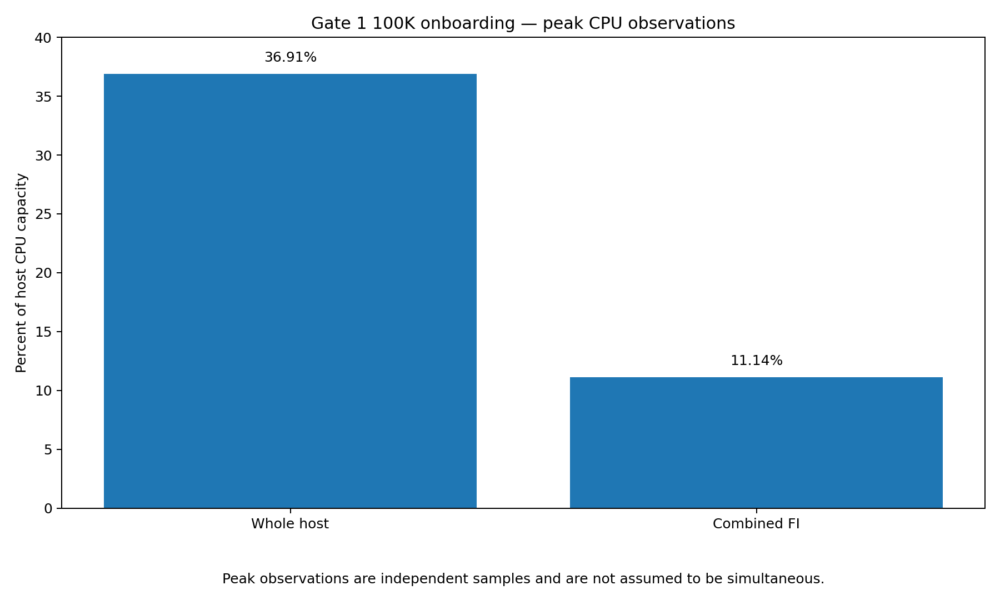
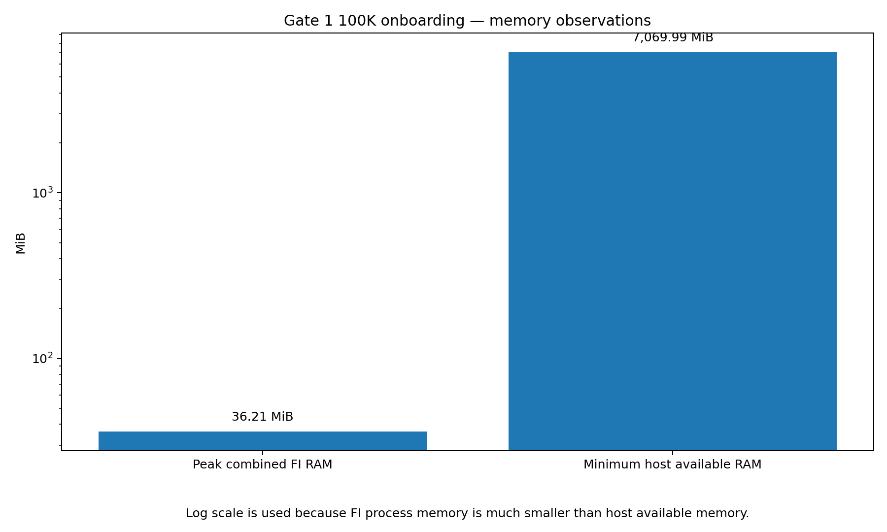
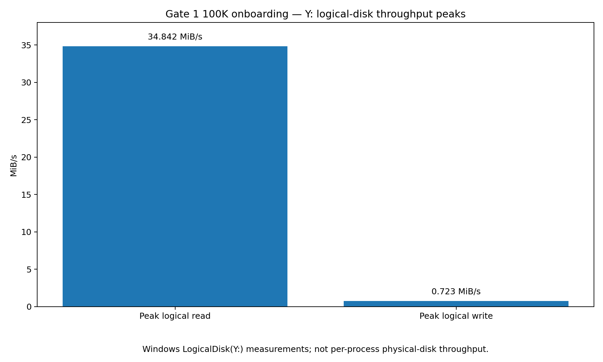
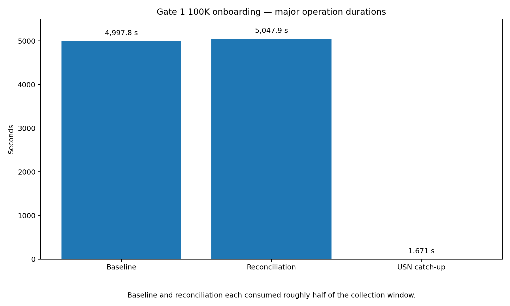
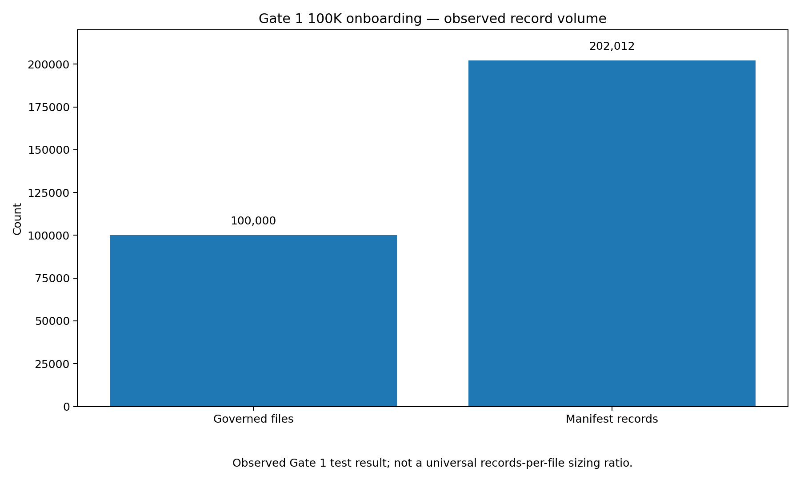

# FI Gate 1 — 100,000-File Onboarding & Source-Impact Engineering Report

Report date: 2026-09-09

Phase: **Phase 1 — Windows File & Identity Intelligence**

Gate: **Gate 1 — Source Intelligence & Continuity**

Result: **PASS**

## 1. Purpose

This report records the final large-scale Phase 1 / Gate 1 onboarding and
source-impact campaign for File Intelligence (FI).

The campaign was designed to answer a practical operational question:

> Can FI perform an initial governed-root onboarding of a substantially larger
> file population without becoming the dominant workload on the source file
> server?

This was not a maximum-throughput benchmark.

FI exists to enrich IT and security operations, not compete with the systems it
observes. Under onboarding, catch-up, reconciliation, backlog, or injected
failure, completing later is preferable to materially degrading the production
server.

The accepted operational rule is:

> **Under overload or injected failure, FI must fail explicitly and recoverably.
> Host availability and durable collection state take priority over maintaining
> nominal FI cadence.**

## 2. Test system

The accepted run was performed on:

```text
Host:             ISS-FS-01
Operating system: Windows Server 2016 Standard Evaluation
Windows build:    10.0.14393
Logical CPUs:     8
Memory:           approximately 9 GiB
```

FI runtime services:

```text
FICollector
FIUSNReader
```

The final source-impact candidate used:

```text
FICollector SHA-256
5C2A8FA07D9AF6F9762F7ED62975E6E6247CCF50325CF3B24211229596E90DB0
```

The accepted collector configuration remained:

```text
Configured collection interval:      1 minute
Supporting-source refresh interval:  30 minutes
```

Those values are Gate 1 acceptance configuration. They are not universal
production defaults.

## 3. Governed dataset

The dataset was created while FI was stopped.

The final measurement harness independently reverified the exact file count and
byte count before FI was started.

```text
Governed root:       Y:\FI-Lab
FI state:            Y:\FI-Gate1\state
FI spool:            Y:\FI-Gate1\spool

Files:               100,000
Bytes:               131,365,642,498
GiB:                 122.344
File-size range:     4 KiB through 2.5 MiB
Distribution:        uniform random
```

This was deliberately a real data-volume onboarding campaign, not a
metadata-only object-count exercise.

## 4. Accepted harnesses

The actual campaign scripts are retained as:

```text
tools/gate1/24A-FileServer-Onboarding100K-Dataset.ps1
tools/gate1/24B-FileServer-Onboarding100K-Measure.ps1
tools/gate1/24C-Remote-Onboarding100K-Watchdog.ps1
```

`24A` created the exact 100,000-file dataset. Its later measurement stage
encountered a Windows performance-counter availability problem after dataset
creation and before FI was started.

`24B` independently reverified the exact dataset and used the corrected native
Windows CPU/RAM measurement path plus working `LogicalDisk(Y:)` counters.

`24C` provided independent remote availability observation during the campaign.

The scripts are preserved as-run rather than rewritten to make the campaign
appear cleaner than it was.

## 5. Final configured collection result

```text
Outcome:            Complete
Elapsed:            10,048.082 sec
Approx. wall time:  2 h 47 m 28 s

FICollector:        Running at completion
FIUSNReader:        Running at completion
```

FI successfully completed initial observation and reconciliation of a
100,000-file / 122.344-GiB governed dataset while both FI services remained
operational.

## 6. CPU impact

Observed CPU results:

```text
Peak whole-host CPU:       36.91 %
Peak combined FI CPU:      11.14 % of host
Combined FI CPU consumed:  6,277.609 CPU-sec
```



The two peak values are independent observations and are not assumed to have
occurred in the same sample.

The important result is that FI did not consume the majority of available host
CPU during the accepted onboarding campaign.

Combined FI CPU remained a minority share of total host capacity while the host
retained substantial CPU headroom for the operating system and other workloads.

## 7. Memory impact

Observed memory results:

```text
Peak combined FI RAM:       36.21 MiB
Minimum host available RAM: 7,069.99 MiB
Peak host memory load:      21.00 %
```



The memory chart uses a logarithmic scale because FI's combined process footprint
was orders of magnitude smaller than the minimum observed host-available memory.

No meaningful host-memory pressure attributable to FI was observed in the
accepted run.

## 8. Logical-volume storage activity

Observed `Y:` logical-disk peaks:

```text
Peak logical read:        34.842 MiB/s
Peak logical write:        0.723 MiB/s
Peak observed read latency: 59.397 ms
Peak observed write latency: 18.014 ms
Peak observed queue:       3
```



These are Windows `LogicalDisk(Y:)` measurements.

They are not represented as:

- FI process physical-disk reads;
- physical device or SAN throughput;
- cache-miss traffic;
- hypervisor backing-storage traffic; or
- per-process physical I/O.

The campaign produced sustained source reads, as expected from full file
observation and hashing. Some storage pressure was observed, but the measurements
do not establish broad host-storage saturation.

## 9. Major operation timing

The accepted configured collection recorded:

```text
Baseline          4,997.792 sec  Complete
USNCatchUp            1.671 sec  Complete
Reconciliation     5,047.862 sec  Complete
```



Relative to the `10,048.082`-second configured collection window:

```text
Baseline:         approximately 49.74 %
Reconciliation:   approximately 50.24 %
USN catch-up:     approximately  0.02 %
```

The approximately 2h47m configured collection was therefore not a single
2h47m baseline scan.

Baseline and reconciliation each consumed roughly half of the accepted
collection window.

This distinction is important when estimating future onboarding behavior or
considering changes to reconciliation strategy.

## 10. Durable spool production

Final local spool measurements:

```text
Spool files:            6,320
Spool bytes:            870,946,901
Approx. spool size:     830.60 MiB
Manifest record count:  202,012
```



For this specific campaign:

```text
100,000 governed files
        |
        v
202,012 manifest records
        |
        v
870,946,901 spool bytes
```

This is a useful measured starting point for Phase 2 transport and receiver
capacity planning.

It is not a universal records-per-file or bytes-per-file sizing formula. The
observed record-to-governed-file ratio for this run was approximately `2.02012`,
but future environments will vary by source facts, object types, activity,
supporting records, and collection state.

## 11. Availability and operational behavior

The remote watchdog was kept separate from FI's source-side measurement harness.

Its purpose was to detect whether the file server became unavailable from a
remote administrative/client perspective while the onboarding workload was in
progress.

The accepted campaign did not demonstrate host availability loss attributable to
FI.

The final run also ended with both FI services still running.

This is central to the Gate 1 interpretation: FI was allowed to take longer
rather than aggressively consume the source host in pursuit of a shorter
benchmark time.

## 12. What this campaign establishes

The accepted campaign establishes that, in the tested environment, FI can:

- onboard and reconcile 100,000 governed files totaling 122.344 GiB;
- complete the configured collection successfully;
- preserve durable local spool output throughout the operation;
- remain a minority consumer of total host CPU;
- maintain a small FI process-memory footprint;
- perform sustained logical-volume reads without demonstrating broad host
  saturation;
- keep the Windows FI services operational; and
- preserve an explicit operation history showing where the collection time was
  spent.

It also provides a concrete first measured data point for Phase 2 transport
sizing: 202,012 manifest records and approximately 830.60 MiB of local spool
material for this campaign.

## 13. What this campaign does not establish

This campaign does not establish:

- a universal maximum supported dataset;
- a universal 1-minute production collection interval;
- a maximum FI throughput target;
- physical disk throughput requirements;
- identical performance on other storage systems;
- identical behavior on different file-size distributions;
- a universal records-per-file ratio;
- downstream Phase 2 transport capacity;
- backend ingest capacity; or
- performance equivalence across all Windows Server builds.

Those require environment-specific measurement or later gate-specific
acceptance.

## 14. Publication-boundary correction

Gate 1 testing also exposed a local producer/transport ownership race.

The corrected Phase 1 rule is:

```text
producer-private temporary state
        |
        v
finalize data
        |
        v
construct manifest
        |
        v
verify private/unpublished pair
        |
        v
publish final manifest
        |
        v
Phase 2 transport-visible ownership boundary
```

After publication, the producer does not depend on reopening the published pair.

Active sender/receiver acknowledgement-and-delete concurrency belongs to
Phase 2 / Gate 2.

The final Phase 1 candidate includes a Go regression test preserving this
publication boundary.

## 15. Source-impact acceptance

The accepted operational interpretation is:

> **FI successfully onboarded and reconciled a 100,000-file / 122.344-GiB
> governed dataset while maintaining a bounded resource footprint and without
> consuming a dominant share of the file server's CPU, memory, or storage
> subsystem.**

The design objective remains:

> **FI exists to enrich IT and security operations, not compete with the systems
> it observes. Under heavy collection work, completing later is preferable to
> materially degrading the production server.**

And the overload/failure rule remains:

> **Under overload or injected failure, FI must fail explicitly and recoverably.
> Host availability and durable collection state take priority over maintaining
> nominal FI cadence.**

## 16. Gate decision

```text
Dataset verification             PASS
Configured collection            PASS
Baseline                         COMPLETE
USN continuity                   COMPLETE
Reconciliation                   COMPLETE

Host CPU impact                  ACCEPTABLE
FI CPU footprint                 ACCEPTABLE
FI memory footprint              ACCEPTABLE
Logical-volume impact            ACCEPTABLE
Durable spool production         VERIFIED
FI service availability          VERIFIED

PHASE 1 LARGE ONBOARDING         PASS
GATE 1 SOURCE IMPACT             PASS
```

**Overall result: PASS**

No Phase 1 blocker was identified by the 100,000-file onboarding campaign.

The accepted result supports advancement to:

**Phase 2 — Secure Record Transport**

**Gate 2 — Secure Durable Record Transfer**

## 17. Related records

See:

- `docs/GATE-1-RESULT-RECORD.md`
- `docs/performance/PHASE-1-GATE-1-CLOSEOUT.md`
- `docs/performance/README.md`
- `tools/gate1/README.md`
- `fi-roadmap/roadmap.md`
- `fi-roadmap/docs/roadmap/phase-02-secure-record-transport.md`
