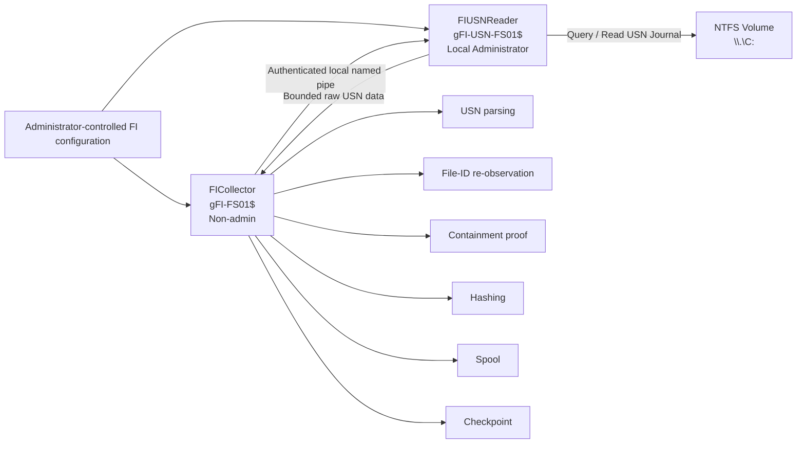
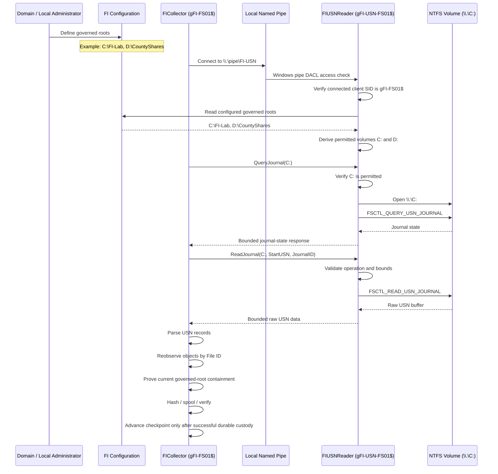

# FI NTFS USN Privilege Boundary, Authentication, and Collection Model

## Purpose

This document explains why FI uses the NTFS USN Journal, what the journal provides to FI, and how FI isolates the Windows administrative privilege required to read the journal.

It is written for multiple audiences:

- IT directors who need to understand the operational and security value
- security administrators who need to understand identity, authorization, trust boundaries, and containment
- Windows administrators who need to deploy and support the services
- FI engineers who need to preserve the intended privilege and collection boundaries

---

## Executive Summary

FI uses the NTFS USN Journal to efficiently discover filesystem changes and maintain collection continuity between observations.

The USN Journal is not treated as the authoritative current state of a file. It tells FI that an NTFS object changed and identifies that object. FI then performs a fresh NTFS observation by File ID and proves whether the object is currently within a configured governed root.

Windows Server 2016 requires administrative direct-volume access for FI's current USN Journal access path. FI therefore separates normal collection from privileged USN access.

Each monitored Windows server uses two Windows services and two unique gMSAs:

1. **FICollector**
   - runs as a restricted, non-administrative per-host gMSA
   - performs normal FI collection
   - owns parsing, re-observation, containment, hashing, spooling, continuity assessment, and checkpoint advancement

2. **FIUSNReader**
   - runs as a separate per-host gMSA
   - is local Administrator on that host only
   - performs only the privileged direct-volume operations needed to query and read the NTFS USN Journal

The services communicate over a local authenticated named pipe.

The privileged service is intentionally small. If an operation does not require administrative direct-volume access, it does not belong in FIUSNReader.

---

# 1. Why FI Uses the NTFS USN Journal

The USN Journal is not being used simply because Windows makes it available, and it is not the authoritative source for the current state of a file.

FI uses the NTFS USN Journal because it provides a durable, volume-level record of filesystem changes that allows FI to determine **what changed between observations** without repeatedly rescanning every file on a governed volume.

That distinction is fundamental to FI.

## 1.1 The Problem FI Needs to Solve

A file intelligence system cannot assume it will run continuously.

Servers reboot. Services stop. Maintenance occurs. FI may be upgraded. A dependency may be unavailable. A monitored directory may contain millions of files.

If FI relied only on periodic directory scans, after an interruption it would have two poor choices:

1. trust that nothing changed while FI was unavailable, or
2. rescan the entire governed environment to rediscover the current state

The first choice is unreliable.

The second can be expensive and still does not directly describe what occurred between observations.

The NTFS USN Journal gives FI another option.

```text
FI last observed filesystem
        |
        | checkpoint = USN X
        |
        | FI stops / server reboots / maintenance
        |
        | NTFS continues recording filesystem changes
        |
        v
FI starts again
        |
        | read USN records after X
        v
FI knows which filesystem objects changed
```

FI can then re-observe those specific objects and determine their current state.

## 1.2 What the USN Journal Provides to FI

The USN Journal provides FI with **change discovery and continuity**.

A USN record can provide information such as:

- NTFS file reference number of the changed object
- parent file reference number
- USN assigned to the change
- reason for the filesystem change
- timestamp associated with the journal record

Conceptually:

```text
NTFS

File A changed
File B renamed
File C deleted
File D created
        |
        v
USN Journal
        |
        +-- Object A changed at USN 1001
        +-- Object B renamed at USN 1002
        +-- Object C deleted at USN 1003
        +-- Object D created at USN 1004
        |
        v
FI
```

FI does not have to blindly rediscover these changes through a complete filesystem walk.

## 1.3 USN Is a Change Source, Not FI's Final Answer

FI deliberately does not treat a USN record as authoritative proof of the current state of a file.

A USN record describes a filesystem change that occurred.

It does not necessarily describe what the object looks like now.

For example:

```text
USN 1001
File changed

USN 1002
File renamed

USN 1003
File changed again

FI observes the object after those events
```

The earlier USN records remain valid source facts about what occurred, but FI needs a fresh observation to determine the object's current state.

Therefore FI uses the USN Journal to answer:

> **What filesystem objects should FI investigate because something changed?**

FI's NTFS collector then answers:

> **What is this object now, and is it currently within FI's governed scope?**

## 1.4 File Identity Is More Important Than the Filename

FI does not rely on the filename contained in a USN record to determine whether an object belongs within a governed root.

Names and paths can change.

An object can be:

```text
created
renamed
moved
renamed again
deleted
```

Instead, FI uses the NTFS object identity from the USN record and attempts to re-open the object by File ID.

```text
USN record
    |
    | File ID
    v
FI re-opens object by NTFS identity
    |
    v
FI collects fresh NTFS information
    |
    v
FI proves current containment
    |
    +-- inside governed root
    |       -> process current observation
    |
    +-- outside governed root
    |       -> record that result
    |
    +-- object no longer exists
            -> preserve USN change fact
               and record re-observation unavailable
```

FI is interested in the NTFS object, not merely a path string that may already be obsolete.

## 1.5 USN Gives FI Continuity Across Interruptions

FI maintains a USN checkpoint containing information such as:

```text
Volume identity
Journal ID
Next USN
Governed-root identity
```

When FI resumes collection, it does not assume the previous checkpoint is still valid.

FI compares the checkpoint with the current NTFS journal state.

```text
Previous FI checkpoint
    |
    +-- JournalID = 12345
    +-- NextUSN   = 500000
    |
    v
Current NTFS journal
    |
    +-- JournalID = 12345
    +-- LowestValidUSN < 500000
    |
    v
Continuity exists
    |
    v
Resume from USN 500000
```

If the journal has changed or FI's checkpoint is no longer represented:

```text
Previous checkpoint
    |
    +-- JournalID = 12345
    +-- NextUSN   = 500000

Current journal
    |
    +-- JournalID = 67890
```

FI does not pretend that collection remained continuous.

It reports the continuity loss and performs the appropriate reconciliation behavior.

This allows FI to distinguish:

```text
"We observed everything since our last checkpoint."
```

from:

```text
"We cannot prove that we observed every filesystem change
since our last checkpoint."
```

Those are materially different statements.

## 1.6 USN Reduces Repeated Full Filesystem Scans

Without change tracking, a large file server could require FI to repeatedly walk millions of files and directories just to determine that only a small number of objects changed.

USN changes that model.

```text
Initial FI baseline
        |
        v
Full governed-root observation
        |
        v
USN checkpoint established
        |
        +-----------------------------+
        |                             |
        v                             v
  filesystem changes             no changes
        |
        v
bounded USN reads
        |
        v
changed File IDs
        |
        v
targeted fresh observations
```

FI still performs full observation when actually required, such as establishing a baseline or reconciling a continuity gap.

The USN Journal prevents every collection cycle from becoming another complete baseline.

## 1.7 USN Does Not Replace FI's Other Sources

The USN Journal provides filesystem change information, but it does not answer every question FI may need to answer.

It is not intended to reliably answer:

```text
Which user performed this operation?
Which process caused it?
Why did the application make the change?
```

Those questions may require other Windows sources.

```text
USN Journal
    -> filesystem change discovery
    -> object identity
    -> change reason
    -> ordering
    -> continuity

NTFS observation
    -> current object state
    -> current metadata
    -> current containment
    -> current file identity

Windows Security source
    -> security/audit observations
    -> account/process information when available and configured

FI
    -> preserves and correlates those source facts
```

FI should not force one source to answer questions that belong to another source.

## 1.8 Why This Capability Is Worth Isolating Privilege For

USN provides FI with:

- durable filesystem change discovery
- efficient incremental collection
- NTFS object identity
- ordered change tracking through USNs
- restart and outage recovery
- journal continuity checking
- explicit detection of continuity gaps
- targeted re-observation instead of constant full rescanning

The architectural question is therefore not:

> "Should FI run as Administrator so it can read another Windows API?"

It is:

> "How do we preserve the USN capabilities FI needs while isolating the Windows administrative access required to obtain them?"

---

# 2. Why FI Uses a Split-Privilege Design

Windows treats direct volume access such as:

```text
\\.\C:
```

as privileged.

FI testing on Windows Server 2016 established that the current USN access path requires administrative direct-volume access.

FI specifically tested reduced approaches before accepting that requirement.

The intended response is not to make the entire collector an Administrator.

Instead FI isolates the privileged operation into a small local service.

```text
                 NTFS
                  |
                  | USN journal
                  v
          +----------------+
          | FIUSNReader    |
          | privileged     |
          | narrow purpose |
          +-------+--------+
                  |
                  | bounded USN data
                  v
          +----------------+
          | FICollector    |
          | non-admin      |
          +-------+--------+
                  |
       +----------+-----------+
       |          |           |
       v          v           v
   Parse USN   Reobserve    Prove
   changes     by File ID   containment
       |          |           |
       +----------+-----------+
                  |
                  v
            spool / checkpoint
```

---

# 3. Per-Host Identity Model

Every monitored Windows server gets its own identity pair.

Example:

```text
ISS-FS-01
    ISS\gFI-FS01$          FICollector
    ISS\gFI-USN-FS01$      FIUSNReader

ISS-FS-02
    ISS\gFI-FS02$          FICollector
    ISS\gFI-USN-FS02$      FIUSNReader

ISS-FS-03
    ISS\gFI-FS03$          FICollector
    ISS\gFI-USN-FS03$      FIUSNReader
```

There is no shared collector gMSA and no shared privileged USN gMSA across monitored hosts.

## 3.1 Why Identities Are Per-Host

This is an accountability requirement for both FI and the customer.

It provides:

- direct attribution
- reduced blast radius
- per-host revocation
- clearer auditing
- simpler incident response
- clear customer ownership of the security boundary

A log entry containing:

```text
ISS\gFI-USN-FS01$
```

directly identifies the privileged FI identity assigned to `ISS-FS-01`.

Compromise of `ISS-FS-02` does not authorize that server to retrieve or use the privileged gMSA assigned to `ISS-FS-01`.

## 3.2 Host-Bound gMSA Retrieval

Each gMSA should be retrievable only by its matching server computer account.

Conceptually:

```text
gFI-FS01$       -> ISS-FS-01$
gFI-USN-FS01$   -> ISS-FS-01$

gFI-FS02$       -> ISS-FS-02$
gFI-USN-FS02$   -> ISS-FS-02$
```

FI should not use a broad "FI servers" group for these per-host accounts.

---

# 4. Service Responsibilities

## 4.1 FICollector

FICollector runs under the restricted per-host gMSA.

Example:

```text
ISS\gFI-FS01$
```

It is not local Administrator.

FICollector owns:

- governed-root processing
- baseline collection
- USN parsing
- continuity assessment
- NTFS File-ID re-observation
- current scope and containment decisions
- NTFS metadata collection
- content hashing
- spool writing
- checkpoint persistence and advancement
- Windows Security source work
- supporting-source collection
- operation reporting

FICollector does not directly open the raw NTFS volume for USN access.

## 4.2 FIUSNReader

FIUSNReader runs under the separate privileged per-host gMSA.

Example:

```text
ISS\gFI-USN-FS01$
```

It is local Administrator on `ISS-FS-01` only.

Its responsibilities are intentionally narrow:

- open an approved local NTFS volume such as `\\.\C:`
- query current USN Journal state
- read a bounded USN Journal range
- return the result to FICollector

It does not own:

- USN parsing decisions
- File-ID re-observation
- current containment
- content hashing
- spool persistence
- checkpoint persistence
- checkpoint advancement
- journal creation
- journal deletion
- journal resizing
- arbitrary filesystem operations

---

# 5. High-Level Architecture



---

# 6. Authentication and Authorization Flow



---

# 7. Authentication Diagram

```mermaid
flowchart TD
    A[Domain Administrator creates per-host gMSAs] --> B[gFI-FS01$]
    A --> C[gFI-USN-FS01$]

    D[ISS-FS-01 computer account] -->|Authorized managed-password retrieval| B
    D -->|Authorized managed-password retrieval| C

    B --> E[FICollector service]
    C --> F[FIUSNReader service]

    E -->|Connect locally| G[\\.\pipe\FI-USN]
    G -->|Pipe DACL check| F
    F -->|Verify caller SID = gFI-FS01$| H{Authorized client?}

    H -->|No| I[Reject]
    H -->|Yes| J[Accept narrow USN request]

    J --> K[Read governed roots from fi.conf]
    K --> L{Requested volume configured?}

    L -->|No| M[Reject: volume not configured]
    L -->|Yes| N[Perform approved USN operation]
```

---

# 8. Single Source of Truth for Approved Volumes

FI does not maintain a separate USN volume allowlist.

The existing FI configuration is the source of truth.

Example:

```text
C:\ProgramData\FI\config\fi.conf

governed roots:
    C:\FI-Lab
    D:\CountyShares
```

FIUSNReader derives:

```text
approved volumes:
    C:
    D:
```

Requests then behave as:

```text
QueryJournal C:   -> allowed
ReadJournal C:    -> allowed

QueryJournal D:   -> allowed
ReadJournal D:    -> allowed

ReadJournal E:    -> denied: volume_not_configured
```

The collector does not tell FIUSNReader which volumes are trusted.

FIUSNReader reads the administrator-controlled FI configuration itself.

This prevents a compromised FICollector from declaring an arbitrary volume authorized.

---

# 9. Named Pipe Security

FICollector and FIUSNReader communicate through a local named pipe such as:

```text
\\.\pipe\FI-USN
```

The pipe must use an explicit security descriptor.

Conceptually:

```text
Allowed:
    ISS\gFI-FS01$
    ISS\gFI-USN-FS01$
    BUILTIN\Administrators
    SYSTEM

Not allowed:
    ordinary users
    unrelated services
    other gMSAs
    other FI hosts
    remote clients
```

Remote pipe clients should be rejected.

FIUSNReader should also verify the connected client's Windows SID after connection.

The expected client is exactly:

```text
ISS\gFI-FS01$
```

Anything else is rejected.

The pipe ACL is the first access check.

The explicit client SID check is the second.

---

# 10. Narrow Privileged API

FIUSNReader must not become a general administrative proxy.

The interface should expose only the operations FI actually requires.

Conceptually:

```text
QueryJournal(volume)

ReadJournal(
    volume,
    startUSN,
    journalID
)
```

The caller must not be able to specify:

- arbitrary device paths
- arbitrary access masks
- arbitrary DeviceIoControl / FSCTL values
- arbitrary administrative commands
- arbitrary buffer sizes
- journal create/delete/resize operations

The helper owns those details internally.

A compromised FICollector should gain, at most, access to the same bounded USN capability that FICollector was already authorized to request.

It should not gain a general Administrator token.

---

# 11. FI Configuration Permissions

FI configuration should be administrator-controlled.

Example:

```text
C:\ProgramData\FI\config\
```

Recommended intent:

```text
Administrators        Modify / Full
SYSTEM                Full

gFI-FS01$             Read
gFI-USN-FS01$         Read
```

Neither FI service should normally modify FI configuration.

This protects the governed-root definition from a compromised running service.

---

# 12. State and Spool Permissions

Examples:

```text
C:\ProgramData\FI\state\
C:\ProgramData\FI\spool\
```

FICollector requires the permissions necessary to maintain state and durable collection output.

Conceptually:

```text
Administrators        Full
SYSTEM                Full
gFI-FS01$             Modify
```

FIUSNReader should not require write access to FI state or spool locations.

The privileged helper does not own checkpoints or durable FI custody.

---

# 13. Windows Service Security

The FIUSNReader Windows service object should be protected so that FICollector cannot reconfigure the privileged service.

FICollector should not be able to:

- replace the FIUSNReader executable path
- change its service identity
- change its startup configuration
- change its service security descriptor

FICollector's relationship with FIUSNReader is through the authenticated named pipe only.

Local Administrators and approved deployment/management mechanisms retain control of service configuration.

---

# 14. gMSA Logon Intent

The privileged gMSA exists to run FIUSNReader as a Windows service.

It should not be deliberately reused for:

- scheduled tasks
- PowerShell automation
- IIS application pools
- SQL services
- unrelated FI components
- administrative scripting
- interactive administration

The intended relationship is:

```text
gFI-USN-FS01$
        |
        v
FIUSNReader
        |
        v
approved raw-volume USN operations only
```

Where appropriate, environment policy may additionally deny unnecessary interactive, remote interactive, or network logon types while preserving the service logon required by FIUSNReader.

---

# 15. Security Boundary During Collector Compromise

If FICollector itself is compromised, the design should not automatically provide a local Administrator token.

Instead:

```text
FICollector compromise
        |
        v
attacker has restricted gFI-FS01$ process context
        |
        v
can attempt authenticated FI-USN pipe calls
        |
        v
FIUSNReader independently enforces:
    - expected client identity
    - approved configured volumes
    - approved operations only
    - bounded requests and responses
```

This is materially different from running all FI collection code as local Administrator.

```text
Whole collector as Administrator

FI compromise
      |
      v
local Administrator
      |
      v
broad server control
```

versus:

```text
Split privilege

FI compromise
      |
      v
restricted collector identity
      |
      v
narrow local USN interface
      |
      v
bounded approved USN operations
```

---

# 16. Local Administrator and SYSTEM Boundary

FI does not claim that a local Administrator or SYSTEM process can be permanently prevented from controlling another local Windows service.

Windows administrators inherently possess broad local authority.

The intended protection is against:

- ordinary users
- unrelated services
- other gMSAs
- other FI servers
- remote callers
- compromise of the non-administrative FICollector alone

The local Administrator/SYSTEM boundary remains the operating system's administrative trust boundary.

---

# 17. Operational Flow

## 17.1 Normal Operation

1. FICollector starts under the restricted per-host collector gMSA.
2. FIUSNReader starts under the separate privileged per-host USN gMSA.
3. Both read the administrator-controlled FI configuration as needed.
4. FICollector determines that current USN state or a bounded journal range is needed.
5. FICollector connects to the local FI-USN named pipe.
6. Windows applies the pipe DACL.
7. FIUSNReader verifies the caller SID.
8. FIUSNReader derives permitted volumes from configured governed roots.
9. FIUSNReader validates the requested volume and operation.
10. FIUSNReader opens the approved raw volume.
11. FIUSNReader queries or reads the USN Journal.
12. FIUSNReader returns the bounded result.
13. FICollector parses the result.
14. FICollector re-observes changed objects by File ID.
15. FICollector proves current governed-root containment.
16. FICollector performs any required hashing and normal source collection.
17. FICollector writes and verifies durable spool output.
18. FICollector advances its checkpoint only after required custody and state work succeeds.

## 17.2 Helper Failure

If FIUSNReader is unavailable or fails:

- FICollector reports the USN operation failure explicitly
- FI must not claim successful USN continuity for work it did not complete
- the USN checkpoint must not be advanced based on failed or incomplete work
- other FI source collection may continue according to FI's existing status model

The privileged service is not allowed to silently convert failure into apparent continuity.

---

# 18. Incident Response and Revocation

Because the collector and USN identities are separate and per-host, the customer can take focused action.

## 18.1 Disable Normal Collector Identity

Example:

```powershell
Disable-ADAccount -Identity gFI-FS01
```

This prevents future successful service logons for the normal collector identity.

## 18.2 Disable Privileged USN Identity

Example:

```powershell
Disable-ADAccount -Identity gFI-USN-FS01
```

This prevents future successful service logons for the privileged USN identity.

Disabling the account does not retroactively destroy a Windows token already held by a running process.

Therefore immediate containment of a currently running service may also require:

- stopping FIUSNReader
- disabling the local service
- endpoint isolation
- other customer incident-response controls

Once the privileged service stops and Windows must perform a new service logon, the disabled gMSA provides a domain-side control preventing normal restart under that identity.

This gives customers a central revocation point while retaining normal Windows incident-response controls for immediate containment.

---

# 19. Accountability Model

FI's identity model intentionally maps identity to host and function.

Example:

```text
Host:
    ISS-FS-01

Collector identity:
    ISS\gFI-FS01$

Privileged USN identity:
    ISS\gFI-USN-FS01$
```

This provides a direct relationship:

```text
server
   |
   +-- normal collector identity
   |
   +-- privileged USN identity
```

No privileged FI service identity is shared across monitored servers.

This supports both customer and FI accountability.

---

# 20. Design Invariants

The following rules define the intended architecture.

## Rule 1: One Host, One Identity Pair

Every monitored Windows server gets:

- one restricted FICollector gMSA
- one privileged FIUSNReader gMSA

No sharing across monitored hosts.

## Rule 2: FIUSNReader Is Not a Second Collector

FIUSNReader is a narrow privileged broker for the direct-volume USN operations required by FI.

## Rule 3: FI Configuration Is the Single Source of Truth

Approved USN volumes are derived from configured governed roots.

There is no separate helper-maintained allowlist.

## Rule 4: Checkpoint Ownership Remains in FICollector

FICollector owns:

- continuity decisions
- spool custody
- checkpoint advancement

FIUSNReader does not maintain FI collection progress.

## Rule 5: Privileged API Surface Stays Small

The helper exposes only approved USN query/read operations.

It does not expose generic raw-volume or administrative functionality.

## Rule 6: If It Does Not Require Privileged Direct-Volume Access, It Does Not Belong in FIUSNReader

Examples that remain in FICollector:

- USN parsing
- File-ID re-observation
- current containment
- hashing
- spool writing
- checkpoint persistence
- supporting-source collection

This is the primary engineering boundary.

---

# 21. Why This Design Matters to an IT Director

The USN Journal lets FI efficiently determine what changed instead of repeatedly rescanning the entire governed filesystem.

The split-service design prevents that performance and continuity capability from forcing the entire FI application to run as Administrator.

Each server has unique identities, allowing the organization to:

- identify exactly which FI component performed a privileged operation
- disable one server's FI identities without affecting every FI host
- limit compromise blast radius
- retain customer control through Active Directory and local service security
- keep normal collection non-administrative

---

# 22. Why This Design Matters to a Security Administrator

The design provides multiple independent controls:

1. per-host gMSAs
2. host-specific managed-password retrieval authorization
3. non-administrative main collector
4. separate privileged service identity
5. local-only named-pipe communication
6. explicit pipe DACL
7. explicit client SID verification
8. administrator-controlled configured-root authorization
9. narrow operation set
10. bounded journal reads
11. protected service configuration
12. protected FI configuration
13. separate AD revocation of collector and privileged identities

No single control is expected to carry the entire security model.

---

# 23. Why This Design Matters to an FI Engineer

The privilege boundary must remain easy to identify in code.

The FIUSNReader code should be small enough that an engineer can answer:

> "What can this privileged process actually do?"

without tracing the entire FI collector.

The answer should remain approximately:

```text
open approved local NTFS volume
query USN journal
read bounded USN journal data
return result
```

If privileged code starts accumulating:

- parsing policy
- checkpoint state
- spool behavior
- hashing
- file intelligence decisions
- arbitrary device operations

the boundary is being violated.

Complexity in the privileged component increases security risk and debugging cost.

---

# 24. Summary

FI uses the NTFS USN Journal because it provides efficient filesystem change discovery and continuity across collection interruptions.

USN tells FI which NTFS objects changed.

FI then re-observes those objects by File ID to determine their current state and current relationship to configured governed roots.

Because Windows Server 2016 requires administrative direct-volume access for FI's current USN Journal access path, FI isolates that requirement into a small privileged service.

On each monitored server:

```text
FICollector
    unique per-host restricted gMSA
    non-admin
        |
        | authenticated local pipe
        v
FIUSNReader
    unique per-host privileged gMSA
    local Administrator on that host only
        |
        v
NTFS USN Journal
```

The main collector remains responsible for FI's actual collection semantics.

The privileged helper exists only to provide the smallest Windows capability that cannot be safely performed by the restricted collector.

This preserves the value of the NTFS USN Journal while reducing FI's privileged attack surface and improving accountability, containment, and customer control.
